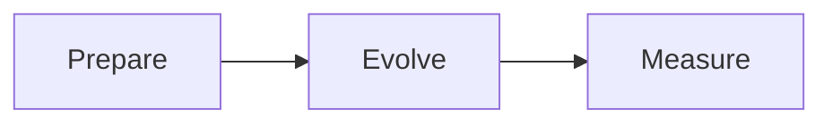

# Writing a quantum note

## Create a note

Keep notes inside `notes/<course-folder>/<note-name>.md`. Course folders and filenames use lowercase letters, numbers, hyphens, or underscores. The website discovers them automatically.

```bash
npm run new:note -- --course ibm-quantum --title "Entanglement"
```

For a new course, also supply `--course-title "My course name"`. You can instead copy `templates/note.md` into a course folder and edit it.

## Required metadata

Every note begins with YAML frontmatter. Use the same course name for every note in a course folder. Quote dates so they remain strings.

```yaml
---
title: "Entanglement"
course: "IBM · Basics of quantum information"
description: "Correlations in composite quantum systems."
updated: "2026-09-26"
order: 3
tags: [entanglement, composite systems]
status: In progress
sources:
  - title: "Name of lecture or course"
    url: https://example.com/course
---
```

The title, course, description, and updated date are required. `order` controls sequence within a course. The source links appear under References.

## Equations

Use dollar signs for inline math and double dollar signs for display equations. LaTeX bracket delimiters are also supported. Common bra-ket commands are included.

```latex
Inline: $\ket{\psi}=\alpha\ket{0}+\beta\ket{1}$

$$
|\alpha|^2+|\beta|^2=1
$$
```

$$
\ket{\psi}=\alpha\ket{0}+\beta\ket{1},
\qquad |\alpha|^2+|\beta|^2=1.
$$

## Mermaid diagrams

Use a fenced code block with the language `mermaid`.

````markdown

````


Diagrams have zoom controls in the reader and are rendered into the downloadable PDFs.

## Callouts

Supported types are `note`, `tip`, `warning`, `definition`, and `example`. An optional title follows the type.

```markdown
:::definition Unitary operator
A matrix $U$ is unitary when $U^\dagger U=I$.
:::
```

:::definition Unitary operator
A matrix $U$ is unitary when $U^\dagger U=I$.
:::

## HTML elements

Use semantic HTML for expandable explanations and concept cards. Scripts, event handlers, iframes, and arbitrary styles are removed. Use the built-in classes for consistent presentation.

```html
<details>
<summary>Why does normalization matter?</summary>
<p>The probabilities of all possible outcomes must sum to one.</p>
</details>

<div class="concept-grid">
  <div class="concept-card"><h3>Concept</h3><p>Explanation.</p></div>
  <div class="concept-card"><h3>Connection</h3><p>Related idea.</p></div>
</div>
```

Use ordinary Markdown paragraphs outside HTML blocks for equations and other Markdown formatting. All expandable explanations are opened in generated PDFs.

## Links, images, and code

Link notes with relative `.md` paths: for example, `[Gates](02-gates-and-interference.md)` from a note in the same folder. The builder validates and rewrites these to website URLs, including the GitHub Pages prefix.

Place images in a course's `assets` folder and reference them with Markdown, such as ``. Supported asset formats are PNG, JPEG, GIF, WebP, SVG, and PDF. Use Markdown links for local assets so paths are rewritten automatically; use absolute HTTPS URLs inside raw HTML.

Use fenced code blocks, ordinary Markdown tables, numbered lists, and blockquotes as needed.

## Download and publish

Each note has a **Download PDF** button and a **Markdown** download. The Export page also provides course PDFs and the complete notebook, or lets you select notes and save them through the print dialog.

```bash
npm run build
npm run preview
```

The build creates the static website and PDFs in `dist`. Push to `main` to rebuild and publish through the included GitHub Pages workflow. Preview-only builds do not refresh PDFs; use the full build before sharing.

## A useful note structure

1. The idea in one sentence.
2. Definitions and intuition.
3. A derivation with assumptions stated.
4. A worked example.
5. Connections to other notes.
6. A question to test understanding.
7. Open questions and source references.

The starter notes illustrate this structure. They are original short examples, not complete course notes or reproductions of lecture material.
