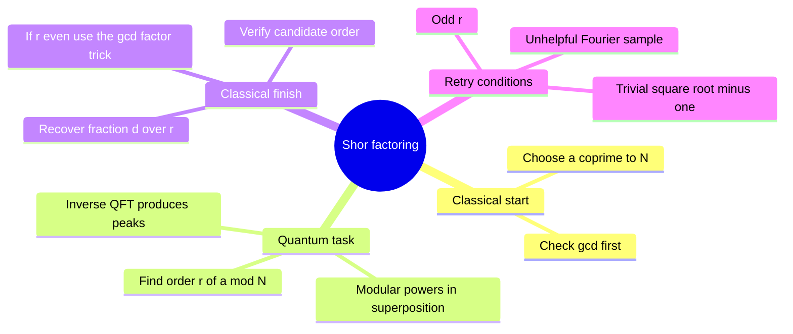

# Shor's factoring algorithm

## The idea in one sentence

Factoring becomes manageable when a quantum circuit finds the **period** of modular powers; ordinary arithmetic then turns a suitable even period into factors.

MIT's factoring unit sets out [the quantum period-finding procedure](https://www.youtube.com/watch?v=iZ355z3AfTg&t=0s), explains [why Fourier amplitudes peak](https://www.youtube.com/watch?v=canCHvkXozE&t=0s), and introduces [continued-fraction recovery](https://www.youtube.com/watch?v=mnUxOLwsvlo&t=0s). The $N=15$ example below is a small independent check, not a claim that factoring 15 requires quantum hardware.

## Step 1: change the factoring problem

Let $N$ be an odd composite number we wish to factor. Choose $1<a<N$ and compute $g=\gcd(a,N)$. If $g>1$, we have already found a factor. Otherwise $a$ is invertible modulo $N$, and it has a finite **order** $r$: the least positive integer satisfying

$$
a^r\equiv1\pmod N.
$$

If $r$ is even, then $(a^{r/2}-1)(a^{r/2}+1)=a^r-1$ is divisible by $N$. If in addition $a^{r/2}\not\equiv-1\pmod N$, compute

$$
d_- =\gcd(a^{r/2}-1,N),
\qquad d_+=\gcd(a^{r/2}+1,N).
$$

For an appropriate choice, these give nontrivial factors. If $r$ is odd or the square root is $-1$ modulo $N$, choose another $a$ and retry. Finding $r$ is the costly part for large $N$.

## Step 2: turn a modular period into Fourier peaks

Define $f(x)=a^x\bmod N$. It repeats every $r$ inputs. Choose a power-of-two first-register size $Q=2^t$, large enough for fraction recovery (a standard safe scale is $Q\gtrsim N^2$). Reversibly compute modular exponentiation:

$$
\frac1{\sqrt Q}\sum_{x=0}^{Q-1}\ket x\ket0
\longrightarrow
\frac1{\sqrt Q}\sum_{x=0}^{Q-1}\ket x\ket{a^x\bmod N}.
$$

The modular arithmetic must be **reversible** and its work qubits uncomputed. Applying the inverse QFT $F_Q^\dagger$ to the first register makes paths from each residue class $x\equiv x_0\pmod r$ reinforce near $y/Q\approx d/r$ for integers $d$. Measuring the first register yields an approximation to one of those fractions. You can reason as though the second register were measured first into a periodic coset; actually measuring it is not required for the first-register probability distribution.

The QFT itself is efficient in the number of qubits, and modular exponentiation can also be built from polynomially many reversible gates. The speedup is not “try all factors at once and read the answer”; interference reveals a period, and a classical reduction uses it.

## Step 3: recover and validate the denominator

Because $Q$ is finite, $y/Q$ is usually close to $d/r$, not exactly equal. Continued fractions generate good rational approximations to $y/Q$. A candidate denominator $r'$ must be checked by modular exponentiation: is $a^{r'}\equiv1\pmod N$? Even then, if $r'$ is a multiple of the actual order, reduce it to the least period before using the factor step. If $d$ and $r$ share a divisor, the reduced fraction has a denominator smaller than $r$; one measurement may therefore be insufficient.

:::example Factor 15 using $a=2$
The powers are $2^0,2^1,2^2,2^3,2^4\equiv1,2,4,8,1\pmod{15}$, so the least order is $r=4$. Take $Q=256$. In this especially clean case $r\mid Q$, the ideal Fourier peaks are at $y=0,64,128,192$, giving $y/Q=0,1/4,1/2,3/4$. A sample $64$ or $192$ reduces to denominator four and reveals $r=4$. A sample $128$ reduces to $1/2$ and suggests denominator two; the test $2^2=4\not\equiv1\pmod{15}$ rejects it, so repeat or inspect possible multiples. A sample zero carries no period information.

Now $r/2=2$ and $2^2=4\not\equiv-1\pmod{15}$. Therefore

$$
\gcd(2^2-1,15)=\gcd(3,15)=3,
\qquad
\gcd(2^2+1,15)=\gcd(5,15)=5.
$$

Both factors multiply to 15. The example also shows why a single quantum measurement is not guaranteed to produce a usable denominator.
:::

## What the algorithm promises and what it does not

The quantum subroutine is probabilistic; it is repeated when fraction recovery or the classical factor step fails. The complexity claim concerns factoring large integers using efficient modular arithmetic and sufficiently reliable quantum operations, not a shortcut for a tiny example. “Exponential advantage” should be understood in the precise asymptotic complexity comparison being made, not as free QFT or free memory. [QFT period peaks](../../basic-algorithms/fourier-transform/01-qft-circuit-and-periods.md) supplies the interference picture; [phase estimation](../phase-estimation/01-phase-estimation.md) supplies another view of the same frequency extraction.

:::note Source access
The MIT video links in this page identify positions in the official timed transcripts. The corresponding embedded lecture videos reported unavailable during this review; the official MIT course unit is linked under References. The worked derivations are checked independently.
:::

## Quick revision and self-check

Remember **coprime base → order $r$ → even-order gcd trick**. Why must $r$ be even? The factor identity uses $a^{r/2}$. Why might $y/Q=1/2$ fail when $r=4$? The sampled fraction can reduce and hide part of the denominator.
