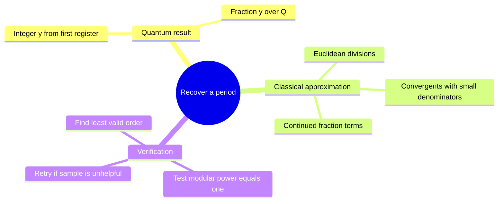
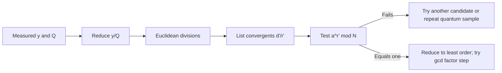

# Continued fractions after a Fourier sample

## The idea in one sentence

A measured value $y/Q$ is close to an unknown fraction $d/r$; continued fractions list the best small-denominator candidates, which we then test against the modular function.

MIT introduces [continued fractions for the order denominator](https://www.youtube.com/watch?v=mnUxOLwsvlo&t=0s) and discusses [when a sufficiently close rational is recovered](https://www.youtube.com/watch?v=VL_F3KeDZIA&t=0s). This page supplies a fully worked arithmetic example.

## Why a rational approximation appears

An order-$r$ periodic state produces Fourier peaks near $y\approx Qd/r$ for some integer $d$. Therefore $y/Q\approx d/r$. The quantum measurement does not directly label $r$; it supplies the left side, which we know exactly as two integers. When $Q$ is chosen large compared with $r^2$ and the sample lands sufficiently near a peak, a sufficiently accurate reduced $d/r$ occurs among the continued-fraction **convergents** of $y/Q$. The result requires the closeness condition; not every measured $y$ is useful.

## Run Euclid's algorithm on a concrete sample

Suppose $Q=256$ and measurement gives $y=110$. Simplify $y/Q=110/256=55/128$. Euclidean division proceeds:

$$
128=2(55)+18,\qquad
55=3(18)+1,\qquad
18=18(1)+0.
$$

Hence $55/128=[0;2,3,18]$. Its convergents are $0/1$, $1/2$, $3/7$, and $55/128$. The third is close to the sampled value:

$$
\left|\frac{55}{128}-\frac37\right|
=\left|\frac{385-384}{896}\right|=\frac1{896}\approx0.001116.
$$

Indeed, $Q(3/7)=256(3/7)\approx109.714$, close to the observed $110$. The small denominator **7** is a period candidate, but the arithmetic alone does not prove it is the order of a specific modular base.

| Candidate | Value | Why inspect it? |
| --- | ---: | --- |
| $1/2$ | $0.5$ | Early small denominator, but far from sample |
| $3/7$ | $\approx0.428571$ | Very close to $55/128\approx0.429688$ |
| $55/128$ | $0.4296875$ | Exact sample; denominator may be far too large |

## Why modular verification is mandatory

For an actual order-finding instance, test each plausible denominator $r'$ by repeated squaring to evaluate $a^{r'}\bmod N$. If it is not one, reject $r'$. If it is one, the **least** order may divide $r'$, so test factors of $r'$ if needed. Also, $d/r$ might reduce because $\gcd(d,r)>1$, hiding part of the period. The [factor-15 example](01-shor-order-finding.md) shows this with $1/2$ from a true period of four. Continued fractions find candidate fractions efficiently; physical and number-theoretic checks complete the inference.

:::note Source access
The MIT video links in this page identify positions in the official timed transcripts. The corresponding embedded lecture videos reported unavailable during this review; the official MIT course unit is linked under References. The worked derivations are checked independently.
:::

## Quick revision and self-check

Remember **sample $y/Q$ → Euclid → convergents → modular order check**. Why is the exact rational $55/128$ usually not the desired period? Its denominator reflects the measurement grid $Q$, while the sought period is a smaller structure of the modular function.
