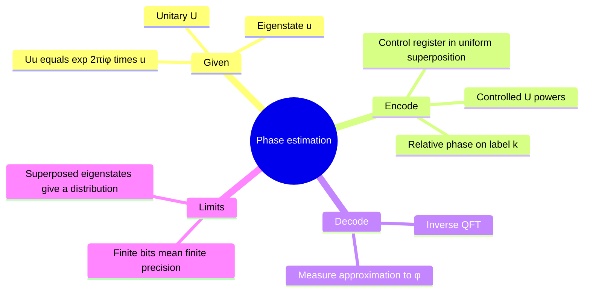
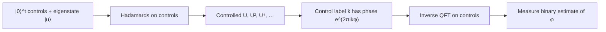

# Quantum phase estimation

## The idea in one sentence

Controlled powers of a unitary write its eigenvalue's angle into relative phases on a control register; an inverse QFT turns those phases into a readable binary number.

MIT introduces [phase estimation and its unitary eigenvalue](https://www.youtube.com/watch?v=sBKVf60-SKA&t=0s), then connects [modular multiplication to phase estimation](https://www.youtube.com/watch?v=ZL41hPcv2LE&t=0s). The exact two-bit example below is derived using the positive QFT convention of these notes.

## Exact mathematical target

Suppose $U\ket u=e^{2\pi i\phi}\ket u$, with $0\le\phi<1$. Use $t$ control qubits and $Q=2^t$. Prepare the controls in $Q^{-1/2}\sum_{k=0}^{Q-1}\ket k$. Controlled $U^{2^j}$ gates implement a controlled $U^k$ for the binary digits of $k$. Because the target is an eigenstate,

$$
\ket k\ket u\xrightarrow{\text{controlled }U^k}
e^{2\pi i k\phi}\ket k\ket u.
$$

After all controlled powers, the joint state is

$$
\left(\frac1{\sqrt Q}\sum_{k=0}^{Q-1}e^{2\pi i k\phi}\ket k\right)\ket u.
$$

If $\phi=m/Q$ for an integer $m$, the parenthesized state is exactly $F_Q\ket m$ under our **positive-exponent** convention. Thus $F_Q^\dagger$ maps it to $\ket m$, which can be measured without error in an ideal circuit. When $\phi$ lies between the $t$-bit grid points, the output is a distribution concentrated near $Q\phi$; increasing $t$ increases precision at the cost of more controlled powers.

:::example An exactly representable phase
Let $t=2$, $Q=4$, and $U\ket u=e^{2\pi i(1/4)}\ket u=i\ket u$. The control state after phase encoding is

$$
\frac12(\ket0+i\ket1-\ket2-i\ket3)=F_4\ket1.
$$

Applying $F_4^\dagger$ gives $\ket1=\ket{01}$, so the measured fraction is binary $0.01_2=1/4$. If one mistakenly uses the positive QFT to decode, the output sign reverses; an explicit convention prevents that bug.
:::

## What if the target is not an eigenstate?

Write $\ket\psi=\sum_j c_j\ket{u_j}$ in an orthonormal eigenbasis of $U$, with phases $\phi_j$. Linearity gives $\sum_j c_j\ket{\text{phase code of }\phi_j}\ket{u_j}$. Measuring the controls returns an eigenphase estimate with probability approximately $|c_j|^2$ when the codes are well separated; the target is correspondingly projected into an eigenstate component. Thus an input with no overlap with the desired eigenstate cannot reveal that eigenphase. This is central in applications to energy estimation and order finding.

## Cost and relation to factoring

The controlled powers $U^{2^j}$ must be implementable; treating them as free hides the main computational work. In order finding, $U$ can be modular multiplication by $a$ on an appropriate subspace; its eigenphases encode fractions with denominator related to the order. The [Shor note](../factoring/01-shor-order-finding.md) gives the classical denominator and gcd steps. The [QFT note](../../basic-algorithms/fourier-transform/01-qft-circuit-and-periods.md) explains phase conventions and the gate order.

:::note Source access
The MIT video links in this page identify positions in the official timed transcripts. The corresponding embedded lecture videos reported unavailable during this review; the official MIT course unit is linked under References. The worked derivations are checked independently.
:::

## Quick revision and self-check

Remember **eigenstate → controlled powers → phase ramp → inverse QFT → binary angle**. If the phase is $1/2$ and $t=2$, the output should be $10$, because $0.10_2=1/2$. If $U\ket u=\ket u$, the phase is zero and the ideal output is all zeros.
