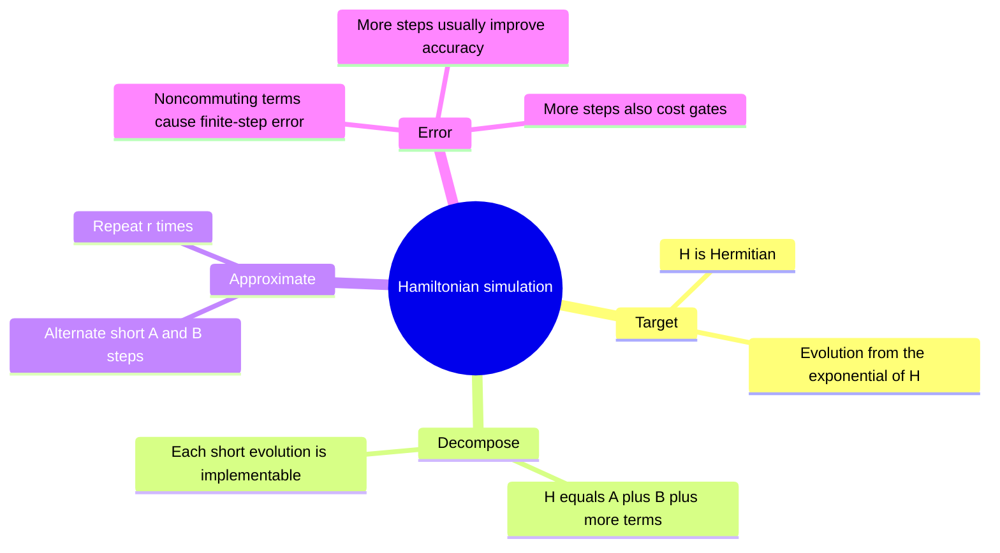
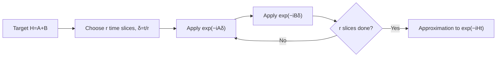

# Hamiltonian simulation and product formulas

## The idea in one sentence

If a complicated Hamiltonian is a sum of simpler pieces, a quantum computer can alternate short evolutions under those pieces to approximate evolution under the sum.

MIT frames [the simulation problem as matching a target system's dynamics](https://www.youtube.com/watch?v=ELesy5qkH3Q&t=0s) and introduces [the Lie product formula and finite-step error](https://www.youtube.com/watch?v=yldQN7uLZnY&t=0s). The algebraic example below shows exactly why noncommuting pieces make the approximation imperfect.

## From dynamics to a gate target

With $\hbar=1$ and a time-independent Hermitian Hamiltonian $H$, the Schrödinger equation $i\,d\ket\psi/dt=H\ket\psi$ has solution

$$
\ket{\psi(t)}=U(t)\ket{\psi(0)},
\qquad U(t)=e^{-iHt}.
$$

The simulation task is to implement a circuit whose action is close to $U(t)$ on relevant input states, to an explicitly chosen error tolerance. If $H=A+B$ and we can implement $e^{-iA\delta}$ and $e^{-iB\delta}$ for short times $\delta$, the first-order product formula uses $r$ slices:

$$
U_r(t)=\left(e^{-iA t/r}e^{-iB t/r}\right)^r
\longrightarrow e^{-i(A+B)t}\quad(r\to\infty).
$$

If $A$ and $B$ commute, the formula is exact already at $r=1$. If not, it is generally only approximate for finite $r$. The order of the two exponentials also matters for the leading error, although either fixed order converges as slices shrink.

## Why there is an error: a one-qubit example

Take $A=X$ and $B=Z$. Both are Hermitian and easy to exponentiate separately, but

$$
[X,Z]=XZ-ZX=-2iY\neq0.
$$

Expand a single short step with $\delta=t/r$:

$$
e^{-iX\delta}e^{-iZ\delta}
=I-i(X+Z)\delta-\left(I+XZ\right)\delta^2+O(\delta^3),
$$

whereas

$$
e^{-i(X+Z)\delta}
=I-i(X+Z)\delta-\left(I+\tfrac12(XZ+ZX)\right)\delta^2+O(\delta^3).
$$

Subtracting shows a leading difference $-\tfrac12[X,Z]\delta^2=iY\delta^2$. The $r$ slices accumulate an error on the order of $t^2/r$ for bounded fixed $X$ and $Z$. More generally, a norm error bound depends on commutators, term norms, time, and the chosen formula; a bare $O(t^2/r)$ is not a universal constant for arbitrary many-body Hamiltonians.

:::example Check commutation and a special case
If instead $A=Z$ and $B=2Z$, then $[A,B]=0$ and $e^{-iA\delta}e^{-iB\delta}=e^{-i3Z\delta}$ exactly. Repeating $r$ times gives $e^{-i3Zt}$. The contrast with $X+Z$ isolates the source of first-order product error: noncommutation.
:::

## Accuracy versus circuit cost

Larger $r$ makes each piece shorter, reducing discretization error, but multiplies the number of gate blocks. More sophisticated symmetric or higher-order formulas can cancel leading error terms; they may cost more gates per slice. There are other simulation methods, so Trotterization is one tool rather than the definition of quantum simulation. Physical gate errors can also accumulate as $r$ grows, so “more slices” is not automatically better on noisy hardware. [Schrödinger dynamics](../../foundations/dynamics/02-schrodinger-equation.md) provides the mathematical starting point. [VQE](../variational/01-vqe-energy-minimization.md) asks a different question: estimate a low energy instead of implementing full time evolution.

:::note Source access
The MIT video links in this page identify positions in the official timed transcripts. The corresponding embedded lecture videos reported unavailable during this review; the official MIT course unit is linked under References. The worked derivations are checked independently.
:::

## Quick revision and self-check

Remember **decompose $H$ → short evolutions → repeat → bound error**. Why is one finite $X$ step followed by one $Z$ step not exactly an $X+Z$ step? $X$ and $Z$ do not commute; their order leaves a commutator term. What changes if $t=0$? Every exponential is $I$, so the formula is exact.
