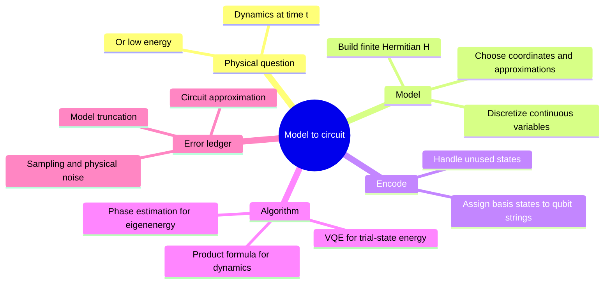
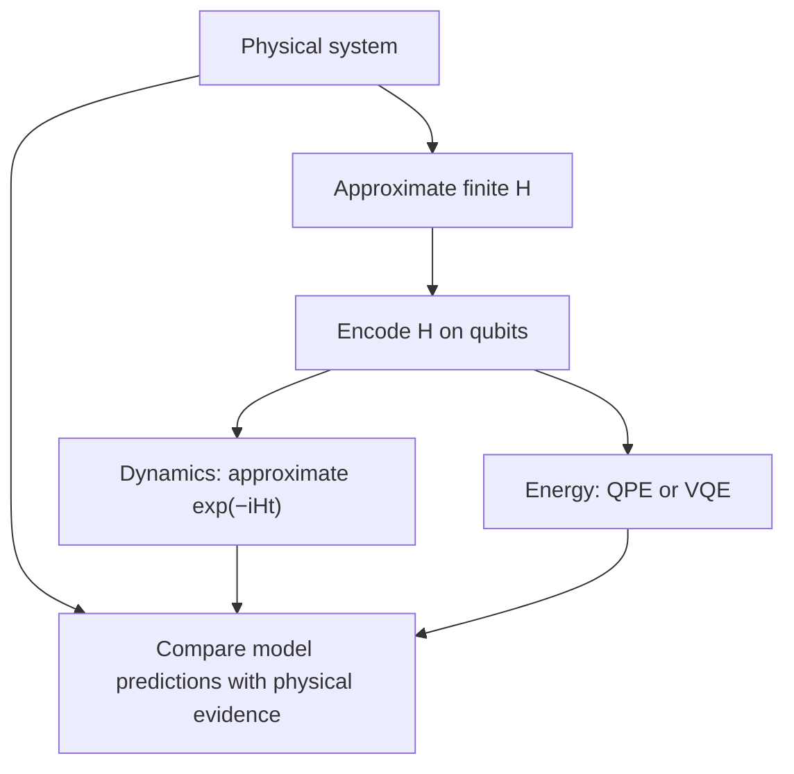

# From physical model to qubit Hamiltonian

## The idea in one sentence

Before a quantum algorithm can simulate nature, we must choose a finite model, encode it on qubits, and separate **model error** from **algorithm error**.

MIT uses [a particle in a one-dimensional potential to introduce discretization](https://www.youtube.com/watch?v=AcojbgWaMDM&t=0s), then contrasts [phase estimation and VQE for approximate energies](https://www.youtube.com/watch?v=8GseS9h6iC0&t=0s). The little matrix below is an original numerical illustration of the modeling step.

## Step 1: choose a mathematical model

A one-dimensional particle can be modeled by $H=p^2/(2m)+V(x)$, with $p=-i\,d/dx$ and $\hbar=1$. Position is continuous, so a finite register cannot represent every $x$ exactly. Choose grid points $x_j$ separated by $\Delta x$ and approximate the second derivative:

$$
\frac{d^2\psi}{dx^2}(x_j)
\approx\frac{\psi_{j+1}-2\psi_j+\psi_{j-1}}{(\Delta x)^2}.
$$

This gives a finite Hamiltonian matrix with diagonal entries $H_{jj}=1/[m(\Delta x)^2]+V_j$ and nearest-neighbor entries $H_{j,j\pm1}=-1/[2m(\Delta x)^2]$, for interior points with chosen boundary conditions. The matrix is Hermitian, as an energy operator must be.

:::example Three grid points
Set $m=1$, $\Delta x=1$, fixed-zero boundary amplitudes outside the grid, and potentials $(V_0,V_1,V_2)=(0,1,0)$. The grid Hamiltonian is

$$
H_{\rm grid}=\begin{pmatrix}
1&-1/2&0\\
-1/2&2&-1/2\\
0&-1/2&1
\end{pmatrix}.
$$

The off-diagonal terms allow amplitude to move between neighboring positions. Three basis states require two qubits because $2^1<3\le2^2$; one computational state, for example $\ket{11}$, is unused and must be handled consistently by the encoded circuit. A finer grid changes the approximation to the original continuous problem; it is not merely a larger circuit for the identical finite model.
:::

## Step 2: decide which question the circuit should answer

For **dynamics**, approximate $e^{-iHt}\ket\psi$ and ask how observables change over time. A product formula can alternate implementable terms, as in [Hamiltonian simulation](01-hamiltonian-simulation-and-trotter.md). For **energy**, one option is [phase estimation](../phase-estimation/01-phase-estimation.md) applied to $U=e^{-iH\tau}$: if $H\ket{E_j}=E_j\ket{E_j}$, then $U\ket{E_j}=e^{-iE_j\tau}\ket{E_j}$. The phase gives energy modulo $2\pi/\tau$, so the range and sign convention must be chosen to avoid ambiguity. It also requires an input state with overlap on the desired eigenstate and controlled implementations of $U$.

The other approach is [VQE](../variational/01-vqe-energy-minimization.md): prepare a trial state and measure $\langle H\rangle$, then adjust parameters. It avoids deep controlled-power circuits but introduces an optimization and measurement problem. Neither method repairs a poor physical model; if the discretized or truncated $H$ omits essential interactions, an exact solution of that $H$ may still answer the wrong physical question.

## Keep an error ledger

Distinguish errors from discretization/basis truncation, Hamiltonian parameter estimation, circuit approximation (such as finite Trotter steps), finite-shot statistics, and physical gate noise. They behave differently: adding Trotter steps can reduce one mathematical error while increasing gate exposure, and adding grid points reduces some model errors while increasing qubit and gate demands. A good result reports which model was simulated and to what precision.

:::note Source access
The MIT video links in this page identify positions in the official timed transcripts. The corresponding embedded lecture videos reported unavailable during this review; the official MIT course unit is linked under References. The worked derivations are checked independently.
:::

## Quick revision and self-check

Remember **model → discretize → encode → choose dynamics or energy → track errors**. Why can two qubits hold three grid positions? They offer four orthogonal computational basis states, one of which can remain unused.
