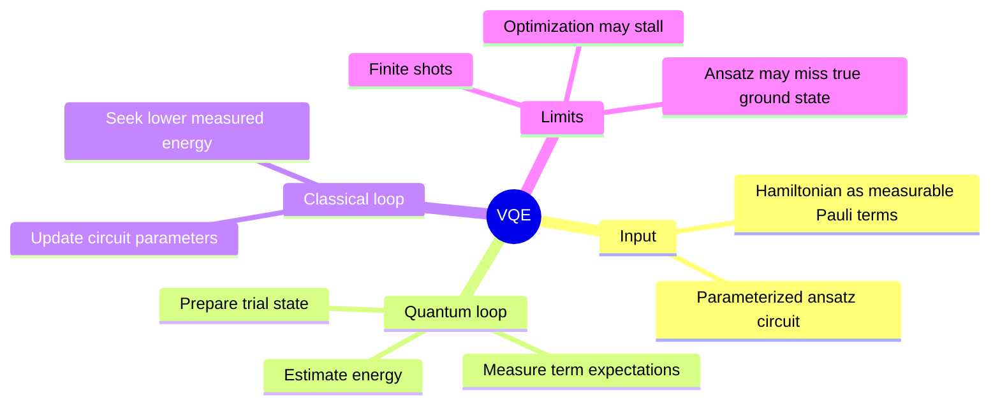
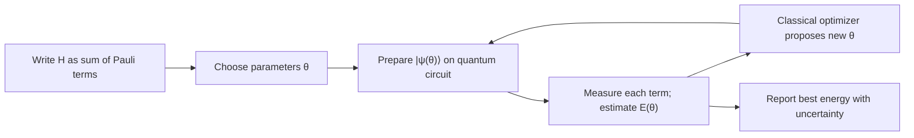

# Variational quantum eigensolver

## The idea in one sentence

A parameterized circuit proposes a trial state, a quantum device estimates its energy, and a classical optimizer adjusts the parameters to seek a low-energy state.

MIT introduces [VQE as an approach to quantum chemistry](https://www.youtube.com/watch?v=qx-n8I8MUto&t=30s). It follows the course's [Hamiltonian simulation discussion](https://www.youtube.com/watch?v=yldQN7uLZnY&t=0s), but VQE targets an energy rather than full time evolution. The one-qubit example below is a self-contained teaching model, not a chemistry calculation.

## The variational guarantee

Let $H$ be Hermitian with ground energy $E_0$. For any normalized state $\ket{\psi(\boldsymbol\theta)}$, the variational principle gives

$$
E(\boldsymbol\theta)
=\bra{\psi(\boldsymbol\theta)}H\ket{\psi(\boldsymbol\theta)}
\ge E_0.
$$

The inequality is exact for an exact expectation value. A finite-shot *estimate* of $E$ can fluctuate below $E_0$ due to sampling error, so measured values are not rigorous upper bounds without uncertainty treatment. If $H=\sum_j h_jP_j$ is a sum of Pauli strings, estimate each $\langle P_j\rangle$ from appropriate measurement bases and add $E=\sum_j h_j\langle P_j\rangle$.

## A complete one-qubit calculation

Take $H=Z+X$, whose matrix is $\begin{pmatrix}1&1\\1&-1\end{pmatrix}$. Its eigenvalues solve $\lambda^2-2=0$, so the true ground energy is $E_0=-\sqrt2$. Choose the trial circuit $\ket{\psi(\theta)}=R_y(\theta)\ket0=\cos(\theta/2)\ket0+\sin(\theta/2)\ket1$. Direct calculation gives

$$
\langle Z\rangle_\theta=\cos\theta,
\qquad
\langle X\rangle_\theta=\sin\theta,
\qquad
E(\theta)=\cos\theta+\sin\theta.
$$

The energy landscape is $E(\theta)=\sqrt2\cos(\theta-\pi/4)$. Its minimum is $-\sqrt2$ at $\theta=5\pi/4$ modulo $2\pi$, so this simple ansatz can reach the exact ground state. The corresponding state has amplitudes $\cos(5\pi/8)$ and $\sin(5\pi/8)$; their squares add to one.

| $\theta$ | $\langle Z\rangle$ | $\langle X\rangle$ | $E$ |
| --- | ---: | ---: | ---: |
| $0$ | $1$ | $0$ | $1$ |
| $\pi/2$ | $0$ | $1$ | $1$ |
| $\pi$ | $-1$ | $0$ | $-1$ |
| $5\pi/4$ | $-1/\sqrt2$ | $-1/\sqrt2$ | $-\sqrt2$ |

To estimate $\langle Z\rangle$, measure directly in the computational basis and map outcome 0 to $+1$, outcome 1 to $-1$. To estimate $\langle X\rangle$, apply $H$ before that measurement (or measure in the $X$ basis). These require separate measurement settings on fresh preparations of the trial state.

## Why a realistic VQE problem is harder

An ansatz with too few or badly chosen parameters may never represent the ground state; then its minimum exceeds $E_0$. Finite samples add statistical noise, circuit errors can bias measurements, and the classical search can stall in local or flat regions. The number of Pauli terms and precision requirements can make measurements costly. Therefore VQE is a useful framework to study, but it is **not** a guarantee that a short noisy circuit efficiently solves every chemistry problem.

:::note Source access
The MIT video links in this page identify positions in the official timed transcripts. The corresponding embedded lecture videos reported unavailable during this review; the official MIT course unit is linked under References. The worked derivations are checked independently.
:::

## Quick revision and self-check

Remember **trial circuit → Pauli measurements → energy → parameter update**. Why is $\theta=\pi$ not optimal for $H=X+Z$? It gives energy $-1$, while $5\pi/4$ gives $-\sqrt2<-1$. Why may a finite-shot estimate fall below the exact ground energy? The estimate is noisy even though the true trial-state expectation obeys the variational bound.
