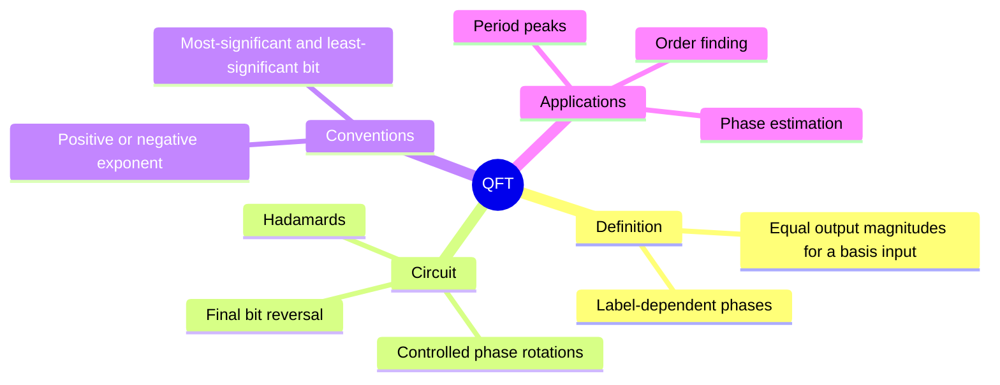
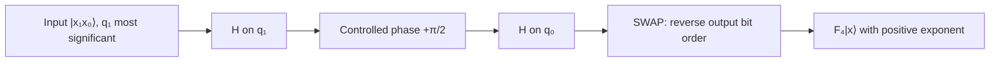
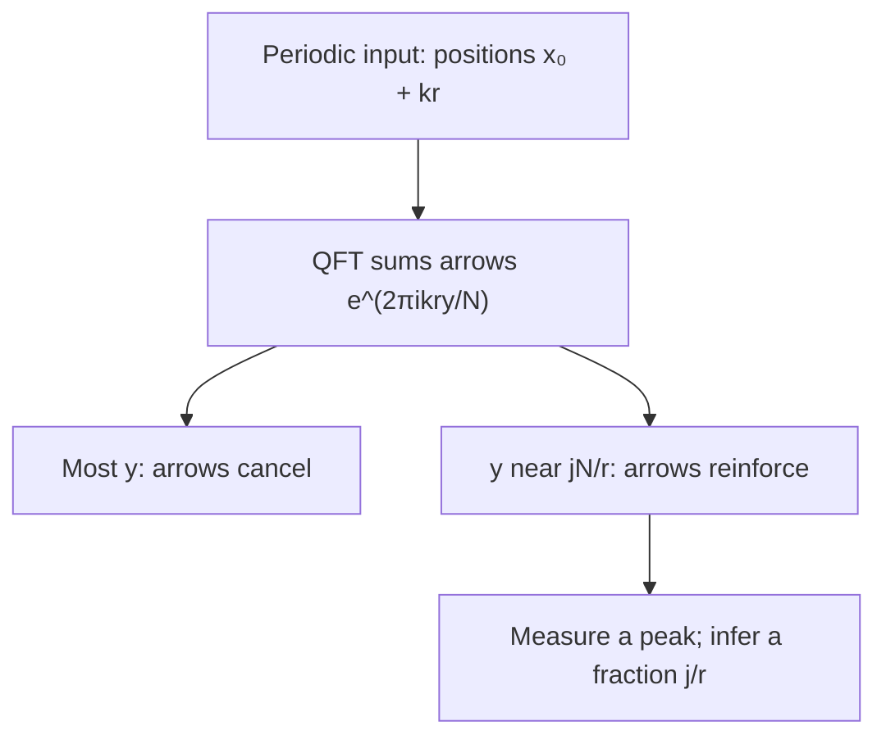

# The QFT circuit and period peaks

## The idea in one sentence

The QFT changes a register from **number labels** to **phase-frequency labels**; structured periodic inputs then interfere into informative output peaks.

This continues the [Foundations QFT note](../../foundations/mathematics/04-discrete-and-quantum-fourier-transform.md). MIT's [two-qubit matrix and gate discussion](https://www.youtube.com/watch?v=gy9SSYSfOl4&t=0s) uses a **negative-exponent** convention, while our Foundations note uses a positive exponent. I inspected sampled frames of the archived playlist QFT lecture showing [small-register phase examples around 15:00](https://www.youtube.com/watch?v=HwOAeEE_cx4&t=900s) and [output swaps around 30:00](https://www.youtube.com/watch?v=HwOAeEE_cx4&t=1800s). Its timed captions were unavailable, so the algebra below is checked independently rather than inferred from speech.

## Fix the convention before touching a circuit

Here $N=2^n$, $x,y\in\{0,\ldots,N-1\}$, and **we use positive exponent**:

$$
F_N\ket x=\frac1{\sqrt N}\sum_{y=0}^{N-1}
e^{2\pi ixy/N}\ket y.
$$

The inverse is $F_N^\dagger$ and uses a negative exponent. Some lectures call that negative-exponent operator “the QFT”; it is a naming choice. Comparing formulas requires checking the sign, not just the word *QFT*. For $N=4$,

$$
F_4=\frac12
\begin{pmatrix}
1&1&1&1\\
1&i&-1&-i\\
1&-1&1&-1\\
1&-i&-1&i
\end{pmatrix}.
$$

Each column has norm one and columns are orthogonal by cancellation of roots of unity. For $x=1$, the output is $(\ket{00}+i\ket{01}-\ket{10}-i\ket{11})/2$. Every computational output is equally likely, so the **phase relations** carry the useful information. A lone measurement of this basis-input output cannot recover $x$.

## Build $F_4$ gate by gate

Let $\ket{x_1x_0}$ have value $2x_1+x_0$; $x_1$ is the most significant bit. Define $CP(\phi)=\operatorname{diag}(1,1,1,e^{i\phi})$. For this positive-exponent convention, one circuit is:

1. Apply $H$ to the first wire $q_1$.
2. Apply $CP(\pi/2)$ between $q_1$ and $q_0$.
3. Apply $H$ to the second wire $q_0$.
4. Swap the wires at the end.

:::example Check the entire circuit on $\ket{01}$
The first Hadamard gives $(\ket{01}+\ket{11})/\sqrt2$. The controlled phase changes only $\ket{11}$, giving $(\ket{01}+i\ket{11})/\sqrt2$. Hadamard on $q_0$ gives

$$
\tfrac12(\ket{00}-\ket{01}+i\ket{10}-i\ket{11}).
$$

The final SWAP changes $01\leftrightarrow10$ and yields

$$
\tfrac12(\ket{00}+i\ket{01}-\ket{10}-i\ket{11})=F_4\ket{01}.
$$

If you omit the final SWAP, you obtain the QFT output with its **bits reversed**, a very common source of apparent disagreement.
:::

## Why an input period becomes output peaks

Suppose, for an especially clean case, $r$ divides $N$ and the input is uniform over one arithmetic progression $x_0,x_0+r,\ldots,x_0+(L-1)r$ where $L=N/r$:

$$
\ket{P_{x_0,r}}=\frac1{\sqrt L}\sum_{k=0}^{L-1}\ket{x_0+kr}.
$$

At output label $y$, the QFT amplitude is

$$
A_y=\frac{e^{2\pi i x_0y/N}}{\sqrt{LN}}
\sum_{k=0}^{L-1}e^{2\pi i kry/N}.
$$

The final sum contains phase arrows spaced by angle $2\pi ry/N$. Usually they wrap around the circle and cancel. When $ry/N$ is an integer, every arrow points together: output peaks occur at $y=jN/r$, $j=0,\ldots,r-1$. If $r$ does not divide $N$, finite-width peaks occur *near* these positions; [Shor's order-finding note](../../advanced-algorithms/factoring/01-shor-order-finding.md) handles that case.

:::example Period two on a four-state register
Take $N=4$, $r=2$, $x_0=0$: $\ket P=(\ket0+\ket2)/\sqrt2$. Applying $F_4$ gives $(\ket0+\ket2)/\sqrt2$. Only $y=0,2$ occur, exactly $jN/r$ for $j=0,1$. The output phases are trivial in this example; for $x_0=1$ the peaks stay at $0,2$ but their relative phase changes.
:::

## Approximate QFT and checks

In an $n$-qubit QFT, rotations between distant wires have progressively small angles. MIT discusses [omitting sufficiently small rotations](https://www.youtube.com/watch?v=Ynib2sJi60o&t=30s) when a whole algorithm tolerates phase error. That produces an **approximation**, not an exact identity; the needed cutoff depends on the error budget of the application. Always test $N=2$ ($F_2=H$), $x=0$ (uniform plus state), sign convention, and output bit reversal.

:::note Source access
The MIT video links in this page identify positions in the official timed transcripts. The corresponding embedded lecture videos reported unavailable during this review; the official MIT course unit is linked under References. The worked derivations are checked independently.
:::

## Quick revision

Remember **phase definition → controlled rotations → swap order → period peaks**. QFT on a basis input is a phase pattern; QFT on a periodic *superposition* can produce peaked measurement probabilities. The distinction is central.
