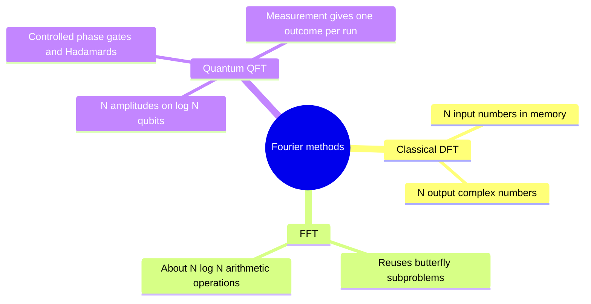
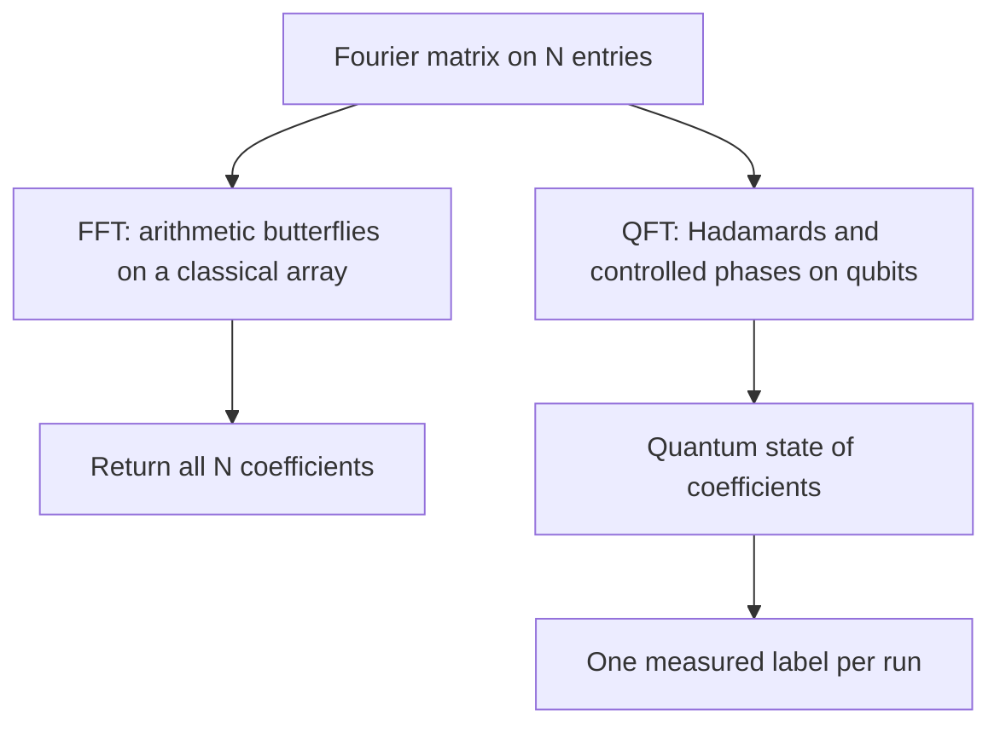

# QFT versus classical FFT

## The idea in one sentence

The classical FFT and quantum Fourier transform organize the same roots-of-unity phase pattern, but they solve different **input and output tasks**.

MIT explicitly compares [Cooley–Tukey butterflies, Hadamards, and phase factors](https://www.youtube.com/watch?v=PX2TGw81PZY&t=0s). This note prevents a common misleading inference from the QFT gate count.

## The shared mathematical transform

For a vector of $N$ complex numbers $a_x$, choose the positive-exponent normalized DFT convention

$$
b_y=\frac1{\sqrt N}\sum_{x=0}^{N-1}e^{2\pi ixy/N}a_x.
$$

A quantum register with state $\sum_x a_x\ket x$ changes to $\sum_y b_y\ket y$ under $F_N$. The **matrix** is the same. The difference is how the input is available and what kind of output can be accessed. In a classical FFT, the whole array $(a_0,\ldots,a_{N-1})$ is provided and the whole output array is produced. In a QFT circuit, amplitudes belong to a normalized quantum state and cannot generally be read one by one from a single copy.

## Why the circuit resembles a butterfly

The two-number normalized butterfly is

$$
\binom{a'}{b'}
=\frac1{\sqrt2}
\begin{pmatrix}1&1\\1&-1\end{pmatrix}
\binom a b.
$$

The matrix is exactly the Hadamard gate. Cooley–Tukey also multiplies some branches by roots of unity, called **twiddle factors**; the QFT circuit realizes corresponding phases with controlled rotations. Both methods exploit factorization of a large Fourier matrix into simpler stages. The analogy is structural, not a claim that one output interface substitutes for the other.

## Compare costs without changing the question

For $N=2^n$, a standard classical FFT computes all $N$ coefficients in $O(N\log N)$ arithmetic steps. A standard QFT circuit uses $O(n^2)$ one- and two-qubit gates, or fewer in certain approximate forms. This apparent exponential gap does **not** mean the QFT is a drop-in replacement for computing all $N$ classical coefficients: loading an arbitrary classical array into amplitudes can itself be costly, and measuring does not reveal the whole transformed array. QFT is especially powerful when an algorithm needs only a **sample** or interference statistic, as in [period finding](../../advanced-algorithms/factoring/01-shor-order-finding.md) and [phase estimation](../../advanced-algorithms/phase-estimation/01-phase-estimation.md).

:::example A measurement limit with $F_4\ket1$
The output is $(\ket0+i\ket1-\ket2-i\ket3)/2$. A computational-basis measurement returns any one label with probability $1/4$. The relative signs and $i$ phases are real features of the state, but a single such measurement gives no table of four complex coefficients. Repeated state preparations and varied measurements can estimate amplitudes, at a cost absent from the bare QFT gate count.
:::

:::note Source access
The MIT video links in this page identify positions in the official timed transcripts. The corresponding embedded lecture videos reported unavailable during this review; the official MIT course unit is linked under References. The worked derivations are checked independently.
:::

## Quick revision and self-check

Remember **same Fourier structure, different accessible output**. Why can a QFT circuit have far fewer gates than an FFT has arithmetic operations without giving a complete classical DFT table quickly? Its output is a quantum state, and extracting all coefficients is a separate task.
