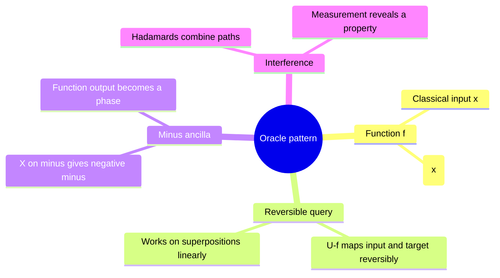

# Quantum parallelism and phase kickback

## The idea in one sentence

A reversible oracle can evaluate $f$ on a superposition, but the useful trick is to arrange for its outputs to become **relative phases** that later interfere.

MIT contrasts [XOR and phase oracles](https://www.youtube.com/watch?v=Bzve_L3yh1U&t=0s); the playlist introduces [parallelism and phase kickback](https://www.youtube.com/watch?v=DnUHyAPqBCU&t=16s). The equations below fix the often-confused ancilla convention.

## Why an oracle needs a target register

For a Boolean function $f:\{0,1\}^n\to\{0,1\}$, the standard reversible oracle is

$$
U_f\ket{x}\ket y=\ket{x}\ket{y\oplus f(x)}.
$$

Here $\oplus$ is addition modulo two. The map is reversible because applying $U_f$ twice restores $y$: $(y\oplus f(x))\oplus f(x)=y$. In particular, a non-injective classical map $x\mapsto f(x)$ cannot by itself be a unitary transformation of just the input register. The extra target stores the answer without erasing $x$.

Prepare an equal superposition of the inputs and a target $\ket0$:

$$
(H^{\otimes n}\ket{0^n})\ket0
=\frac1{\sqrt{2^n}}\sum_x\ket x\ket0
\xrightarrow{U_f}\frac1{\sqrt{2^n}}\sum_x\ket x\ket{f(x)}.
$$

This is “quantum parallelism,” but a computational-basis measurement yields just one random pair $(x,f(x))$. It does **not** print the truth table. An algorithm must make the branches interfere so a useful global property becomes likely or certain.

## Turn an answer bit into a phase

Use the target $\ket-=(\ket0-\ket1)/\sqrt2$. Since $X\ket-=-\ket-$,

$$
U_f\ket x\ket-
=\ket x\frac{\ket{f(x)}-\ket{1\oplus f(x)}}{\sqrt2}
=(-1)^{f(x)}\ket x\ket-.
$$

The target returns to $\ket-$, so we can suppress it and describe an effective phase oracle $O_f\ket x=(-1)^{f(x)}\ket x$. That phase is **relative** across a superposition. For a single fixed $x$, a global factor $-1$ is not observable; comparing paths after more gates is where it matters.

:::example A two-input parity oracle
Let $f(x_1x_0)=x_1\oplus x_0$. In order $00,01,10,11$, the truth table is $0,1,1,0$. After the phase query, the input register is

$$
\frac12(\ket{00}-\ket{01}-\ket{10}+\ket{11})
=\ket-\otimes\ket-.
$$

Another $H\otimes H$ maps $\ket-\ket-$ to $\ket{11}$ with probability one. One oracle use has revealed a **structured property** of this function, not its four independent output bits. This same calculation is the core of Deutsch–Jozsa and Bernstein–Vazirani.
:::

## Know what is counted

An **oracle query** counts one use of $U_f$ or an equivalent phase oracle. It does not include the cost of constructing $U_f$, preparing a superposition, error correction, or reading out. Query speedups are meaningful for a stated black-box promise; applying them to a real problem also requires an efficient oracle implementation. For a more physical gate view, revisit [reversible classical computation](../../foundations/gates-and-circuits/03-reversible-classical-computation.md).

:::note Source access
The MIT video links in this page identify positions in the official timed transcripts. The corresponding embedded lecture videos reported unavailable during this review; the official MIT course unit is linked under References. The worked derivations are checked independently.
:::

## Quick revision and self-check

Think **XOR oracle → minus target → sign on each input path → recombine**. If the target is $\ket+ $, what happens? Because $X\ket+=\ket+$, no $f$-dependent phase appears. If $f$ is constant one, every input gets the same $-1$ global phase; alone this reveals nothing.
