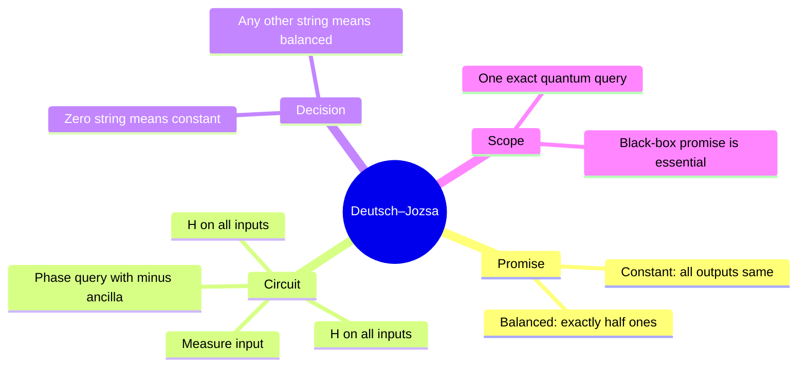
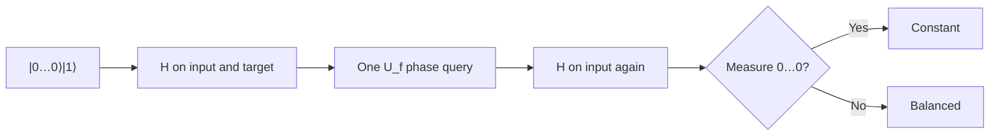

# Deutsch and Deutsch–Jozsa

## The idea in one sentence

A final Hadamard test adds all oracle phases together; for a promised function, the all-zero result distinguishes **constant** from **balanced** with one exact quantum query.

MIT states the [constant-versus-balanced test](https://www.youtube.com/watch?v=1720IWZA0dE&t=87s). The playlist treats [Deutsch's one-bit case](https://www.youtube.com/watch?v=QCYI22olL40&t=18s) and then [the $n$-bit extension](https://www.youtube.com/watch?v=Wpl3ERQ8EuA&t=40s).

## Start with the promise

The input has $n$ bits, so $N=2^n$ possible $x$. We are **promised** that either $f(x)$ is the same for all $x$ or exactly $N/2$ values are zero and $N/2$ are one. Functions between these cases are outside the problem. Prepare $\ket{0^n}\ket1$, apply Hadamards to every qubit, query $U_f$, then apply Hadamards to the input again. The target after the first Hadamard is $\ket-$.

After the oracle, the input has amplitudes $(-1)^{f(x)}/\sqrt N$. Because $\langle 0^n|H^{\otimes n}|x\rangle=1/\sqrt N$, the final amplitude of $\ket{0^n}$ is

$$
A_{0^n}=\frac1N\sum_{x\in\{0,1\}^n}(-1)^{f(x)}.
$$

For constant zero the sum is $N$, so $A_{0^n}=1$; for constant one it is $-N$, so $A_{0^n}=-1$ (same measurement). For a balanced function there are equally many $+1$ and $-1$ terms, so $A_{0^n}=0$. One measurement therefore gives the promised answer with certainty. It does **not** tell us the entire function or which inputs yield one.

## Deutsch's original one-bit case

With $n=1$, the four Boolean truth tables are $00,11$ (constant) and $01,10$ (balanced), where the two digits are $f(0)f(1)$. The final input amplitudes are

$$
A_0=\frac{(-1)^{f(0)}+(-1)^{f(1)}}2,
\qquad
A_1=\frac{(-1)^{f(0)}-(-1)^{f(1)}}2.
$$

Equal outputs make $A_1=0$; different outputs make $A_0=0$. This is the smallest example of using interference to test a global property.

:::example Two-bit balanced parity
Let $f(x_1x_0)=x_1\oplus x_0$. The outputs in order $00,01,10,11$ are $0,1,1,0$, so it is balanced. The phase query makes $(\ket{00}-\ket{01}-\ket{10}+\ket{11})/2=\ket-\ket-$. Final Hadamards produce $\ket{11}$, a nonzero result, and we answer “balanced.” Here the full output happens to identify parity, but the decision rule only requires **nonzero**.
:::

## Compare the right query models

An exact deterministic classical algorithm may need $2^{n-1}+1$ oracle values in the worst case: after seeing $2^{n-1}$ identical results it still cannot exclude a balanced function. Deutsch–Jozsa uses one quantum oracle query and is exact. A **randomized bounded-error** classical algorithm can sample a few inputs and often identify the case quickly, so do not claim an exponential advantage over every classical notion of efficiency. The comparison also assumes access to the oracle as a black box; building the oracle may dominate a real application.

:::note Source access
The MIT video links in this page identify positions in the official timed transcripts. The corresponding embedded lecture videos reported unavailable during this review; the official MIT course unit is linked under References. The worked derivations are checked independently.
:::

## Quick revision and self-check

Remember **promise → equal phase sum or cancellation → check $0^n$**. If a function on four inputs outputs $0,0,0,1$, the Deutsch–Jozsa guarantee does not apply. For constant-one $f$, why is the answer still constant? The entire register gains one global minus sign, leaving measurement at $0^n$ certain. The phase mechanism is developed in [phase kickback](01-phase-kickback-and-oracles.md).
