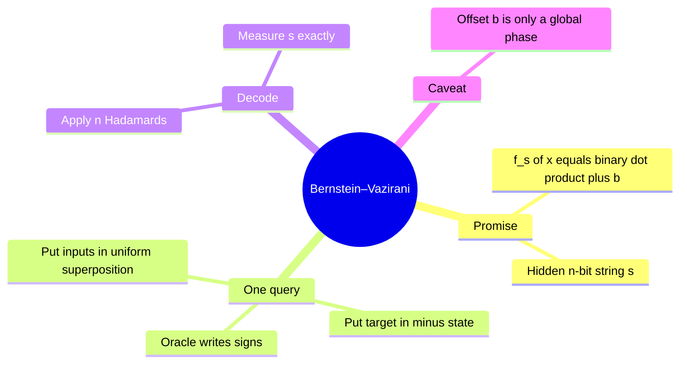
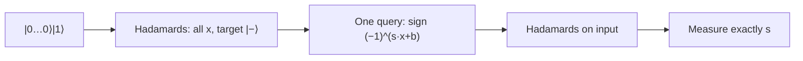

# Bernstein–Vazirani

## The idea in one sentence

If a black box computes a hidden binary dot product, one phase query plus Hadamards converts the hidden string directly into a measurable basis label.

The playlist introduces the [hidden-string problem](https://www.youtube.com/watch?v=pAeed0DVqTY&t=23s). MIT's [oracle discussion](https://www.youtube.com/watch?v=Bzve_L3yh1U&t=0s) supplies the phase-oracle background; the derivation and example below are independent.

## The precise promise

Let $s=s_1\cdots s_n$ be unknown. The oracle promises

$$
f_{s,b}(x)=s\cdot x\oplus b
=\bigoplus_{j=1}^n s_jx_j\oplus b,
\quad x\in\{0,1\}^n.
$$

Every product and sum here is in $\mathbb F_2$. If $b=0$, a classical deterministic strategy learns each $s_j$ by querying the unit vector $e_j$, requiring $n$ queries. If $b$ is also unknown, query $x=0^n$ once to learn it, then $n$ unit vectors to learn $s$. The quantum circuit learns **$s$** in one query regardless of $b$; that one query does not reveal $b$ because it becomes a global phase.

## Derive the hidden string output

Start with $\ket{0^n}\ket1$, apply Hadamards, use the XOR oracle with target $\ket-$, then apply input Hadamards again:

$$
\frac1{\sqrt{2^n}}\sum_x\ket x\ket-
\xrightarrow{U_f}
\frac{(-1)^b}{\sqrt{2^n}}\sum_x(-1)^{s\cdot x}\ket x\ket-.
$$

The input sum factors bit by bit:

$$
\frac1{\sqrt{2^n}}\sum_x(-1)^{s\cdot x}\ket x
=\bigotimes_{j=1}^n\frac{\ket0+(-1)^{s_j}\ket1}{\sqrt2}
=H^{\otimes n}\ket s.
$$

One more $H^{\otimes n}$ gives $(-1)^b\ket s\ket-$. Thus measuring the input returns exactly the $n$-bit string $s$. The offset $b$ multiplies the whole state by $(-1)^b$ and is invisible to measurement.

:::example Four-bit hidden string
Take $s=1011$ and $b=1$. The oracle outputs $f(x)=x_1\oplus x_3\oplus x_4\oplus1$ if we number bits left to right. The phase state factors as

$$
(-1)^b\ket-\otimes\ket+\otimes\ket-\otimes\ket-.
$$

Hadamards map these four factors to $\ket1\ket0\ket1\ket1$, so the result is $1011$ with probability one. To learn $b$, make a separate query on $x=0000$ with target $\ket0$: its output is $b=1$.
:::

## What this teaches beyond the exercise

The final Hadamards are a Fourier transform over binary strings. They distinguish the phase characters $(-1)^{s\cdot x}$. [Deutsch–Jozsa](02-deutsch-and-deutsch-jozsa.md) checks only whether the zero-frequency coefficient vanishes; Bernstein–Vazirani identifies which linear character is present. [Simon](04-simon-hidden-xor-period.md) uses a related transform to collect equations about a hidden period.

:::note Source access
The MIT video links in this page identify positions in the official timed transcripts. The corresponding embedded lecture videos reported unavailable during this review; the official MIT course unit is linked under References. The worked derivations are checked independently.
:::

## Quick revision and self-check

Remember **dot product in the oracle → product of plus/minus states → read $s$**. If $s=0000$, the input returns $0000$ even if $b=1$. The one-query result is a query-complexity statement under the hidden-linear-function promise, not a claim that every classical computation of the oracle is free.
