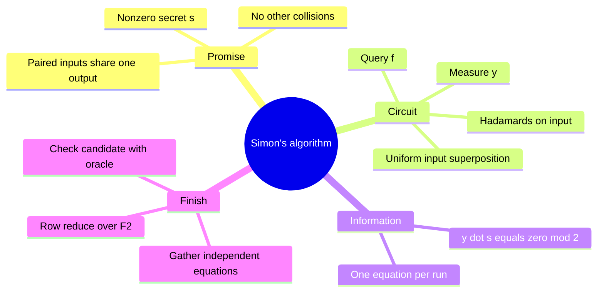

# Simon's hidden XOR period

## The idea in one sentence

One oracle query yields a **random linear equation** satisfied by the hidden period; repeat until enough equations determine that period.

MIT lays out the [four-step circuit](https://www.youtube.com/watch?v=4Yp5IiK0kDQ&t=0s) and then [solves the binary equations](https://www.youtube.com/watch?v=IAbvZhJrDe0&t=0s). The playlist gives the [two-to-one promise](https://www.youtube.com/watch?v=2LZEcZriQTo&t=54s) and [small examples](https://www.youtube.com/watch?v=FJCybKA6ZLE&t=8s).

## State the collision promise exactly

For an unknown $s\in\{0,1\}^n$ with $s\neq0^n$, Simon's oracle obeys

$$
f(x)=f(x')\quad\Longleftrightarrow\quad x'=x\ \text{or}\ x'=x\oplus s.
$$

Every output has exactly two preimages, separated by the same XOR string $s$. The “if” direction alone is not enough: extra collisions would change the analysis. The goal is to find $s$, using the oracle as a black box. Arithmetic is over $\mathbb F_2$, so $1+1=0$.

## Why measuring gives $y\cdot s=0$

Prepare $\ket{0^n}\ket0$, apply $H^{\otimes n}$ to the first register and query the reversible oracle:

$$
\frac1{\sqrt{2^n}}\sum_x\ket x\ket{f(x)}.
$$

If we measure the output register and see $f(x_0)$, the input collapses to $(\ket{x_0}+\ket{x_0\oplus s})/\sqrt2$. Measuring that output is a useful way to explain the circuit; it is optional in an implementation because ignoring the output gives the same input statistics. Now apply $H^{\otimes n}$ to the input. The amplitude for $y$ is proportional to

$$
(-1)^{x_0\cdot y}+(-1)^{(x_0\oplus s)\cdot y}
=(-1)^{x_0\cdot y}\left[1+(-1)^{s\cdot y}\right].
$$

If $s\cdot y=1$, the two paths cancel exactly. If $s\cdot y=0$, they reinforce. The outcome is uniform over the $2^{n-1}$ strings orthogonal to $s$. Thus every run supplies one equation

$$
y_1s_1\oplus\cdots\oplus y_ns_n=0.
$$

:::example Solve a three-bit secret
Suppose $s=110$. A valid oracle has four collision pairs: $(000,110)$, $(001,111)$, $(010,100)$, $(011,101)$, each pair assigned a distinct output. The allowed measurement strings satisfy $y_1\oplus y_2=0$, so they are $000,001,110,111$.

Imagine we sample the independent rows $y^{(1)}=001$ and $y^{(2)}=110$. The equations are $s_3=0$ and $s_1\oplus s_2=0$. Their solution space is $\{000,110\}$. The nonzero-promise leaves $s=110$. Check with the oracle: $f(000)=f(110)$.
:::

## How many queries, and what can go wrong?

Repeated samples may be dependent, including $y=0^n$, so one does not get exactly one new independent row every time. Nevertheless, $O(n)$ samples/queries suffice with high probability for enough independent equations. Classically, finding a collision for a random promised oracle requires on the order of $2^{n/2}$ queries; this is an **oracle query** separation, with the promise and black-box model explicit. The output register must be large enough to label $2^{n-1}$ distinct pairs. After solving, verify the candidate with a fresh oracle equality check if the source or apparatus might violate the promise.

:::note Source access
The MIT video links in this page identify positions in the official timed transcripts. The corresponding embedded lecture videos reported unavailable during this review; the official MIT course unit is linked under References. The worked derivations are checked independently.
:::

## Quick revision and self-check

Remember **paired inputs → cancelling phases → orthogonal $y$ → solve binary equations**. For $s=101$, can $y=100$ occur? No: $100\cdot101=1$. Can $y=010$ occur? Yes. Compare the simpler character recovery in [Bernstein–Vazirani](03-bernstein-vazirani.md).
