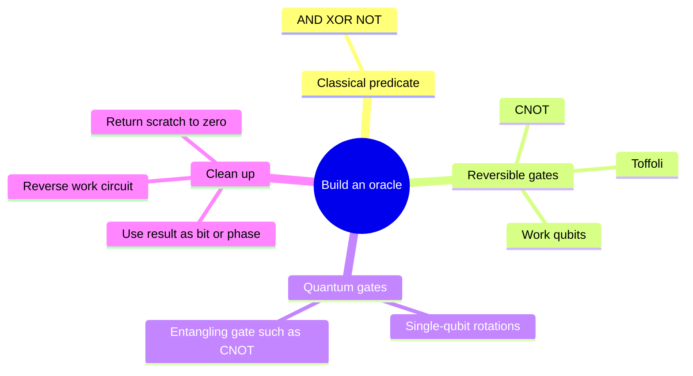
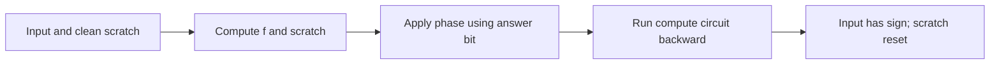

# From oracle symbols to gates

## The idea in one sentence

Algorithms draw an oracle as one box, but a physical circuit must compute the predicate reversibly, use it, and erase temporary information so paths can interfere.

MIT moves from [gate universality](https://www.youtube.com/watch?v=DLABu_mLqVU&t=0s) to [Toffoli and reversible permutation circuits](https://www.youtube.com/watch?v=ibp5-gbYPis&t=0s), then discusses [decomposing Toffoli into smaller quantum gates](https://www.youtube.com/watch?v=P0aAkG_WQ4s&t=0s). The precise Toffoli truth table below supplies the most useful hand check.

## The three-bit Toffoli gate

The Toffoli gate, also called controlled-controlled-NOT, acts as

$$
T\ket{a,b,c}=\ket{a,b,c\oplus(a b)},\qquad a,b,c\in\{0,1\}.
$$

Only when both controls are one does the target flip. It is its own inverse, so it is a useful reversible building block. If $c=0$, the target becomes $ab$; this computes AND **without erasing** $a$ or $b$.

| $a$ | $b$ | Target before | Target after |
| ---: | ---: | ---: | ---: |
| 0 | 0 | $c$ | $c$ |
| 0 | 1 | $c$ | $c$ |
| 1 | 0 | $c$ | $c$ |
| 1 | 1 | $c$ | $c\oplus1$ |

Together with NOT and CNOT, Toffoli can realize reversible versions of ordinary Boolean logic. A universal quantum gate family additionally needs gates that create and control phases; a commonly used finite set is $\{H,T,\mathrm{CNOT}\}$, which approximates arbitrary unitary circuits to chosen accuracy. Here $T=\operatorname{diag}(1,e^{i\pi/4})$ is the single-qubit phase gate, a different use of the letter from “Toffoli.” The word **universal** refers to approximation to arbitrary accuracy and does not make every unitary an exact finite circuit in this set.

## Compute, phase, uncompute

Suppose a reversible circuit $C_f$ computes $f(x)$ into an answer bit while also leaving scratch data $w(x)$:

$$
\ket x\ket0\ket{0^k}
\xrightarrow{C_f}
\ket x\ket{f(x)}\ket{w(x)}.
$$

To make a clean phase oracle, condition a $Z$ phase on the answer bit, then run $C_f^\dagger$:

$$
\ket x\ket0\ket{0^k}
\xrightarrow{C_f}\ket x\ket{f(x)}\ket{w(x)}
\xrightarrow{Z_{\rm answer}}(-1)^{f(x)}\ket x\ket{f(x)}\ket{w(x)}
\xrightarrow{C_f^\dagger}(-1)^{f(x)}\ket x\ket0\ket{0^k}.
$$

Now the scratch qubits are independent of $x$ and the intended paths can interfere. If they retained $w(x)$, the resulting state would carry which-input information; a later Hadamard on the input would not generally combine amplitudes as the algorithm assumes.

:::example One-AND phase oracle
Let $f(x_1x_0)=x_1x_0$. Prepare a zero answer bit and apply Toffoli with controls $x_1,x_0$; the answer becomes one only for $11$. Apply $Z$ to that answer, then the same Toffoli again. The answer returns to zero and only $\ket{11}$ gains a minus sign. This is the marked-state oracle for a four-item Grover search.
:::

## Cost and no-cloning caveat

The black-box query model counts this whole oracle use as one. Gate-level resource estimates must count the Toffoli decomposition, clean ancillas, and error budget. CNOT can copy a computational-basis **bit label** into a zero target, but on $\alpha\ket0+\beta\ket1$ it produces $\alpha\ket{00}+\beta\ket{11}$, not two independent copies of the unknown state. Revisit [no-cloning](../../foundations/states-and-measurement/06-no-cloning-and-why-copying-a-bit-is-different.md) and [phase kickback](01-phase-kickback-and-oracles.md).

:::note Source access
The MIT video links in this page identify positions in the official timed transcripts. The corresponding embedded lecture videos reported unavailable during this review; the official MIT course unit is linked under References. The worked derivations are checked independently.
:::

## Quick revision and self-check

Remember **compute → use answer → uncompute**. Why not just discard $w(x)$? The discarded register can keep which-path information and spoil interference. Why does Toffoli with target zero compute AND reversibly? It retains both inputs, so the mapping remains one-to-one.
