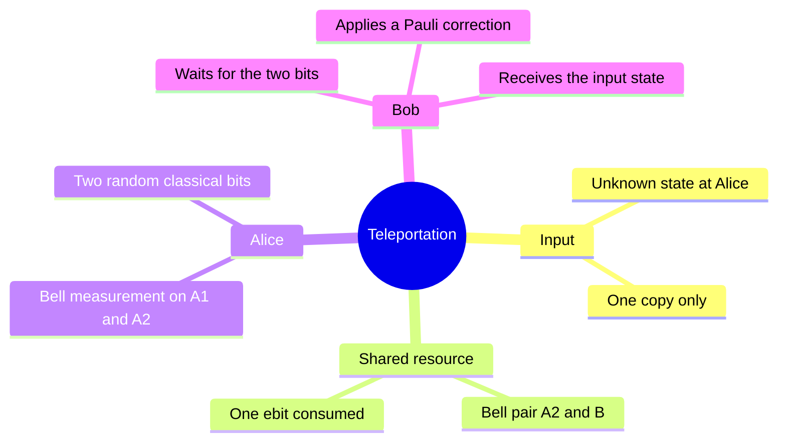
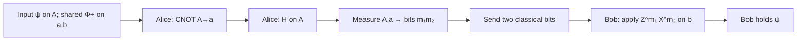
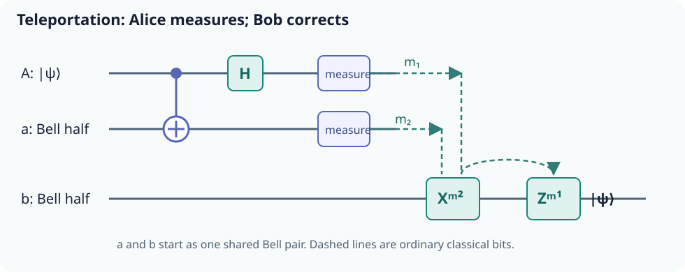
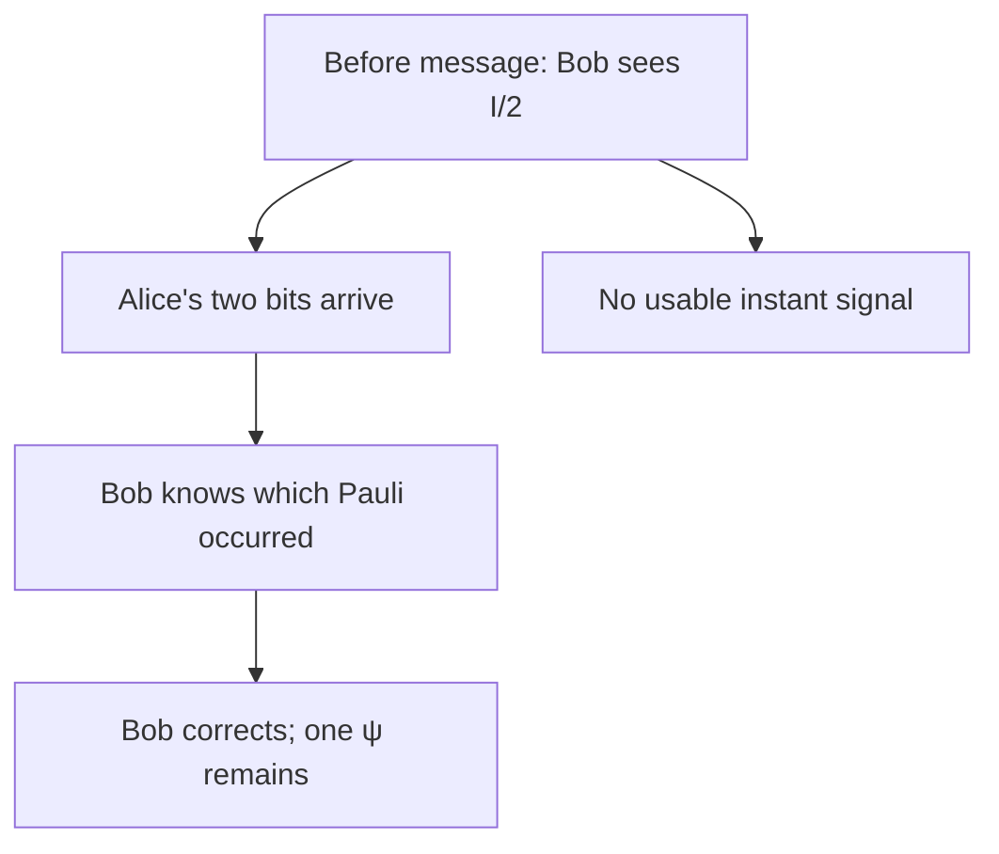

# Quantum teleportation

## The idea in one sentence

Alice can transfer an **unknown qubit state** to Bob by consuming one shared Bell pair and sending him two ordinary bits; the input state is destroyed at Alice's end.

This is a protocol for a state, not a way to send matter or an instant message. MIT builds it from a [Bell measurement near the start of its lecture](https://www.youtube.com/watch?v=ETkTSDAecZA&t=0s), then derives the [full correction protocol](https://www.youtube.com/watch?v=DuUpnxgQ1Vk&t=300s). The playlist gives a second [teleportation walkthrough](https://www.youtube.com/watch?v=upIbM_hPdPk&t=0s). The branch table and numerical example here are worked independently from the algebra.

## First, name the three qubits

Let $A$ be Alice's input, $a$ her half of a previously shared Bell pair, and $b$ Bob's half. Use computational basis order $Aab$ throughout:

$$
\ket\psi_A=\alpha\ket0+\beta\ket1,
\quad |\alpha|^2+|\beta|^2=1,
\quad \ket{\Phi^+}_{ab}=\frac{\ket{00}+\ket{11}}{\sqrt2}.
$$

Alice need not know $\alpha$ or $\beta$. The prepared joint state is $\ket\psi_A\ket{\Phi^+}_{ab}$. A Bell measurement is a measurement in the four orthonormal states $\Phi^\pm=(\ket{00}\pm\ket{11})/\sqrt2$ and $\Psi^\pm=(\ket{01}\pm\ket{10})/\sqrt2$. Alice can implement it with CNOT $A\to a$, then $H$ on $A$, then measuring $A$ and $a$ in the computational basis. That circuit is the **inverse** of a Bell-pair preparation circuit.

The solid lines in this circuit carry qubits; the dashed lines carry the measured **ordinary bits**. Bob applies $X^{m_2}$ before $Z^{m_1}$.

## Derive the four branches

Expand the joint state in the Bell basis of Alice's **two** qubits:

$$
\ket\psi_A\ket{\Phi^+}_{ab}
=\frac12\left(
\ket{\Phi^+}_{Aa}\ket\psi_b
+\ket{\Phi^-}_{Aa}Z\ket\psi_b
+\ket{\Psi^+}_{Aa}X\ket\psi_b
+\ket{\Psi^-}_{Aa}XZ\ket\psi_b
\right).
$$

The factor $1/2$ makes each of the four outcomes have probability $1/4$, independent of the unknown input. A global minus sign on a branch does not change the state. With the CNOT-then-$H$ implementation, the measured bits label $\Phi^+,\Psi^+,\Phi^-,\Psi^-$ as $00,01,10,11$ respectively.

| Alice's bits $m_1m_2$ | Bell branch | Bob before message | Bob applies | Bob after |
| --- | --- | --- | --- | --- |
| 00 | $\Phi^+$ | $\ket\psi$ | $I$ | $\ket\psi$ |
| 01 | $\Psi^+$ | $X\ket\psi$ | $X$ | $\ket\psi$ |
| 10 | $\Phi^-$ | $Z\ket\psi$ | $Z$ | $\ket\psi$ |
| 11 | $\Psi^-$ | $XZ\ket\psi$ | $ZX$ | $\ket\psi$ |

Read the correction $Z^{m_1}X^{m_2}$ **right to left** as an operator: apply $X$ if $m_2=1$, then $Z$ if $m_1=1$. For 11, $(ZX)(XZ)=I$. Swapping the order only changes a global sign for that branch, but a fixed convention prevents circuit confusion.

:::example Trace a nontrivial state through outcome 11
Take $\alpha=\sqrt3/2$ and $\beta=1/2$. Alice does **not** know these values in the protocol; we choose them to check the math. Before correction, Bob's normalized branch is

$$
XZ\ket\psi=X\left(\tfrac{\sqrt3}{2}\ket0-\tfrac12\ket1\right)
=-\tfrac12\ket0+\tfrac{\sqrt3}{2}\ket1.
$$

He applies $X$ first, obtaining $\tfrac{\sqrt3}{2}\ket0-\tfrac12\ket1$, then $Z$, obtaining $\tfrac{\sqrt3}{2}\ket0+\tfrac12\ket1=\ket\psi$. The branch occurs with probability $1/4$.
:::

## Why this does not signal faster than light

Before receiving Alice's two bits, Bob has an equal mixture of the four possible Pauli-distorted states:

$$
\rho_b=\frac14\sum_{P\in\{I,X,Z,XZ\}}P\ket\psi\!\bra\psi P^\dagger=\frac I2.
$$

No measurement on Bob's qubit alone reveals $\alpha$, $\beta$, or Alice's outcome. The classical message is necessary and travels at an ordinary signal speed. MIT's [protocol resource discussion](https://www.youtube.com/watch?v=DaS3MqVseDM&t=0s) counts the ebit and two classical bits explicitly.

## Resource ledger and common traps

| Resource | Beginning | End |
| --- | --- | --- |
| Unknown state | One copy on $A$ | One copy on $b$; Alice's original measured |
| Shared entanglement | One Bell pair | Consumed |
| Classical message | None | Two bits $m_1m_2$ sent Alice → Bob |

Teleportation does not learn the full amplitudes from a single copy, duplicate the state, or replace the classical channel. Compare [measurement and no-cloning](../../foundations/states-and-measurement/06-no-cloning-and-why-copying-a-bit-is-different.md) and the companion [superdense coding note](02-superdense-coding.md).

:::note Source access
The MIT video links in this page identify positions in the official timed transcripts. The corresponding embedded lecture videos reported unavailable during this review; the official MIT course unit is linked under References. The worked derivations are checked independently.
:::

## Quick revision and self-check

Remember **share → Bell-measure → send two bits → correct**. Why can Alice not simply tell Bob $\alpha$ and $\beta$? One unknown physical qubit does not supply an exact finite classical description from a single measurement. If Alice gets $10$, Bob has $Z\ket\psi$ and applies $Z$.
