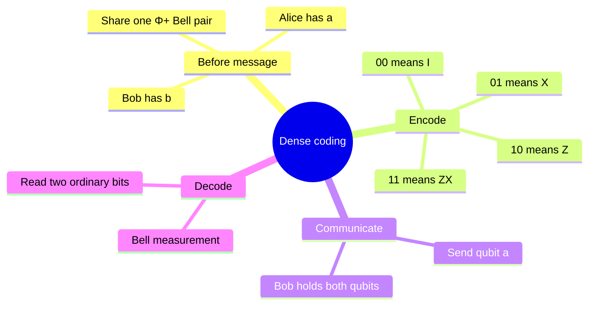
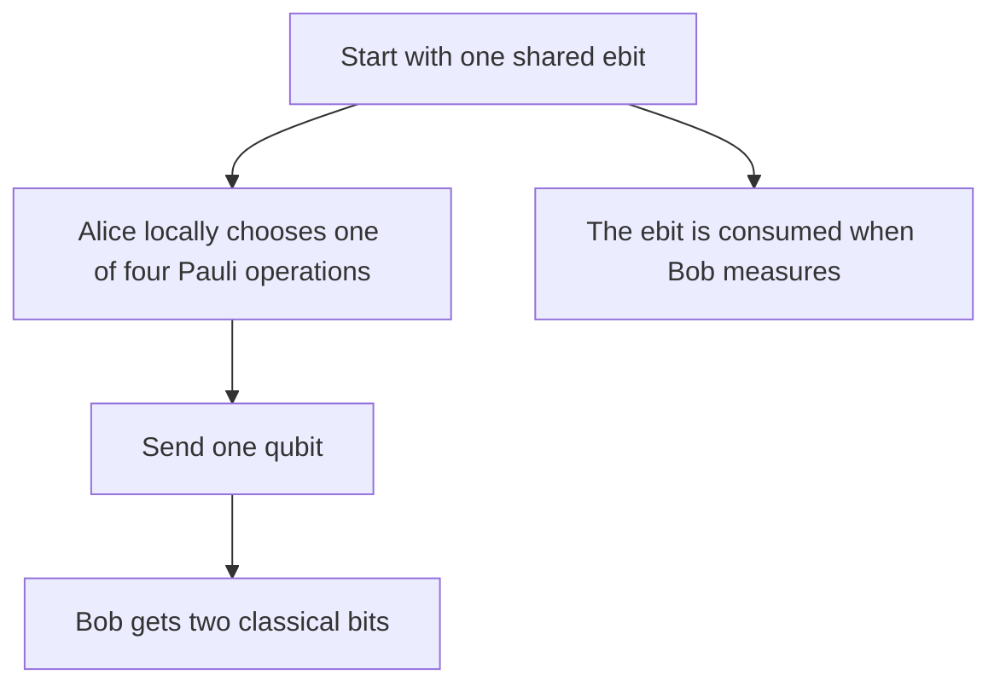

# Superdense coding

## The idea in one sentence

With a Bell pair already shared, Alice can encode **two classical bits** by changing and transmitting only her one qubit; Bob reads the bits by measuring both halves together.

The pre-shared pair is an essential resource. MIT [introduces the Pauli encodings](https://www.youtube.com/watch?v=zcPS0lYwJa4&t=0s); the playlist also [works through dense coding](https://www.youtube.com/watch?v=_yC7SgILlWI&t=0s). The following table fixes one convention and checks it algebraically.

## Four messages, four orthogonal states

Fix the qubit order $ab$, with Alice acting on $a$:

$$
\ket{\Phi^+}_{ab}=\frac{\ket{00}+\ket{11}}{\sqrt2}.
$$

Alice chooses one of four one-qubit operators. The convention here is $11\mapsto ZX$, meaning $X$ acts first, then $Z$. Global phase is irrelevant, so using $XZ$ for 11 would encode the same distinguishable Bell state.

| Bits | Alice applies to $a$ | Joint state after encoding | Bell label |
| --- | --- | --- | --- |
| 00 | $I$ | $(\ket{00}+\ket{11})/\sqrt2$ | $\Phi^+$ |
| 01 | $X$ | $(\ket{10}+\ket{01})/\sqrt2$ | $\Psi^+$ |
| 10 | $Z$ | $(\ket{00}-\ket{11})/\sqrt2$ | $\Phi^-$ |
| 11 | $ZX$ | $(\ket{01}-\ket{10})/\sqrt2$ | $\Psi^-$ |

All four Bell states are pairwise orthogonal. The information is in **which joint state** they share, not in Alice's qubit alone. Alice sends $a$ to Bob. He now holds both halves and can make a Bell measurement, which distinguishes all four perfectly. The same inverse-Bell circuit from [teleportation](01-quantum-teleportation.md) works: CNOT $a\to b$, then $H$ on $a$, then measure both. The measured computational bits are $00,01,10,11$ in the table's order.

:::example Send the message 10
Alice applies $Z$ to her half: $Z_a\ket{\Phi^+}=(\ket{00}-\ket{11})/\sqrt2=\ket{\Phi^-}$. On Bob's two-qubit register, CNOT maps this to $(\ket{00}-\ket{10})/\sqrt2=\ket-\ket0$. Hadamard changes $\ket-$ to $\ket1$, so the final state is $\ket{10}$. Both measured bits match the chosen message.
:::

## The resource accounting matters

The slogan “two bits in one qubit” is incomplete: **one shared ebit + one transmitted qubit** are used to convey two classical bits. If Bob had only Alice's transmitted qubit, his reduced state would be $I/2$ for every message, so he could not distinguish the messages. MIT's [resource comparison](https://www.youtube.com/watch?v=DaS3MqVseDM&t=0s) makes this constraint explicit.

Teleportation goes the other direction: an ebit plus **two classical bits** transfers **one unknown qubit state**. The two protocols use entanglement differently, but neither creates extra information from nothing.

:::note Source access
The MIT video links in this page identify positions in the official timed transcripts. The corresponding embedded lecture videos reported unavailable during this review; the official MIT course unit is linked under References. The worked derivations are checked independently.
:::

## Quick revision and self-check

Remember **share → Pauli encode → send one qubit → Bell decode**. What if Alice applies $X$? The Bell state becomes $\Psi^+$ and Bob measures $01$. Why does Bob need both qubits? Every single-qubit marginal is $I/2$; only a joint Bell measurement reveals the label.
