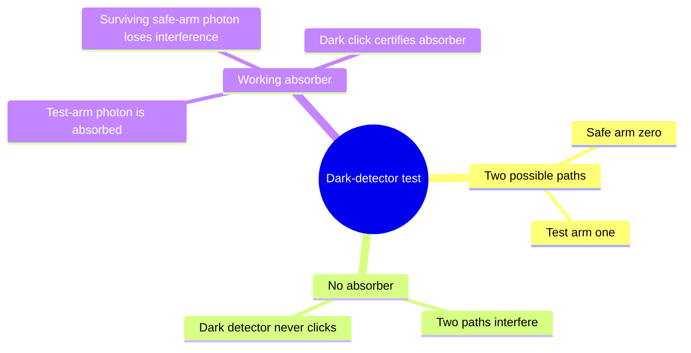
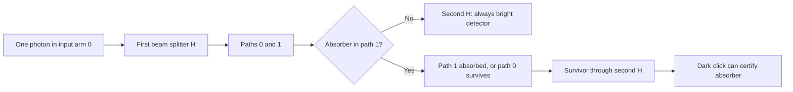

# Interaction-free measurement

## The idea in one sentence

When an object blocks one arm of an interferometer, a detector that should stay dark can sometimes click **without the photon being absorbed**, revealing the object.

MIT presents this as [a sensitive-bomb thought experiment](https://www.youtube.com/watch?v=-hwWufcByJ4&t=0s) and gives the [one-shot probabilities around 4:12–5:35](https://www.youtube.com/watch?v=-hwWufcByJ4&t=252s). The two-state model below is enough to derive the simple 25% result.

## Model the interferometer with Hadamards

Let $\ket0$ and $\ket1$ denote two photon paths. A balanced beam splitter acts like $H$ up to phase conventions. With no absorber, the two beam splitters compose to $H^2=I$:

$$
\ket0\xrightarrow{H}\ket+=\frac{\ket0+\ket1}{\sqrt2}
\xrightarrow{H}\ket0.
$$

Call output $0$ the **bright** detector and output $1$ the **dark** detector. In the ideal aligned device, the dark detector has zero probability when the test arm is clear.

## Add a perfectly absorbing object in path 1

After the first splitter, the photon has probability $1/2$ in the test path. In that branch the working bomb absorbs it and explodes. The other $1/2$ branch survives in path $0$. **Conditional on survival**, the state is $\ket0$, not $\ket+$; the absorber has removed the other coherent path. The second splitter gives $H\ket0=(\ket0+\ket1)/\sqrt2$, so its conditional detector probabilities are both $1/2$.

| Working absorber outcome | Probability |
| --- | ---: |
| Absorption / explosion | $1/2$ |
| Survives and bright detector clicks | $(1/2)(1/2)=1/4$ |
| Survives and dark detector clicks | $(1/2)(1/2)=1/4$ |

The three probabilities sum to one. A dark click is the decisive branch: a clear path could not have produced it, yet that detected photon did **not** traverse the absorber. A bright click is ambiguous because it can happen with or without the object. This matches MIT's [25% dark-detector branch](https://www.youtube.com/watch?v=-hwWufcByJ4&t=308s).

## Why the phrase needs care

“Interaction-free” describes the **successful detected branch**. The overall attempt has a 50% destructive absorption risk in this simple setup. The object still affects which paths can interfere, and a more elaborate scheme can change the probability tradeoff; the simple one-shot calculation does not prove zero disturbance in every trial. This is a measurement-and-interference lesson, not a faster-than-light communication protocol. Revisit [partial measurement](../../foundations/states-and-measurement/04-measuring-part-of-a-quantum-system.md) for the state-update perspective.

:::note Source access
The MIT video links in this page identify positions in the official timed transcripts. The corresponding embedded lecture videos reported unavailable during this review; the official MIT course unit is linked under References. The worked derivations are checked independently.
:::

## Quick revision and self-check

Remember **clear arm → destructive interference at dark detector; blocked arm → no two-path interference**. Why is the unconditional dark-click probability $1/4$, not $1/2$? Survival itself occurs only half the time.
