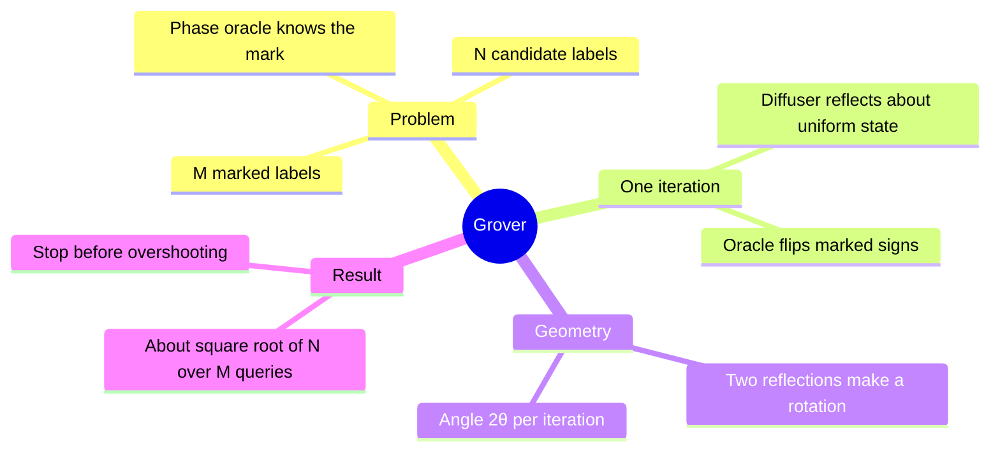
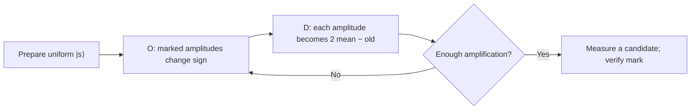
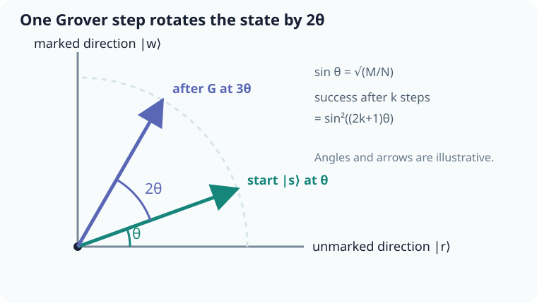

# Grover search as two reflections

## The idea in one sentence

Grover's algorithm repeatedly flips the phase of marked states and reflects amplitudes about the starting superposition; together those two reflections rotate probability toward a marked answer.

MIT introduces [the unstructured search problem](https://www.youtube.com/watch?v=SiOmnrBSNaw&t=45s) and depicts [the diffuser as a reflection](https://www.youtube.com/watch?v=aX3oOGlFgB8&t=0s). The playlist adds a [Grover introduction](https://www.youtube.com/watch?v=RqNDAu1cCJg&t=0s) and [iteration-matrix treatment](https://www.youtube.com/watch?v=BmvcGye8y7U&t=0s).

## Define the two reflections

Let $N=2^n$ and let $M$ of the $N$ basis states satisfy the marking predicate. Assume $1\le M<N$. The equal input superposition is

$$
\ket s=\frac1{\sqrt N}\sum_{x=0}^{N-1}\ket x=H^{\otimes n}\ket{0^n}.
$$

The phase oracle $O$ multiplies each marked $\ket x$ by $-1$ and leaves each unmarked $\ket x$ alone. The diffuser is $D=2\ket s\!\bra s-I$. One Grover step is $G=DO$: the oracle acts first, then the diffuser. This order matters when tracing amplitudes.

If a state has computational amplitudes $a_x$ with mean $\bar a=(1/N)\sum_x a_x$, then

$$
(D\boldsymbol a)_x=2\bar a-a_x.
$$

So the diffuser sends each amplitude to its mirror image across the mean. The expression $2\ket s\!\bra s-I$ proves this for arbitrary complex amplitudes as a linear map; the “mean” picture is most intuitive for real amplitudes.

## Compress the geometry to two dimensions

Define a normalized marked superposition $\ket w$ and normalized unmarked superposition $\ket r$. They are orthogonal. Set $\sin\theta=\sqrt{M/N}$, so

$$
\ket s=\sin\theta\ket w+\cos\theta\ket r.
$$

The oracle reflects across the unmarked axis: the coefficient of $\ket w$ changes sign. The diffuser reflects across the line through $\ket s$. In a two-dimensional plane, two successive reflections make a rotation of $2\theta$ toward $\ket w$. After $k$ iterations,

The pictured arrows are schematic; the exact angle is set by $\sin\theta=\sqrt{M/N}$.

$$
G^k\ket s=\sin((2k+1)\theta)\ket w
+\cos((2k+1)\theta)\ket r,
\qquad
P_{\rm success}=\sin^2((2k+1)\theta).
$$

To get close to the first maximum, choose an integer near $k_*=\pi/(4\theta)-1/2$. For $M\ll N$, $\theta\approx\sqrt{M/N}$, so the number of oracle calls is $O(\sqrt{N/M})$. This is a query count: oracle construction, state preparation, gates, noise control, and readout still cost resources.

:::example Four candidates, one marked
Here $N=4,M=1$, so $\sin\theta=1/2$ and $\theta=\pi/6$. One iteration gives $(2(1)+1)\theta=\pi/2$, hence success probability one. See the [amplitude-by-amplitude trace](02-grover-circuits-and-examples.md) to make the geometry concrete.
:::

## When to stop, and when the promise changes

Repeated iterations do not increase success forever: after the rotation passes $\ket w$, the probability falls. If $M$ is unknown, using a count calculated for $M=1$ can overshoot. Search variants choose or estimate an iteration count, sometimes with randomized counts; the simple formula assumes known $M$ and an ideal oracle. If $M=0$, $\ket w$ is undefined and this derivation does not apply. A real candidate should be checked against the predicate after measurement.

:::note Source access
The MIT video links in this page identify positions in the official timed transcripts. The corresponding embedded lecture videos reported unavailable during this review; the official MIT course unit is linked under References. The worked derivations are checked independently.
:::

## Quick revision and self-check

Remember **mark sign → reflect about mean → rotate toward mark**. For $M=N/4$, $\sin\theta=1/2$ and one step is exact. Why is the speedup quadratic rather than exponential in $N$? The angle per query is of order $1/\sqrt N$ for one mark, so about $\sqrt N$ steps make an order-one turn.
