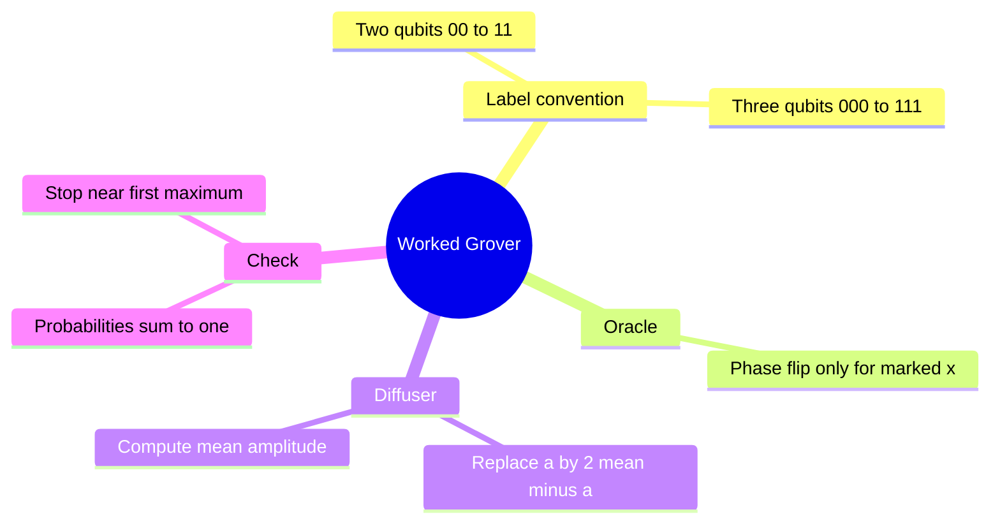
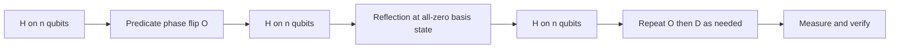
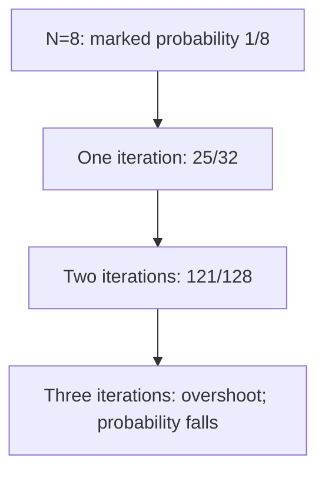

# Grover circuit workshop

## The idea in one sentence

Tracking a tiny register by hand shows exactly how a phase flip becomes a large measurement probability after inversion about the mean.

The playlist includes a [circuit-design lecture](https://www.youtube.com/watch?v=gW-cOIBZGNA&t=0s) and [two- and three-qubit examples](https://www.youtube.com/watch?v=OZpkG-T2DaI&t=0s). MIT separately derives the [oracle and diffusion steps](https://www.youtube.com/watch?v=hOmPuGEYUCc&t=0s). These numerical examples are checked from the operator $D=2\ket s\!\bra s-I$.

## Circuit recipe

For $n$ qubits, prepare $\ket s=H^{\otimes n}\ket{0^n}$. Build a reversible predicate that flips the sign of marked basis states; equivalently, compute the predicate into a $\ket-$ target. Apply $D=H^{\otimes n}(2\ket{0^n}\!\bra{0^n}-I)H^{\otimes n}$, up to an irrelevant global sign depending on which zero-state phase-flip circuit you implement. A multi-controlled phase flip around $\ket{0^n}$ can be built using $X$ gates to turn a zero-control condition into a one-control condition, then a multi-controlled $Z$, then undoing the $X$ gates. **Uncompute** any scratch registers in the oracle so they do not hold which-path information.

## Two qubits: one iteration is exact

Let $N=4$ and mark $\ket{10}$. Initially every amplitude is $+1/2$. After the oracle, the marked amplitude is $-1/2$ and the others remain $+1/2$. The mean after the oracle is $(-1/2+3/2)/4=1/4$. Apply $a\mapsto2\bar a-a$:

| Basis label | Initial | After oracle | After diffuser |
| --- | ---: | ---: | ---: |
| $00$ | $1/2$ | $1/2$ | $0$ |
| $01$ | $1/2$ | $1/2$ | $0$ |
| $10$ **marked** | $1/2$ | $-1/2$ | $1$ |
| $11$ | $1/2$ | $1/2$ | $0$ |

The final state is exactly $\ket{10}$. The probabilities add to one. This is the amplitude version of the $\theta=\pi/6$ geometry in [the reflection note](01-grover-as-two-reflections.md).

## Three qubits: calculate instead of guessing

Let $N=8$ and mark one state, say $\ket{101}$. All initial amplitudes are $1/\sqrt8$. The oracle makes the marked amplitude $-1/\sqrt8$; the mean is $6/(8\sqrt8)=3/(4\sqrt8)$. The first diffuser gives

$$
a_{\rm mark}^{(1)}=2\frac3{4\sqrt8}+\frac1{\sqrt8}
=\frac5{2\sqrt8},
\qquad
a_{\rm other}^{(1)}=2\frac3{4\sqrt8}-\frac1{\sqrt8}
=\frac1{2\sqrt8}.
$$

The first success probability is $25/32\approx0.78125$. The seven failures contribute $7(1/32)=7/32$, so normalization checks out. For a second iteration, the oracle negates only $5/(2\sqrt8)$. The new mean is $1/(8\sqrt8)$, so

$$
a_{\rm mark}^{(2)}=\frac{11}{4\sqrt8},
\quad a_{\rm other}^{(2)}=-\frac1{4\sqrt8},
\quad P_{\rm success}^{(2)}=\frac{121}{128}\approx0.9453125.
$$

The seven other outcomes contribute $7/128$, again totaling one. Here two iterations are better than one; a third would rotate past the peak and lower success.

## How to debug your own small circuit

Write amplitudes in a fixed binary order; mark exactly the intended strings; calculate the **post-oracle** mean; apply the diffuser to every amplitude; square magnitudes and sum to one. If a scratch qubit remains correlated with $x$, the intended amplitude interference can fail. If your diffuser is $I-2\ket s\!\bra s$ instead, it differs by a global minus, so probabilities match. These checks distinguish harmless sign conventions from a real error.

:::note Source access
The MIT video links in this page identify positions in the official timed transcripts. The corresponding embedded lecture videos reported unavailable during this review; the official MIT course unit is linked under References. The worked derivations are checked independently.
:::

## Quick revision and self-check

For $N=4$ with one mark, why is the post-oracle mean $1/4$? Three $+1/2$ values and one $-1/2$ sum to $1$; divide by four. For $N=8$, why do the other amplitudes become negative after two iterations? The second reflection moves the whole state past the uniform direction while still approaching the marked axis.
