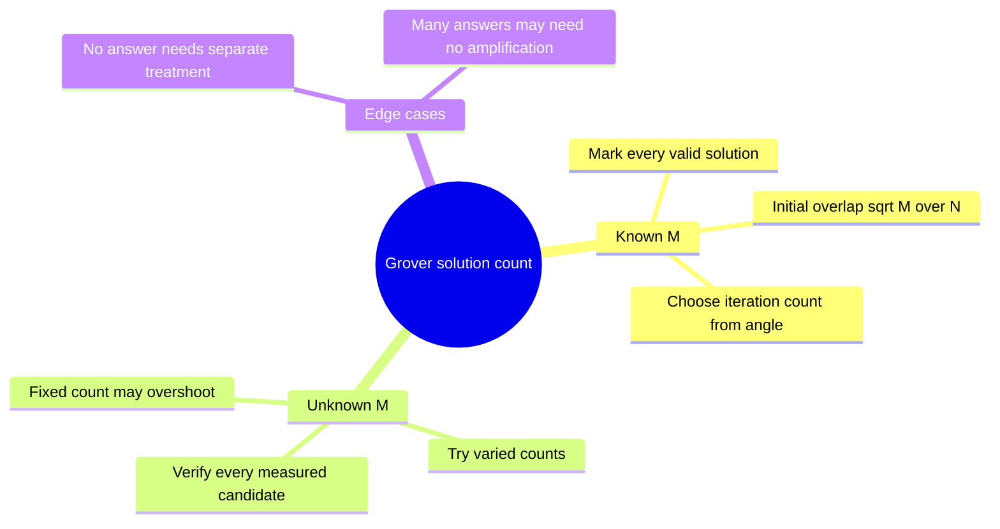
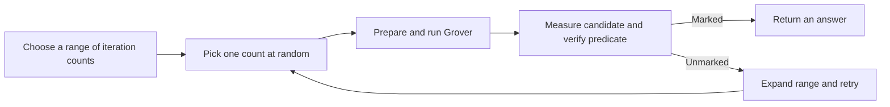

# Grover with several or unknown answers

## The idea in one sentence

The same Grover circuit works for several marked items, but the rotation angle depends on how many there are, so an unknown count calls for an adaptive stopping strategy.

MIT develops the [multiple-solution geometry](https://www.youtube.com/watch?v=dNXHMrhnKUQ&t=0s) and then the [unknown-count problem](https://www.youtube.com/watch?v=yWjAnzfBJMg&t=0s). This note makes the two assumptions explicit.

## Known $M$: one marked subspace

Let $W$ be the marked set, $|W|=M$, and let $R$ be its unmarked complement, $|R|=N-M$. Their normalized uniform vectors are

$$
\ket w=\frac1{\sqrt M}\sum_{x\in W}\ket x,
\qquad
\ket r=\frac1{\sqrt{N-M}}\sum_{x\in R}\ket x.
$$

Despite many possible marked strings, the ideal circuit stays in the span of just $\ket w$ and $\ket r$. The equal superposition is $\ket s=\sqrt{M/N}\ket w+\sqrt{1-M/N}\ket r$. Define $\theta=\arcsin\sqrt{M/N}$. Then after $k$ Grover steps, $P_k=\sin^2((2k+1)\theta)$. Once measurement succeeds, the outcome is one of the marked strings; with a symmetric oracle and uniform start, marked strings have equal probability.

:::example Four of sixteen states are marked
Here $M/N=1/4$, so $\theta=\pi/6$. Initially a measurement succeeds with probability $1/4$. One oracle-plus-diffuser iteration rotates to angle $3\theta=\pi/2$ and succeeds with probability one. A second iteration rotates to $5\pi/6$ and falls back to probability $1/4$. This is a sharp example of **overshooting**.
:::

## Unknown $M$: why one fixed count cannot serve all cases

If $M=1$, the first maximum takes roughly $\pi\sqrt N/4$ iterations. If $M=N/4$, it takes exactly one. Applying the first rule to the second case rotates around the two-dimensional plane many times and can miss the marked subspace. The measured candidate can be checked classically by computing the predicate, so a failed attempt can trigger a new trial.

One approach chooses a random iteration count $k$ in $\{0,\ldots,L-1\}$, measures and verifies, then increases $L$ if needed. The randomization avoids repeatedly landing near the same low-probability angle. For known angle $\theta$, its mean success probability is

$$
\frac1L\sum_{k=0}^{L-1}\sin^2((2k+1)\theta)
=\frac12-\frac{\sin(4L\theta)}{4L\sin(2\theta)},
$$

when $\sin(2\theta)\ne0$. As the tested range spans enough rotation angles, this average is often substantial. An adaptive schedule for $L$ can obtain the usual $O(\sqrt{N/M})$ expected query scale for $M>0$ under suitable conditions, but it requires repeated candidate checks and more careful analysis than the known-$M$ formula. The formula above alone does not certify an algorithm for every edge case.

## Edge cases

If $M=0$, there is no marked direction $\ket w$ and the rotation derivation is invalid; an algorithm that repeatedly sees failures needs an explicit policy for reporting “none,” with a confidence or promise statement. If $M=N$, every label is marked, and a uniform sample already succeeds; no search is needed. If $M$ is a sizeable fraction of $N$, classical random sampling may also be cheap. Query advantage claims must specify the marked fraction and what resources are counted. The underlying reflection circuit is in [Grover geometry](01-grover-as-two-reflections.md).

:::note Source access
The MIT video links in this page identify positions in the official timed transcripts. The corresponding embedded lecture videos reported unavailable during this review; the official MIT course unit is linked under References. The worked derivations are checked independently.
:::

## Quick revision and self-check

Remember **more answers → larger starting angle → fewer useful rotations**. For $M=N/4$, what happens after two iterations? The success probability returns to $1/4$, so “more Grover steps” is not always better.
