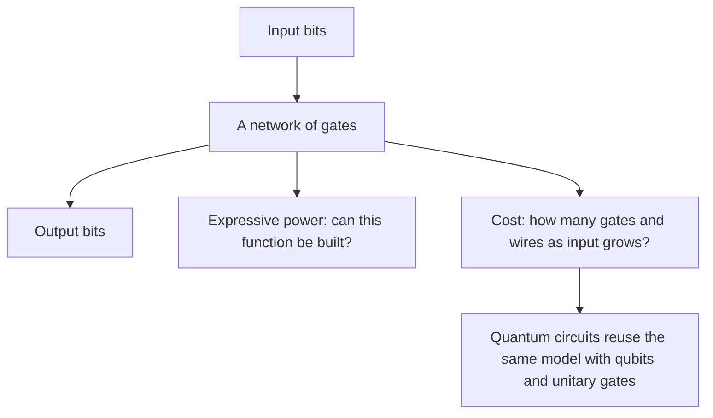
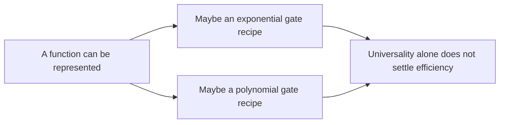
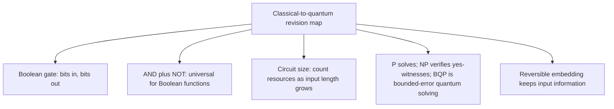

# Classical circuits, universality, and computational cost

## The idea in one sentence

Classical circuits teach us how to connect simple operations into a calculation; **universality** asks whether the operations can express a function, while **complexity** asks how many resources the construction needs.

MIT compares Turing machines, finite automata, and circuits in [U1.1, “Models for classical computation,” about 0:00–5:55](https://www.youtube.com/watch?v=BM4hlDQsc1M&t=0s). The course's public timed transcript is available; the embedded video itself currently reports unavailable. We focus on circuits because both the MIT course and the requested playlist build quantum computations by arranging gates on wires.

## 1. A circuit is a recipe with a declared input size

A Boolean gate takes bits and returns bits. For example, $\operatorname{AND}(a,b)=1$ only if both inputs are $1$, and $\operatorname{NOT}(a)=1-a$. Gates connect through wires, and the **output of one gate** becomes the input of another. A circuit for two input bits is one fixed diagram; handling arbitrary input lengths requires a family of circuits, one for each length. MIT emphasizes this size issue around [6:35–14:35](https://www.youtube.com/watch?v=BM4hlDQsc1M&t=395s).

| Input size | One possible task | A circuit must specify |
| --- | --- | --- |
| 2 bits | Compute $a\lor b$ | Two input wires and a few gates |
| $n$ bits | Parity of all $n$ bits | A growing family of gates/wires |
| Arbitrary $n$ | One algorithmic problem | A uniform way to construct each size's circuit |

That last row matters: if someone handed us an unrelated, magically chosen circuit for every $n$, its description might hide answers rather than compute them. Requiring an ordinary classical procedure to generate the circuit family prevents that trick; it is the **uniform circuit** viewpoint the MIT lecture uses.

## 2. Why AND plus NOT can express every Boolean function

Even OR can be built from AND and NOT. De Morgan's law says

$$
a\lor b=\neg(\neg a\land\neg b).
$$

Check all four possibilities:

| $a$ | $b$ | $a\lor b$ | $\neg(\neg a\land\neg b)$ |
| --- | --- | --- | --- |
| 0 | 0 | 0 | 0 |
| 0 | 1 | 1 | 1 |
| 1 | 0 | 1 | 1 |
| 1 | 1 | 1 | 1 |

More generally, split any Boolean function $f(y,x_1,\ldots,x_n)$ by the first input. Let $f_0(x)=f(0,x)$ and $f_1(x)=f(1,x)$. Then the correct selector identity is

$$
f(y,x)=(\neg y\land f_0(x))\lor(y\land f_1(x)).
$$

If $y=0$, the left term returns $f_0$ and the right vanishes; if $y=1$, the reverse happens. Repeating the split eventually reaches constant functions. That proves **expressibility** with AND, NOT, and wires. MIT builds this idea in [U1.2, “Universality of AND and NOT,” about 0:00–4:22](https://www.youtube.com/watch?v=o99YHHEURRE&t=0s). The spoken transcript appears to swap the two selector terms at about 2:00; the displayed identity here is checked by substituting $y=0$ and $y=1$.

:::example Build a three-input function
Let $g(a,b,c)=(a\land b)\lor\neg c$. First compute $u=a\land b$ and $v=\neg c$. Then compute $\neg(\neg u\land\neg v)$ to form $u\lor v$ using only AND and NOT. For $(a,b,c)=(1,1,1)$, $u=1$, $v=0$, so $g=1$. For $(1,0,1)$, both are $0$, so $g=0$.
:::

## 3. Universal can still be inefficient

The recursive selector construction may duplicate subcircuits. A naive truth-table implementation can therefore use a number of pieces growing like $2^n$ for an arbitrary $n$-bit function. That says **some construction always exists**, not that it is efficient. MIT calls out this difference between the universality proof and its resource cost around [4:14–6:10](https://www.youtube.com/watch?v=o99YHHEURRE&t=254s).

By contrast, the parity function has a compact XOR chain:

$$
\operatorname{PARITY}(x_1,\ldots,x_n)
=x_1\oplus x_2\oplus\cdots\oplus x_n,
$$

using $n-1$ two-input XOR gates. The **input length** $n$, rather than the numeric value represented by the bits, is the natural size variable. For an integer $N$, that length is roughly $\log_2N$.

## 4. A small map of complexity language

For **decision problems** (yes/no questions), these labels compare resources as input length grows:

| Name | Simple reading | What it does **not** say |
| --- | --- | --- |
| $\mathrm P$ | A deterministic classical algorithm solves the problem in polynomial time. | Every problem outside $\mathrm P$ is impossible. |
| $\mathrm{NP}$ | A yes-answer has a polynomial-size witness that a deterministic classical algorithm can verify in polynomial time. | “NP” does **not** mean “non-polynomial.” |
| $\mathrm{BQP}$ | A uniform quantum circuit family solves the problem in polynomial time with bounded error. | It does **not** mean all hard classical problems become easy. |

The class names appear in MIT's [“Brief introduction to computational complexity,” about 5:00–13:12](https://www.youtube.com/watch?v=8EfjJLIeTwE&t=300s). We use the standard definitions here; the automatic-looking or spoken transcript sometimes expands abbreviations loosely, so memorizing the table is safer than memorizing a phrase. A polynomial bound might look like $n^2$; an exponential bound might look like $2^n$. Their difference becomes huge as $n$ increases.

The introductory course uses factoring to motivate quantum algorithms, but no claim that quantum computers solve every $\mathrm{NP}$ problem follows. This note only introduces the vocabulary; later algorithm notes can explain specific speedups with their assumptions.

## 5. Bridge to reversible and quantum circuits

Ordinary AND loses its input history: output $0$ has three possible two-bit inputs. Quantum gates acting on an isolated register are unitary and therefore invertible. The bridge is to keep the inputs and write the Boolean answer into an extra target, as in

$$
(a,b,t)\mapsto(a,b,t\oplus(a\land b)).
$$

This is the Toffoli operation on bit strings, developed in [Reversible classical computation](03-reversible-classical-computation.md). MIT also points out that classical wiring may copy a bit to several destinations (“fanout”), while an arbitrary unknown qubit cannot be copied; see [No-cloning](../states-and-measurement/06-no-cloning-and-why-copying-a-bit-is-different.md).

## What to remember in 30 seconds

## Check your understanding

If $y=0$, what does the selector identity return?

The term $\neg y\land f_0$ becomes $f_0$; the other term is zero. Thus it returns $f(0,x)$.

Does a proof that AND and NOT can build every Boolean function prove a small circuit for every function?

No. It proves expressibility. The naive recursive construction can grow exponentially with the number of input bits.

Does “NP” stand for “not polynomial”?

No. It means nondeterministic polynomial time; for this note, remember its polynomial-time verifier definition.

## Next connections

- [Reversible classical computation](03-reversible-classical-computation.md) turns lossy logic into invertible operations.
- [Gate matrices and interference](05-gate-matrices-and-interference.md) shows how quantum circuits use amplitudes on these wires.
