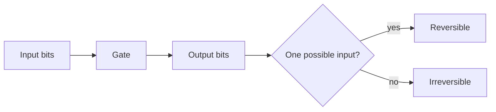
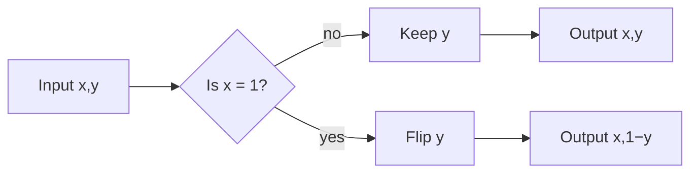
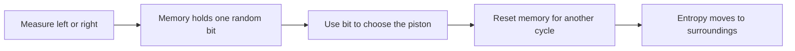
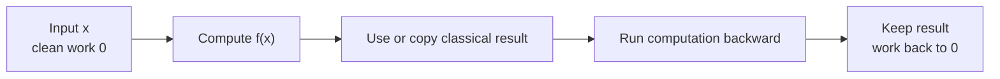
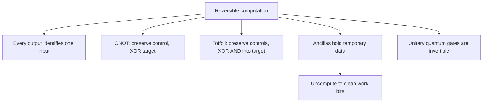

# Reversible classical computation

## The idea in one sentence

A gate is reversible when its output uniquely determines its input. Quantum gates must preserve information during isolated evolution, so reversible classical gates are the simplest bridge from ordinary circuits to quantum circuits.

## Intuition: can you run the gate backwards?

An AND gate outputs only one bit. The output $0$ might have come from $00$, $01$, or $10$, so you cannot reconstruct the input. MIT uses this exact loss-of-input idea in its [reversible-computation lecture at 0:24–1:03](https://www.youtube.com/watch?v=m-C4jWJPRDo&t=24s). It then uses a frictionless billiard-ball model to motivate reversible logic ([about 1:55–5:14](https://www.youtube.com/watch?v=m-C4jWJPRDo&t=115s)). The physical model is an intuition aid; real devices have friction and noise.

| Gate | Mapping | Can the output reveal the input? |
| --- | --- | --- |
| AND | $(x,y)\mapsto x\land y$ | No: several inputs give $0$ |
| NOT | $x\mapsto 1-x$ | Yes: apply NOT again |
| SWAP | $(x,y)\mapsto(y,x)$ | Yes: swap again |
| CNOT | $(x,y)\mapsto(x,x\oplus y)$ | Yes: apply CNOT again |

Here $\oplus$ means addition modulo $2$: $0\oplus0=0$, $0\oplus1=1$, $1\oplus0=1$, $1\oplus1=0$.

## 1. CNOT keeps the control bit

Choose the **first** bit as control. CNOT leaves $x$ untouched and flips $y$ only when $x=1$:

$$
\operatorname{CNOT}(x,y)=(x, y\oplus x).
$$

| Input $xy$ | Output $(x,y\oplus x)$ |
| --- | --- |
| 00 | 00 |
| 01 | 01 |
| 10 | 11 |
| 11 | 10 |

Each output appears once. Applying it twice gives $y\oplus x\oplus x=y$, because $x\oplus x=0$. Thus CNOT is its own inverse. MIT introduces CNOT, Toffoli, and Fredkin in [“Reversible gates and circuits,” 0:00–1:20](https://www.youtube.com/watch?v=A1AfvCUk5Ew&t=0s). The wire/control convention is explicitly fixed here so that a drawn circuit and its algebra agree.

## 2. Toffoli computes AND while keeping enough information

The Toffoli gate has two controls and a target:

$$
T(x,y,z)=(x,y,z\oplus(x\land y)).
$$

It changes the target only when **both** controls are $1$. The first two bits preserve the original input, so the action can be undone by applying the gate again. In particular,

$$
T(x,y,0)=(x,y,x\land y).
$$

The last output now contains AND, but the complete three-bit mapping is reversible. MIT demonstrates this construction around [1:59–2:27](https://www.youtube.com/watch?v=A1AfvCUk5Ew&t=119s).

:::example Work the gate twice
Start with $(x,y,z)=(1,1,0)$. The first Toffoli gives $(1,1,1)$. Apply it again: the target becomes $1\oplus(1\land1)=0$, so the original $(1,1,0)$ returns. If either control had been $0$, both passes would leave the target unchanged.
:::

This construction uses a clean extra bit, often called an **ancilla**, initialized to $0$. The control outputs are retained. If a larger algorithm needs only the AND result, leftover work bits may have to be cleaned up; simply deleting them would lose reversibility.

## 3. Why erasing a bit has a physical cost

MIT first asks the question through [Maxwell's demon, about 2:55–6:30](https://www.youtube.com/watch?v=TaCeCRK-6cE&t=175s): if a tiny observer separates fast and slow gas molecules, where does the apparent free energy come from? In its [Szilard-engine lecture, about 1:20–9:55](https://www.youtube.com/watch?v=uctYqQAbfyk&t=80s), the observer records whether a molecule is on the left or right, uses that information to extract work, then must reset its one-bit memory to repeat the cycle. The timed course transcript, rather than the currently unavailable embedded video, supports these positions.

For an **unknown, equally likely bit** reset to a standard value while coupled to a heat bath at temperature $T$, the ideal lower bound on heat released to the bath is

$$
Q_{\min}=k_{\mathrm B}T\ln2.
$$

The bit initially has two possible values, hence information entropy $k_{\mathrm B}\ln2$; after reset it has one. That entropy cannot simply vanish from a complete physical cycle. MIT states the Landauer bound in the official timed transcript around [13:40–17:20](https://www.youtube.com/watch?v=uctYqQAbfyk&t=820s). The bound concerns a specified erasure task and an ideal bath; it does **not** mean every logically reversible gate is automatically free of heat or that every irreversible gate always uses exactly this much in a real device.

:::example A one-bit sanity check
Resetting a register that is *known* to be $0$ leaves no uncertainty to erase. The $k_{\mathrm B}T\ln2$ expression refers to a bit with two equally likely unknown logical possibilities, not to the physical motion of every switch.
:::

## 4. Uncomputation clears temporary results

The useful pattern is **compute → use → uncompute**. A reversible function circuit can be arranged as

$$
U_f\ket{x}\ket{0}=\ket{x}\ket{f(x)}.
$$

If the output has been copied into a separate target by a suitable reversible operation, applying $U_f^{-1}$ restores the work register to its clean starting state. You cannot in general copy an *unknown quantum state* this way; here the copied value is a computational-basis classical bit string. MIT points out that reversible embeddings carry extra “garbage” and that it must be managed in [“Reversible gates and circuits,” about 3:22–5:34](https://www.youtube.com/watch?v=A1AfvCUk5Ew&t=202s).

Why does this matter later? A quantum circuit uses **unitary** operations between measurements. A unitary matrix has an inverse $U^{-1}=U^\dagger$, so its action on all basis states is one-to-one. CNOT and Toffoli are unitary when viewed as permutations of computational-basis states. Quantum circuits can additionally act on superpositions of those basis states. Measurement and deliberate discarding require a separate description; they are not the same as an isolated unitary gate.

## What to remember in 30 seconds

- **Irreversible AND:** two inputs collapse to one output, so input information is lost.
- **Reversible AND embedding:** keep $x,y$ and write $x\land y$ into a third bit.
- **Two-pass test:** CNOT and Toffoli applied twice return every input bit string.
- **Quantum link:** a reversible classical truth table becomes a permutation matrix; quantum evolution also allows complex amplitudes and interference.
- **Thermodynamic link:** resetting an unknown fair bit has the ideal Landauer heat bound $k_{\mathrm B}T\ln2$; uncomputation avoids discarding temporary information.

## Check your understanding

What is $T(1,0,1)$?

The controls are not both $1$, so the target stays $1$. The output is $(1,0,1)$.

Why is $(x,y)\mapsto(x,x\land y)$ not reversible?

If $x=0$, both $y=0$ and $y=1$ give output $(0,0)$. Keeping the first input alone is not enough; Toffoli keeps both controls.

What does CNOT do to $(1,0)$, and what does a second CNOT do?

The first gives $(1,1)$; the second returns $(1,0)$.

## Next connections

- [Gates and interference](02-gates-and-interference.md) shows how quantum gates act on amplitudes.
- [Tensor products and two-qubit space](../mathematics/03-tensor-products-and-two-qubit-space.md) explains the four-dimensional space on which CNOT acts.
