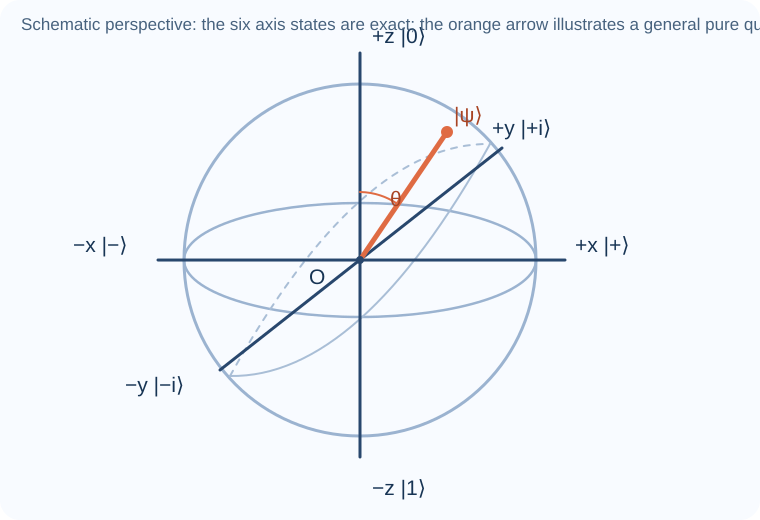
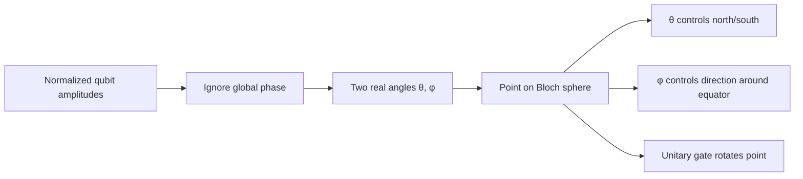
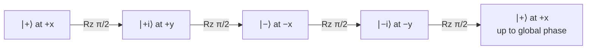
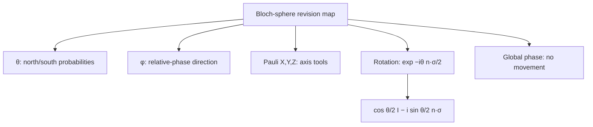

# Bloch sphere and qubit rotations

## The idea in one sentence

After ignoring global phase, every **pure qubit** is a point on a sphere; single-qubit unitary gates rotate that sphere, while relative phase controls the direction around its equator.

The diagram is a schematic perspective guide. MIT locates $\ket0,\ket1,\ket+,\ket-$ and the $Y$-basis states on the Bloch sphere in [U1.3, “The Bloch sphere representation of qubit states,” 0:00–2:07](https://www.youtube.com/watch?v=fpYFH-cOtV0&t=0s). The playlist develops general directions and spin measurements in [“Bloch sphere and Qubit Representation,” about 20:00–32:00](https://www.youtube.com/watch?v=nVpj3_NOvRI&t=1200s).

## First map: algebra ↔ geometry

## 1. Why two angles are enough

A general qubit ket is $\alpha\ket0+\beta\ket1$, with $|\alpha|^2+|\beta|^2=1$. That gives three independent real parameters. One is an unobservable common phase, leaving two. Choose that phase so the $\ket0$ coefficient is real and nonnegative:

$$
\ket{\psi(\theta,\phi)}
=\cos\frac\theta2\ket0
+e^{i\phi}\sin\frac\theta2\ket1,
\qquad 0\leq\theta\leq\pi,
\quad 0\leq\phi<2\pi.
$$

The half-angle is necessary because probabilities use **squared** amplitudes:

$$
P(0)=\cos^2\frac\theta2,
\qquad P(1)=\sin^2\frac\theta2.
$$

At $\theta=0$ we are at the north pole $\ket0$; at $\theta=\pi$ we are at the south pole $\ket1$ (the phase there is global). At $\theta=\pi/2$ both computational-basis outcomes have probability $1/2$, yet $\phi$ still distinguishes different states. The playlist gives this angle parameterization in [“Bloch sphere and Qubit Representation,” around 0:00–5:00](https://www.youtube.com/watch?v=nVpj3_NOvRI&t=0s).

| Bloch direction | Ket (up to global phase) | A useful name |
| --- | --- | --- |
| $+z$ | $\ket0$ | computational 0 |
| $-z$ | $\ket1$ | computational 1 |
| $+x$ | $(\ket0+\ket1)/\sqrt2$ | $\ket+$ |
| $-x$ | $(\ket0-\ket1)/\sqrt2$ | $\ket-$ |
| $+y$ | $(\ket0+i\ket1)/\sqrt2$ | $\ket{+i}$ |
| $-y$ | $(\ket0-i\ket1)/\sqrt2$ | $\ket{-i}$ |

### From angles to coordinates

With the Pauli matrices below, the Bloch vector of a pure state is

$$
\mathbf r=(\langle X\rangle,\langle Y\rangle,\langle Z\rangle)
=\bigl(\sin\theta\cos\phi,\;\sin\theta\sin\phi,\;\cos\theta\bigr).
$$

For example, $\theta=\pi/2,\phi=\pi/2$ gives $\mathbf r=(0,1,0)$ and the ket $\ket{+i}$. The squared length is $\sin^2\theta(\cos^2\phi+\sin^2\phi)+\cos^2\theta=1$.

## 2. Pauli matrices are the three axis tools

$$
X=\begin{pmatrix}0&1\\1&0\end{pmatrix},\quad
Y=\begin{pmatrix}0&-i\\i&0\end{pmatrix},\quad
Z=\begin{pmatrix}1&0\\0&-1\end{pmatrix}.
$$

Each is Hermitian and unitary, and $X^2=Y^2=Z^2=I$. These matrices represent measurements along the respective axes and, up to an overall phase, $180^\circ$ rotations about them. MIT explores their Bloch actions in [U1.3, “Rotating the Bloch sphere,” 0:00–4:17](https://www.youtube.com/watch?v=8Z9MkaLgEsg&t=0s).

:::example See $X$ in two ways
Algebra: $X\ket0=\ket1$. Geometry: the $+z$ point moves to $-z$ under a half-turn about the $x$ axis. Also $X\ket+=\ket+$, so the $+x$ axis is fixed. These are the same operation viewed as a matrix and a rotation.
:::

## 3. Derive a rotation gate

Let $\hat{\mathbf n}$ be a unit axis and write $N=\hat n_xX+\hat n_yY+\hat n_zZ$. Pauli algebra gives $N^2=I$. Split the matrix exponential into even and odd powers:

$$
\begin{aligned}
R_{\hat n}(\vartheta)
&=e^{-i\vartheta N/2}\\
&=\left(1-\frac{(\vartheta/2)^2}{2!}+\frac{(\vartheta/2)^4}{4!}-\cdots\right)I\\
&\quad-i\left(\frac\vartheta2-\frac{(\vartheta/2)^3}{3!}+\cdots\right)N\\
&=I\cos\frac\vartheta2-iN\sin\frac\vartheta2.
\end{aligned}
$$

This is the rotation formula. The half-angle in the exponent is not a typo: it produces a physical Bloch-sphere rotation by $\vartheta$. MIT shows the even/odd-series derivation for $Y$ in [U1.3, “Single-qubit rotation operators,” about 1:48–4:54](https://www.youtube.com/watch?v=pdWdnj2io-4&t=108s); the playlist develops arbitrary-axis spin rotations around [40:00–55:00](https://www.youtube.com/watch?v=MqSRe5RXLO0&t=2400s).

### Easy case: rotate around $z$

Because $Z$ is diagonal,

$$
R_z(\vartheta)
=e^{-i\vartheta Z/2}
=\begin{pmatrix}e^{-i\vartheta/2}&0\\0&e^{i\vartheta/2}\end{pmatrix}
\sim\begin{pmatrix}1&0\\0&e^{i\vartheta}\end{pmatrix}.
$$

The symbol $\sim$ means equal **up to a global phase**. The relative phase between $\ket0$ and $\ket1$ changes by $\vartheta$, so an equator point turns around the $z$ axis. MIT works through this diagonal exponential in [U1.3, “Continuous rotations of the Bloch sphere,” about 1:13–2:39](https://www.youtube.com/watch?v=0bWcRWVti68&t=73s).

Apply $R_z(\pi/2)$ to $\ket+$:

$$
R_z(\pi/2)\ket+
\sim\frac{\ket0+i\ket1}{\sqrt2}=\ket{+i}.
$$

The point moves from $+x$ to $+y$. Both states still look 50–50 in the $Z$ measurement; an $X$ or $Y$ measurement reveals the changed relative phase.

## 4. What the sphere can and cannot show

- **One pure qubit:** a point on the sphere's surface.
- **One mixed qubit:** a point inside the sphere; the center is $I/2$.
- **Two or more qubits:** one Bloch sphere per qubit is insufficient to show entanglement and all correlations.
- **Global phase:** never appears as a change of point.

The [density-matrix note](../states-and-measurement/03-density-matrices-and-partial-trace.md) explains the inside of the sphere as $\rho=(I+\mathbf r\cdot\boldsymbol\sigma)/2$.

## What to remember in 30 seconds

## Check your understanding

Which ket is at the $+y$ direction?

$\ket{+i}=(\ket0+i\ket1)/\sqrt2$.

Why do $\ket+$ and $\ket{+i}$ have the same $Z$-basis probabilities?

Both have amplitudes of magnitude $1/\sqrt2$ on $\ket0$ and $\ket1$. Their relative phases differ, so other measurement bases can distinguish them.

What is $R_z(0)$?

$I$. In the exponential formula, cosine is one and sine is zero.

## Next connections

- [Four rules for quantum states](../states-and-measurement/02-four-rules-of-quantum-states.md) explains why these rotations must be unitary.
- [Density matrices and partial trace](../states-and-measurement/03-density-matrices-and-partial-trace.md) extends the sphere picture to mixed states.
