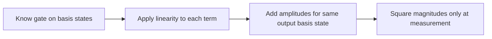
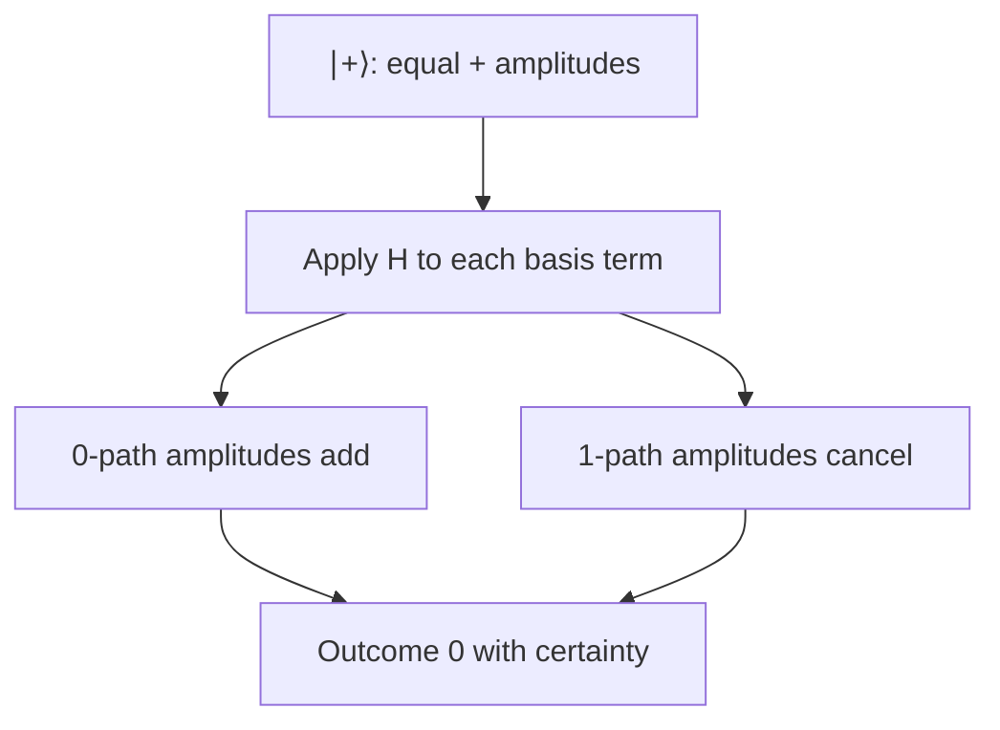
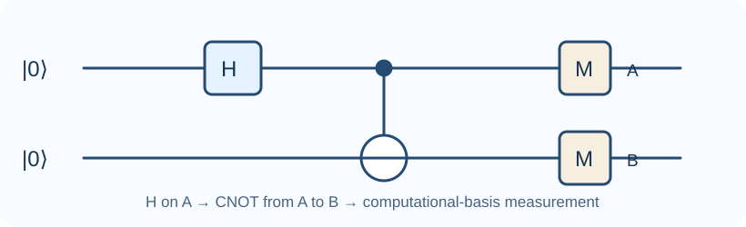
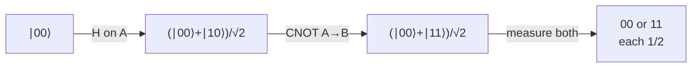
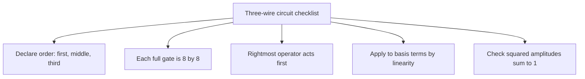
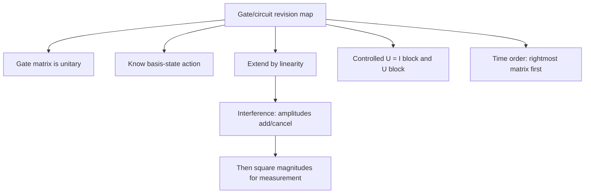

# Gate matrices and interference

## The idea in one sentence

A gate tells every basis state where to go; **linearity** then tells every superposition where to go, and amplitudes can add or cancel before measurement.

The playlist begins its gate section by treating gates as unitary operations on basis states ([“Quantum Gates-I,” about 0:00–15:00](https://www.youtube.com/watch?v=ZuvCUU2jD30&t=0s)). We use the two-qubit order $\ket{AB}=\ket{00},\ket{01},\ket{10},\ket{11}$.

## 1. Learn a gate by its action on $\ket0,\ket1$

Three common single-qubit gates are

$$
X=\begin{pmatrix}0&1\\1&0\end{pmatrix},\qquad
Z=\begin{pmatrix}1&0\\0&-1\end{pmatrix},\qquad
H=\frac1{\sqrt2}\begin{pmatrix}1&1\\1&-1\end{pmatrix}.
$$

Their basis actions are easier to memorize than a matrix full of symbols:

| Gate | On $\ket0$ | On $\ket1$ | Intuition |
| --- | --- | --- | --- |
| $X$ | $\ket1$ | $\ket0$ | Flip the basis label |
| $Z$ | $\ket0$ | $-\ket1$ | Flip relative phase |
| $H$ | $\ket+$ | $\ket-$ | Change between $Z$ and $X$ bases |

The playlist works Pauli $X,Y,Z$ and Hadamard actions in [“Quantum Gates-I,” about 20:00–45:00](https://www.youtube.com/watch?v=ZuvCUU2jD30&t=1200s); MIT also derives the $H^2=I$ identity in [U1.4, “Quantum gate identities: Hadamard gates”](https://openlearninglibrary.mit.edu/courses/course-v1:MITx+8.370.1x+1T2018/courseware/Week2/lectures_u1_4/).

### The key step: apply linearity before probabilities

If $\ket\psi=\alpha\ket0+\beta\ket1$, then

$$
H\ket\psi
=\alpha H\ket0+\beta H\ket1
=\frac{(\alpha+\beta)\ket0+(\alpha-\beta)\ket1}{\sqrt2}.
$$

For $\ket+=\frac1{\sqrt2}(\ket0+\ket1)$, the $\ket1$ amplitude after $H$ is $(1/\sqrt2-1/\sqrt2)/\sqrt2=0$. The $\ket0$ amplitude is $1$. Thus $H\ket+=\ket0$. **Interference** is the cancellation of amplitudes, not cancellation of probabilities.

## 2. Controlled gates: the top bit chooses an operation

For a control qubit $A$ and target $B$, a controlled-$U$ applies $I$ to $B$ if $A=0$ and $U$ if $A=1$:

$$
C_U=\ket0\bra0\otimes I+\ket1\bra1\otimes U
=\begin{pmatrix}I&0\\0&U\end{pmatrix}
$$

in our $00,01,10,11$ basis order. The block matrix makes sense: the first two coordinates have control $0$, and the last two have control $1$. The playlist introduces this block form in [“Quantum Gates-II,” about 29:00–34:00](https://www.youtube.com/watch?v=Yi_yjzaj5o4&t=1740s).

Set $U=X$ to get CNOT:

$$
\operatorname{CNOT}_{A\to B}
=\begin{pmatrix}
1&0&0&0\\0&1&0&0\\0&0&0&1\\0&0&1&0
\end{pmatrix}.
$$

It maps $00\to00$, $01\to01$, $10\to11$, and $11\to10$. The matrix is unitary because it permutes orthonormal basis vectors. The playlist connects this action to XOR around [“Quantum Gates-II,” 34:00–40:00](https://www.youtube.com/watch?v=Yi_yjzaj5o4&t=2040s).

:::warning Control convention
Some books draw the control on a different wire or reverse displayed bitstring order. Never memorize the 4×4 matrix without its stated basis order and control/target labels.
:::

## 3. Trace a circuit through every stage

Start with $\ket{00}$. The first gate acts only on $A$:

$$
(H\otimes I)\ket{00}
=\frac{\ket{00}+\ket{10}}{\sqrt2}.
$$

Now CNOT leaves $\ket{00}$ unchanged and maps $\ket{10}\to\ket{11}$:

$$
\operatorname{CNOT}_{A\to B}
\frac{\ket{00}+\ket{10}}{\sqrt2}
=\frac{\ket{00}+\ket{11}}{\sqrt2}=\ket{\Phi^+}.
$$

This is a Bell state. Its computational-basis outcomes are $00$ and $11$, each with probability $1/2$. Neither qubit has a definite individual outcome, but the results agree when both are measured in this basis. The state is normalized: $1/2+1/2=1$.

## 4. Matrix order follows time order backwards

If gate $G_1$ acts first and gate $G_2$ acts second, the final state is $G_2G_1\ket\psi$. The **rightmost** matrix touches the input first. For the Bell circuit above,

$$
\ket{\Phi^+}=\operatorname{CNOT}_{A\to B}(H\otimes I)\ket{00}.
$$

Reading this left to right as a time sequence is a frequent mistake. A circuit diagram puts time on its horizontal axis; a matrix product applies right to left. Check a proposed identity on every basis vector or multiply the matrices to verify it.

The playlist continues into more gates and multi-qubit circuits in its [“Quantum Gates-III”](https://www.youtube.com/watch?v=emHhNFf5AVM), [“Quantum Circuits-I”](https://www.youtube.com/watch?v=_LsNOxTxYJo), and [“Quantum Circuits-II”](https://www.youtube.com/watch?v=rR1eiKzRndM) videos. Those videos are archived in the source register; their unavailable captions are not used to support a specific equation here.

## 5. Scale the same method to three wires

A three-qubit state has $2^3=8$ basis amplitudes. A single-qubit gate on the **first** wire is $H\otimes I\otimes I$, an $8\times8$ matrix. A controlled flip from the first to the third wire can be written without listing all 64 matrix entries:

$$
C_{1\to3}=\ket0\bra0\otimes I\otimes I
+\ket1\bra1\otimes I\otimes X.
$$

The playlist's separate [three-qubit circuit-solving example, about 0:00–20:00](https://www.youtube.com/watch?v=aeQGhh5t-lU&t=0s) constructs a full unitary from wire-wise tensor products and reverses time order in the matrix product. Here is a **smaller original example** to practice that method:

$$
\begin{aligned}
\ket{000}
&\xrightarrow{H\otimes I\otimes I}
\frac{\ket{000}+\ket{100}}{\sqrt2}\\
&\xrightarrow{C_{1\to3}}
\frac{\ket{000}+\ket{101}}{\sqrt2}\\
&\xrightarrow{I\otimes X\otimes I}
\frac{\ket{010}+\ket{111}}{\sqrt2}.
\end{aligned}
$$

Thus the total operator is $(I\otimes X\otimes I)C_{1\to3}(H\otimes I\otimes I)$. Each arrow can be checked on the displayed basis terms; you need not multiply three full $8\times8$ matrices just to determine this output. The result is normalized, with two outcomes of probability $1/2$. The middle qubit is always $1$, while the first and third are correlated.

## What to remember in 30 seconds

## Check your understanding

What is $HZ\ket+$?

$Z\ket+=\ket-$, then $H\ket-=\ket1$. Since $Z$ acts first, the answer is $\ket1$.

What is $\operatorname{CNOT}_{A\to B}\ket{01}$?

The control $A$ is 0, so the target is unchanged: $\ket{01}$.

Why is $H\ket+$ deterministic even though $\ket+$ has two terms?

The two $\ket1$ output amplitudes have opposite signs and cancel; the $\ket0$ amplitudes add. Probabilities are computed only after adding amplitudes.

In the three-wire example, what happens if the final $X$ on the middle wire is omitted?

The output is $(\ket{000}+\ket{101})/\sqrt2$. Only the middle qubit's fixed value changes when the $X$ is restored.

## Next connections

- [Reversible classical computation](03-reversible-classical-computation.md) explains CNOT and Toffoli on bit strings.
- [Measuring part of a quantum system](../states-and-measurement/04-measuring-part-of-a-quantum-system.md) follows what happens after the Bell circuit.
