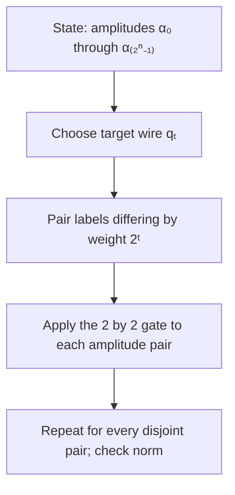
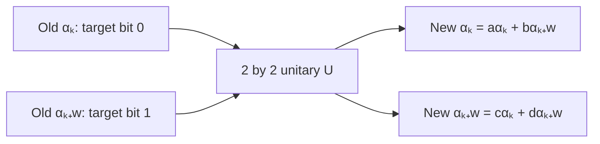
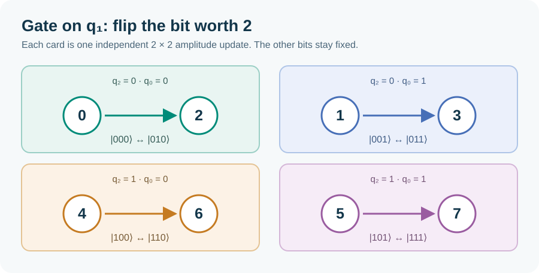
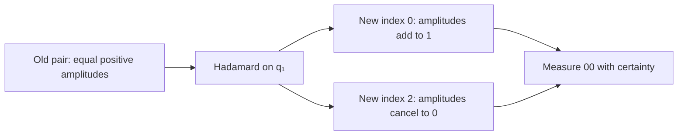
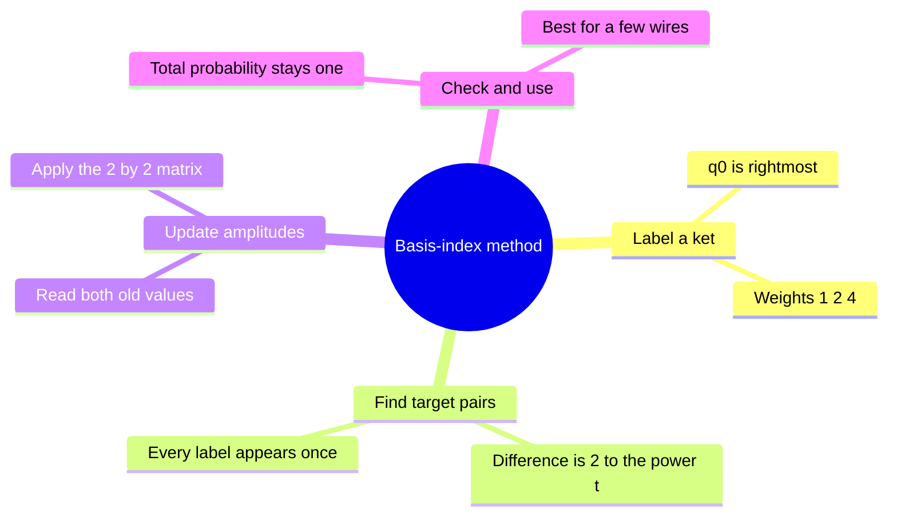

# Solve circuits with basis-index pairs

## The idea in one sentence

Give each basis ket a decimal label, then update only the **two amplitudes whose labels differ at the target bit**; this is ordinary matrix multiplication made easier to see.

The video introduces its decimal-label notation in [1:08–9:12](https://www.youtube.com/watch?v=hPtKTLVtRjA&t=68s), then derives single-wire rules from gate-matrix columns in [9:12–26:15](https://www.youtube.com/watch?v=hPtKTLVtRjA&t=552s). This is a **hand-calculation organization method**, not a different kind of quantum operation. The worked examples below are original small checks of the method.

## 1. Declare the bit order before touching a gate

For this note, $q_0$ is the **rightmost, least-significant** bit. The three-qubit ket $\ket{q_2q_1q_0}$ has decimal index

$$
k=4q_2+2q_1+q_0,
\qquad \ket k_3\equiv\ket{q_2q_1q_0}.
$$

The subscript on $\ket k_3$ says there are **three qubits**; it is not a multiplication or a probability. The basis table is a map, not a new state:

| Decimal $k$ | Binary ket | Bits on | Decimal $k$ | Binary ket | Bits on |
| --- | --- | --- | --- | --- | --- |
| 0 | $\ket{000}$ | none | 4 | $\ket{100}$ | $q_2$ |
| 1 | $\ket{001}$ | $q_0$ | 5 | $\ket{101}$ | $q_2,q_0$ |
| 2 | $\ket{010}$ | $q_1$ | 6 | $\ket{110}$ | $q_2,q_1$ |
| 3 | $\ket{011}$ | $q_1,q_0$ | 7 | $\ket{111}$ | all three |

The video explicitly assigns weights $1,2,4$ from least to most significant in [about 3:00–8:50](https://www.youtube.com/watch?v=hPtKTLVtRjA&t=180s). Some simulators print wires in a different top-to-bottom order, so translate their display before comparing an answer; the speaker notes this issue during [the gate-combination examples, about 1:05:50](https://www.youtube.com/watch?v=hPtKTLVtRjA&t=3950s).

:::tip Fast conversion
For $\ket{101}$, compute $4+0+1=5$. Conversely, $6=4+2+0$, so $\ket6_3=\ket{110}$. Keeping the weights above the wires prevents most indexing mistakes.
:::

## 2. A local gate acts on disjoint pairs

For an $n$-qubit state,

$$
\ket\psi=\sum_{k=0}^{2^n-1}\alpha_k\ket k_n,
\qquad\sum_k|\alpha_k|^2=1.
$$

Let a one-qubit gate $U$ act on target $q_t$. The target's index weight is $w=2^t$. For every $k$ whose target bit is **0**, make one pair $(k,k+w)$. The first member has target 0; the second has target 1. If

$$
U=\begin{pmatrix}a&b\\c&d\end{pmatrix},
$$

then update the **old pair of amplitudes together**:

$$
\begin{pmatrix}\alpha'_k\\\alpha'_{k+w}\end{pmatrix}
=\begin{pmatrix}a&b\\c&d\end{pmatrix}
\begin{pmatrix}\alpha_k\\\alpha_{k+w}\end{pmatrix}
=\begin{pmatrix}a\alpha_k+b\alpha_{k+w}\\c\alpha_k+d\alpha_{k+w}\end{pmatrix}.
$$

The video writes its off-diagonal symbols in the opposite letter order, $\begin{pmatrix}a&c\\b&d\end{pmatrix}$. Here $b$ means the **top-right** entry and $c$ the **bottom-left** entry, matching the matrix displayed above. The rule depends on **column positions**, not letter names.

This compact formula is the safe version of the video's “use the first column for an off target and the second for an on target” instruction around [17:43–25:15](https://www.youtube.com/watch?v=hPtKTLVtRjA&t=1063s). When the input is one basis ket, the relevant column indeed gives the output. For an arbitrary superposition, **both old amplitudes** contribute to each new one. Do not overwrite $\alpha_k$ before reading the old $\alpha_{k+w}$.

### The four pairs for $q_1$ in three qubits

Here $w=2$. Group labels by the **other** two bits:

| Other bits $(q_2,q_0)$ | Target off | Target on | Pair |
| --- | --- | --- | --- |
| $(0,0)$ | $\ket{000}=\ket0_3$ | $\ket{010}=\ket2_3$ | $(0,2)$ |
| $(0,1)$ | $\ket{001}=\ket1_3$ | $\ket{011}=\ket3_3$ | $(1,3)$ |
| $(1,0)$ | $\ket{100}=\ket4_3$ | $\ket{110}=\ket6_3$ | $(4,6)$ |
| $(1,1)$ | $\ket{101}=\ket5_3$ | $\ket{111}=\ket7_3$ | $(5,7)$ |

Each label appears exactly once. The video builds the two-qubit $(0,2),(1,3)$ pattern around [31:44–37:14](https://www.youtube.com/watch?v=hPtKTLVtRjA&t=1904s) and extends it by adding the unused weight 4 around [42:44–47:14](https://www.youtube.com/watch?v=hPtKTLVtRjA&t=2564s).

## 3. Worked example: a Hadamard column on the middle qubit

Start with $\ket{101}=\ket5_3$. Its middle bit $q_1$ is 0, so the relevant pair is $(5,7)$ and we use the **first column** of $H$:

$$
H=\frac1{\sqrt2}\begin{pmatrix}1&1\\1&-1\end{pmatrix},
\qquad H_{q_1}\ket5_3
=\frac{\ket5_3+\ket7_3}{\sqrt2}
=\frac{\ket{101}+\ket{111}}{\sqrt2}.
$$

If the input is instead $\ket7_3$, its middle bit is 1, so the **second column** gives $(\ket5_3-\ket7_3)/\sqrt2$. Notice how the relative minus sign depends on the input column. The video works this column-selection idea with $H$ and rotation matrices in [17:43–26:15](https://www.youtube.com/watch?v=hPtKTLVtRjA&t=1063s).

## 4. Worked example: interference needs both amplitudes

Take a normalized two-qubit input $\ket\phi=(\ket0_2+\ket2_2)/\sqrt2$, which is $\ket+_{q_1}\ket0_{q_0}$. Apply $H$ on $q_1$. In the pair $(0,2)$ the old amplitude vector is $(1/\sqrt2,1/\sqrt2)^T$:

$$
\begin{pmatrix}\alpha'_0\\\alpha'_2\end{pmatrix}
=H\begin{pmatrix}1/\sqrt2\\1/\sqrt2\end{pmatrix}
=\begin{pmatrix}1\\0\end{pmatrix}.
$$

The final state is $\ket0_2=\ket{00}$. The two paths into $\ket2_2$ cancel **before** probabilities are squared. This example shows why the pair formula is safer than separately saying “each basis ket follows one column.”

## 5. Quick gate cards for the same pair

| Gate on $q_t$ | Old pair $(u,v)$ becomes | Meaning |
| --- | --- | --- |
| $X$ | $(v,u)$ | Swap the two labels |
| $Z$ | $(u,-v)$ | Give target-on branch a minus sign |
| $S=\operatorname{diag}(1,i)$ | $(u,iv)$ | Quarter-turn phase on target-on branch |
| $H$ | $((u+v)/\sqrt2,(u-v)/\sqrt2)$ | Mix and possibly cancel amplitudes |

The video organizes flip/phase/superposition gates in [48:14–1:23:26](https://www.youtube.com/watch?v=hPtKTLVtRjA&t=2894s). The table follows their exact matrices, so it also handles non-basis inputs.

:::example Three wires, two local gates
Begin at $\ket{010}=\ket2_3$. Apply $H$ to $q_1$: because the target is on, the state becomes $(\ket0_3-\ket2_3)/\sqrt2$. Then apply $X$ to $q_0$, swapping $(0,1)$ and $(2,3)$. The result is $(\ket1_3-\ket3_3)/\sqrt2=(\ket{001}-\ket{011})/\sqrt2$. Both squared amplitudes are $1/2$.
:::

## What to remember in 30 seconds

The method does not evade exponential state-space size: a fully general $n$-qubit state has $2^n$ amplitudes. Its benefit is avoiding a bulky full matrix for a **small** circuit. The next note adds controls to the same pair rule.

## Check your understanding

For three qubits, what pairs does a gate on $q_0$ update?

The weight is 1: $(0,1),(2,3),(4,5),(6,7)$.

What is $X_{q_2}\ket{011}$?

$\ket{011}=\ket3_3$ and $q_2$ has weight 4. Flip that bit to get $\ket7_3=\ket{111}$.

Why must the pair amplitudes be read before either is overwritten?

Both new values depend on both old values. A sequential in-place update would feed a new amplitude into the second calculation and cease to be the intended matrix product.

## Next connections

- [Controlled gates and circuit identities](07-controlled-gates-anticontrols-and-circuit-identities.md) selects which pairs actually receive an operation.
- [Gate matrices and interference](05-gate-matrices-and-interference.md) presents the full-matrix viewpoint this method abbreviates.
- [Tensor products and two-qubit space](../mathematics/03-tensor-products-and-two-qubit-space.md) explains why an $n$-qubit state has $2^n$ amplitudes.
