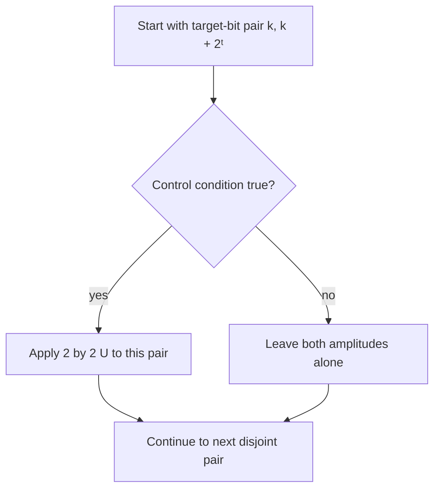
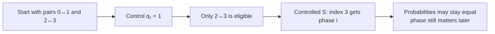
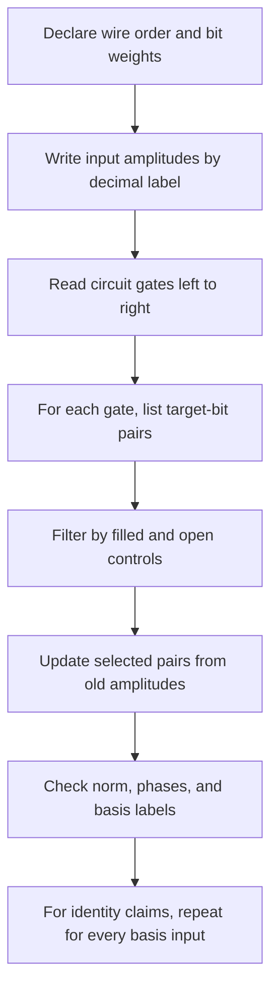
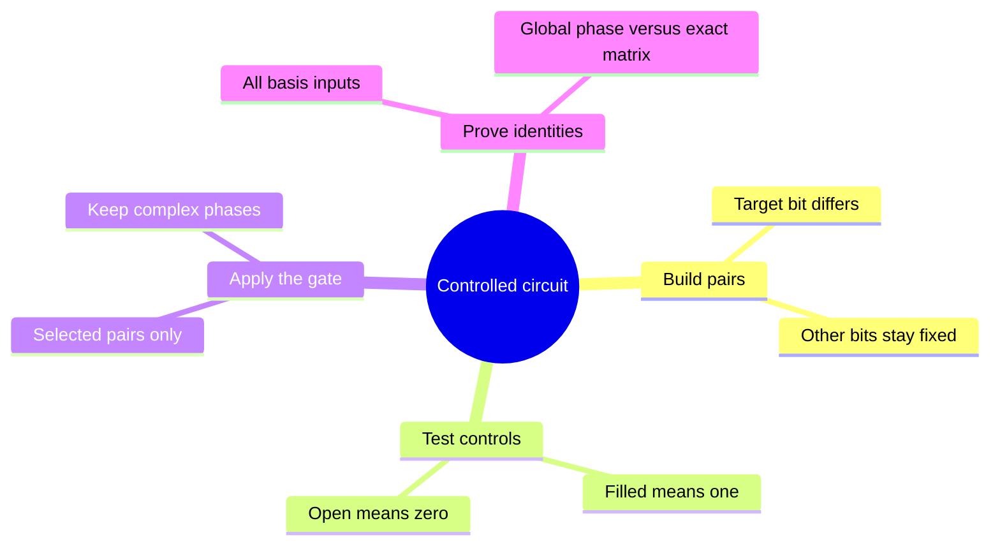

# Controlled gates, anticontrols, and circuit identities

## The idea in one sentence

A controlled gate uses the same two-amplitude update as an ordinary gate, but only on pairs whose **control bits meet a stated condition**; that makes even three-wire circuits manageable by hand.

This continues [Solve circuits with basis-index pairs](06-solve-circuits-with-basis-index-pairs.md). We keep its convention: $\ket{q_{n-1}\cdots q_0}=\ket k_n$ with $q_0$ the **rightmost** bit and weight $2^0=1$. The video starts controlled-$U$ examples in [1:23:26–1:43:43](https://www.youtube.com/watch?v=hPtKTLVtRjA&t=5006s), and revisits two-control and open-control cases in [5:04:34–6:37:15](https://www.youtube.com/watch?v=hPtKTLVtRjA&t=18274s).

## 1. Write the eligibility rule before the output

Let $t$ be the target bit and $c$ a different control bit. Every target pair has a target-off index $k$ and target-on index $k+2^t$; both members have the **same control bit**. Select a pair according to the gate:

| Gate symbol | Condition on $q_c$ | What to do to selected pair |
| --- | --- | --- |
| Filled control $\bullet$ with $U$ target | $q_c=1$ | Apply $U$ |
| Open control $\circ$ with $U$ target | $q_c=0$ | Apply $U$ |
| Two filled controls | $q_{c_1}=q_{c_2}=1$ | Apply $U$ |
| One filled, one open | Required $1$ and $0$ both hold | Apply $U$ |

An open control is often called an **anticontrol**. It means “operate when this control bit is zero,” not “negate the target.” The lecture illustrates its pair filtering in [the final section, about 5:40:30–5:54:41](https://www.youtube.com/watch?v=hPtKTLVtRjA&t=20430s).

## 2. Worked example: CNOT is one selected swap

Take two qubits $\ket{q_1q_0}$, with $q_1$ as control and $q_0$ as target. An $X$ target normally swaps pairs $(0,1)$ and $(2,3)$. The control demands $q_1=1$, so only $(2,3)$ is eligible:

| Input label | Binary | CNOT output | Why |
| --- | --- | --- | --- |
| 0 | $00$ | 0 | Control off |
| 1 | $01$ | 1 | Control off |
| 2 | $10$ | 3 | Control on; target flips |
| 3 | $11$ | 2 | Control on; target flips |

Now start with a superposition, not just one row. Prepare $\ket{00}$, apply $H$ to $q_1$, then CNOT:

$$
\ket0_2
\xrightarrow{H_{q_1}}\frac{\ket0_2+\ket2_2}{\sqrt2}
\xrightarrow{\mathrm{CNOT}_{q_1\to q_0}}
\frac{\ket0_2+\ket3_2}{\sqrt2}
=\frac{\ket{00}+\ket{11}}{\sqrt2}.
$$

The CNOT swaps **only** the $2$ amplitude into slot $3$; the $0$ amplitude stays. The video uses controlled index pairs, including CNOT, in [about 1:28:30–1:38:38](https://www.youtube.com/watch?v=hPtKTLVtRjA&t=5310s). This small Bell-state calculation is independently checked and also connects to [Gate matrices and interference](05-gate-matrices-and-interference.md).

## 3. Worked example: a controlled phase changes a sign or phase

For controlled-$S$ with control $q_1$ and target $q_0$, the eligible target pair is again $(2,3)$. Since $S=\operatorname{diag}(1,i)$, label $2$ stays unchanged and label $3$ gets a factor $i$. Applied to $\ket+\ket+$,

$$
\frac{\ket0_2+\ket1_2+\ket2_2+\ket3_2}{2}
\longmapsto
\frac{\ket0_2+\ket1_2+\ket2_2+i\ket3_2}{2}.
$$

Every amplitude still has magnitude $1/2$, so all four computational-basis probabilities stay $1/4$. The **relative phase** changed, and later gates can make that change visible through interference. The video discusses controlled phase gates around [1:33:34–1:42:43](https://www.youtube.com/watch?v=hPtKTLVtRjA&t=5614s).

## 4. Two closed controls give Toffoli

For three qubits $\ket{q_2q_1q_0}$, let $q_2,q_1$ control an $X$ on target $q_0$. The target's four pairs are $(0,1),(2,3),(4,5),(6,7)$. The only pair with **both** controls equal to $1$ is $(6,7)$. Therefore Toffoli swaps $\ket{110}$ and $\ket{111}$ and fixes the other six basis states:

$$
\operatorname{Toffoli}_{q_2,q_1\to q_0}\ket6_3=\ket7_3,
\qquad
\operatorname{Toffoli}_{q_2,q_1\to q_0}\ket7_3=\ket6_3.
$$

On $\ket\psi=(\ket5_3+\ket6_3)/\sqrt2$, only the second term changes, giving $(\ket5_3+\ket7_3)/\sqrt2$. The result remains normalized. The video derives the two-control selection and Toffoli pair in [about 5:04:34–5:22:32](https://www.youtube.com/watch?v=hPtKTLVtRjA&t=18274s).

## 5. An open control is a zero-bit test

Put a **filled** control on $q_2$, an **open** control on $q_1$, and $X$ on target $q_0$. The only eligible target pair has $(q_2,q_1)=(1,0)$: $(4,5)$. Pair $(6,7)$ is excluded because $q_1=1$.

:::example Mixed-control trace
Start with $\ket\psi=(\ket4_3+i\ket5_3+\ket6_3)/\sqrt3$. The gate swaps the old amplitudes at labels $4$ and $5$, leaving label $6$ alone:

$$
\ket\psi\longmapsto
\frac{i\ket4_3+\ket5_3+\ket6_3}{\sqrt3}.
$$

The squared magnitudes still add to one. The factor $i$ moved with its amplitude; it did not disappear.
:::

An anticontrol can also be built from ordinary controls: put $X$ on the **control** wire before and after a controlled-$U$ gate,

$$
C_{q_c=0}(U)=X_{q_c}\,C_{q_c=1}(U)\,X_{q_c}.
$$

The rightmost $X$ acts first. If the original control was $0$, it becomes $1$ just long enough to trigger $U$ and then returns to $0$. If it was $1$, the middle gate is bypassed. This is a basis-state proof that works for arbitrary superpositions by linearity.

## 6. Test a circuit identity on every basis input

Two circuits that agree on **one** input might disagree elsewhere. To prove exact equality of their unitary matrices on $n$ qubits, compare outputs on all $2^n$ computational-basis inputs; linearity then covers every superposition. The lecture uses basis-index tracing to compare circuits in [1:43:43–2:12:34](https://www.youtube.com/watch?v=hPtKTLVtRjA&t=6223s) and again in [2:27:59–3:13:44](https://www.youtube.com/watch?v=hPtKTLVtRjA&t=8879s).

### Example A: three CNOTs make SWAP

For two qubits, let $C_{10}$ mean CNOT from $q_1$ to $q_0$ and $C_{01}$ the reverse. Apply $C_{10}$, then $C_{01}$, then $C_{10}$:

| Input | After $C_{10}$ | After $C_{01}$ | After $C_{10}$ | SWAP answer |
| --- | --- | --- | --- | --- |
| $00$ | $00$ | $00$ | $00$ | $00$ |
| $01$ | $01$ | $11$ | $10$ | $10$ |
| $10$ | $11$ | $01$ | $01$ | $01$ |
| $11$ | $10$ | $10$ | $11$ | $11$ |

Every basis input matches SWAP. Thus the total matrix is $C_{10}C_{01}C_{10}$, with the **rightmost** $C_{10}$ acting first. The video traces this identity near [2:08:43–2:12:34](https://www.youtube.com/watch?v=hPtKTLVtRjA&t=7723s).

### Example B: Hadamard turns a target-X into a target-Z

The single-qubit identity $HXH=Z$ gives

$$
(I\otimes H)\,\mathrm{CNOT}_{q_1\to q_0}\,(I\otimes H)
=\mathrm{CZ}.
$$

To see the key case, input $\ket{11}$. The first target $H$ turns $\ket1$ into $\ket-$. The controlled $X$ acts because $q_1=1$, and $X\ket-=-\ket-$. The last target $H$ returns $-\ket1$, so $\ket{11}\mapsto-\ket{11}$. With control $0$, CNOT does nothing and the two $H$ gates cancel; with control $1$ and target $0$, $X\ket+=\ket+$, so that input stays positive. Thus only $\ket{11}$ receives a minus sign, exactly CZ. The video presents the Hadamard/CNOT equivalence around [1:57:13–2:01:03](https://www.youtube.com/watch?v=hPtKTLVtRjA&t=7033s).

:::note Exact versus physical equivalence
The table and identity above show **exactly equal matrices**. If two complete circuits differ only by one common factor $e^{i\gamma}$ on *every* output, they give the same pure-state measurement predictions but are not literally equal matrices. A relative phase on only one branch is observable after interference and must not be discarded.
:::

## 7. A compact solving checklist

This is especially useful for a few wires and sparse inputs. It does **not** make general large quantum-state simulation cheap: a complete state table still has $2^n$ amplitudes. For long circuits, keep a short state table after each gate and cross out branches known to have zero amplitude.

## What to remember in 30 seconds

## Check your understanding

In the three-qubit Toffoli above, does $\ket5_3=\ket{101}$ change?

No. The controls are $q_2=1$ and $q_1=0$, so the two-filled-control condition fails.

For the mixed closed/open-control gate, why is $(6,7)$ excluded?

Both labels have $q_1=1$, while the open control requires $q_1=0$.

If two circuits both return $\ket{00}$ on input $\ket{00}$, are they equivalent?

That single input is insufficient. Compare all four two-qubit basis inputs (or prove an operator identity) before claiming exact equality.

## Next connections

- [Solve circuits with basis-index pairs](06-solve-circuits-with-basis-index-pairs.md) derives the underlying amplitude update.
- [Reversible classical computation](03-reversible-classical-computation.md) gives CNOT and Toffoli truth-table intuition.
- [No-cloning](../states-and-measurement/06-no-cloning-and-why-copying-a-bit-is-different.md) explains why control and fanout do not copy an arbitrary unknown state.
