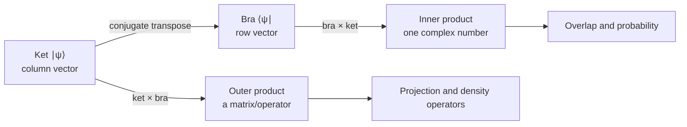
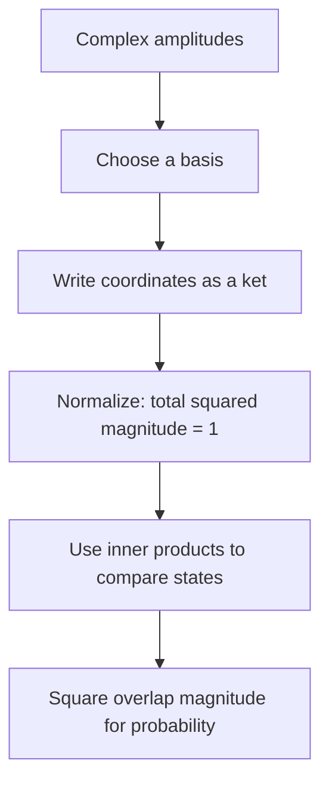
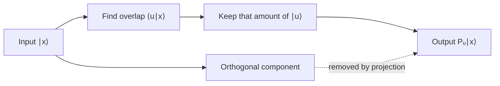
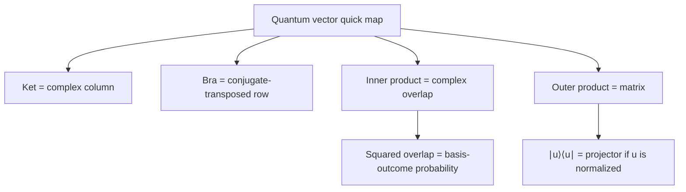

# Complex vectors and Dirac notation

## The idea in one sentence

A quantum state is represented by a **unit-length complex vector**; an inner product compares states, while an outer product makes an operator that can act on states.

:::note How to use this note
Read the diagrams first, then work the example with a pencil. The final revision map and self-checks are designed for a quick second pass. We use finite-dimensional spaces, as in [MIT's prerequisite introduction at 1:38](https://www.youtube.com/watch?v=LUkz6k2208Q&t=98s).
:::

## First picture: what each object does

This is the one distinction to memorize: **bra times ket gives a number; ket times bra gives a matrix.** [MIT introduces kets, bras, and inner products around 5:12–6:40](https://www.youtube.com/watch?v=UikJ0wg-Z7U&t=312s); the playlist develops inner and outer products at [about 1:01:30](https://www.youtube.com/watch?v=02Iu2StZfko&t=3690s) and [1:18:35](https://www.youtube.com/watch?v=02Iu2StZfko&t=4715s).

## 1. A complex vector is a list of amplitudes

A complex number has the form $z=a+ib$, where $i^2=-1$. Its conjugate is $z^*=a-ib$, and its squared magnitude is

$$
|z|^2=z^*z=a^2+b^2.
$$

The numbers $a$ and $b$ can be negative; $|z|^2$ cannot. That is why squared magnitudes can become probabilities. A two-dimensional complex vector is

$$
\ket{v}=\begin{pmatrix}v_0\\v_1\end{pmatrix}
=v_0\ket{0}+v_1\ket{1},
\qquad
\ket{0}=\begin{pmatrix}1\\0\end{pmatrix},\quad
\ket{1}=\begin{pmatrix}0\\1\end{pmatrix}.
$$

The basis states tell us **which coordinate is which**. The coefficients tell us the amplitude in each basis direction. MIT uses photon polarization and spin as physical examples of two distinguishable basis states ([U1.3 at 1:10–2:11](https://www.youtube.com/watch?v=UikJ0wg-Z7U&t=70s)).

:::definition Finite-dimensional state space
For an $n$-level system, a state vector lives in $\mathbb C^n$: an $n$-component list of complex amplitudes. A physical pure-state representative has length one. Multiplying the entire vector by the same phase $e^{i\gamma}$ does not change its measurement predictions; relative phases generally do.
:::

### Normalization, step by step

For $\ket{w}=\begin{pmatrix}1\\2i\end{pmatrix}$, the squared length is $1^2+|2i|^2=1+4=5$. Divide by $\sqrt5$:

$$
\ket{\psi}=\frac{1}{\sqrt5}\begin{pmatrix}1\\2i\end{pmatrix},
\qquad
\langle\psi|\psi\rangle=\frac{1+4}{5}=1.
$$

If you divide by $5$ instead, the squared length becomes $1/5$, not one. The playlist works this normalization-constant idea at [about 39:15–42:00](https://www.youtube.com/watch?v=02Iu2StZfko&t=2355s).

## 2. Turn a ket into a bra

To turn a column vector into its corresponding row vector, **transpose and conjugate** every component:

$$
\ket{\psi}=\begin{pmatrix}\alpha\\\beta\end{pmatrix}
\quad\Longrightarrow\quad
\bra{\psi}=\begin{pmatrix}\alpha^*&\beta^*\end{pmatrix}.
$$

For the normalized vector above,

$$
\bra{\psi}=\frac{1}{\sqrt5}\begin{pmatrix}1&-2i\end{pmatrix}.
$$

The minus sign comes from conjugating $2i$. Omitting it is a common error. MIT states the bra as the ket's conjugate transpose at [5:37–5:49](https://www.youtube.com/watch?v=UikJ0wg-Z7U&t=337s).

## 3. Inner product: “How much of one state points along another?”

For $\ket{u},\ket{v}\in\mathbb C^n$,

$$
\braket{u|v}=\sum_{j=0}^{n-1}u_j^*v_j.
$$

This is a complex number. Conjugation belongs to the **first** argument in this convention. It gives three useful checks:

$$
\braket{v|v}=\sum_j|v_j|^2\geq0,
\qquad
\braket{u|v}=\braket{v|u}^*,
\qquad
\braket{0|1}=0.
$$

The first expression is the squared length. The last says the computational basis vectors are orthogonal. An orthonormal basis also has $\braket{j|k}=\delta_{jk}$, where $\delta_{jk}=1$ when $j=k$ and $0$ otherwise.

If both $\ket{u}$ and $\ket{v}$ are normalized, then $|\braket{u|v}|^2$ is the probability of obtaining the $u$ outcome when a system in state $v$ is measured with a basis containing $u$. A single overlap is **not** the full measurement rule for arbitrary unnormalized vectors or a non-orthogonal set. The playlist connects overlap with transition probability around [1:01:30–1:07:00](https://www.youtube.com/watch?v=02Iu2StZfko&t=3690s).

:::example A complex overlap
Let $\ket{u}=(1,i)^T/\sqrt2$ and $\ket{v}=(1,0)^T$. Then $\bra{u}=(1,-i)/\sqrt2$, so

$$
\braket{u|v}=\frac{1}{\sqrt2},
\qquad
P(u\mid v)=|\braket{u|v}|^2=\frac12.
$$

The result lies between zero and one, as a probability must.
:::

## 4. Outer product: make an operator

Reverse the order of the multiplication:

$$
\ket{u}\bra{v}
=\begin{pmatrix}u_0\\u_1\end{pmatrix}
\begin{pmatrix}v_0^*&v_1^*\end{pmatrix}
=\begin{pmatrix}u_0v_0^*&u_0v_1^*\\u_1v_0^*&u_1v_1^*\end{pmatrix}.
$$

The result is a $2\times2$ matrix. Acting on another ket makes the structure clear:

$$
(\ket{u}\bra{v})\ket{x}=\ket{u}\,\braket{v|x}.
$$

Read right to left: first measure the overlap of $x$ with $v$; then put that complex coefficient in the $u$ direction. This is the playlist's operator viewpoint at [1:18:35–1:24:00](https://www.youtube.com/watch?v=02Iu2StZfko&t=4715s).

When $u=v$ and $u$ has unit length, $P_u=\ket{u}\bra{u}$ is a projector. It keeps the component along $u$ and removes the orthogonal component:

$$
P_u\ket{x}=\ket{u}\braket{u|x},
\qquad P_u^2=P_u,\qquad P_u^\dagger=P_u.
$$

For $\ket{u}=(1,i)^T/\sqrt2$,

$$
P_u=\frac12\begin{pmatrix}1&-i\\i&1\end{pmatrix}.
$$

Its trace is $1$, and direct multiplication gives $P_u^2=P_u$. More generally, $\operatorname{tr}(\ket{u}\bra{v})=\braket{v|u}$; the playlist discusses the trace of an outer product at [about 1:52:15](https://www.youtube.com/watch?v=02Iu2StZfko&t=6735s).

## What to remember in 30 seconds

| If you see… | Ask… | Quick check |
| --- | --- | --- |
| $\ket{\psi}$ | What basis are its coordinates in? | Column dimensions |
| $\bra{\psi}$ | Did I conjugate? | $i$ becomes $-i$ |
| $\braket{u|v}$ | Is the answer a number? | $\braket{v|u}=\braket{u|v}^*$ |
| $\ket{u}\bra{v}$ | Is the answer a matrix? | Dimensions: $n\times n$ |
| A probability | Did I square a magnitude? | Between $0$ and $1$; totals sum to $1$ |

## Check your understanding

Why is $(1,i)^T$ not normalized, and what fixes it?

Its squared length is $|1|^2+|i|^2=2$. Divide the vector by $\sqrt2$.

What are $\bra{v}$ and $\braket{v|v}$ for $\ket{v}=(1,2i)^T/\sqrt5$?

$\bra{v}=(1,-2i)/\sqrt5$ and $\braket{v|v}=(1+4)/5=1$.

Why does $\ket{u}\bra{u}$ need $u$ normalized to be a projector?

Squaring it gives $\ket{u}\braket{u|u}\bra{u}$. This equals the original operator only when $\braket{u|u}=1$ (apart from the zero-vector triviality).

## Next connections

- [Vectors and inner products](01-vectors-and-inner-products.md) is a shorter starter note.
- [Qubits and quantum states](../states-and-measurement/01-qubits-and-states.md) turns vector coordinates into measurement probabilities.
- [Tensor products and two-qubit space](03-tensor-products-and-two-qubit-space.md) explains how dimensions grow from one qubit to many.
