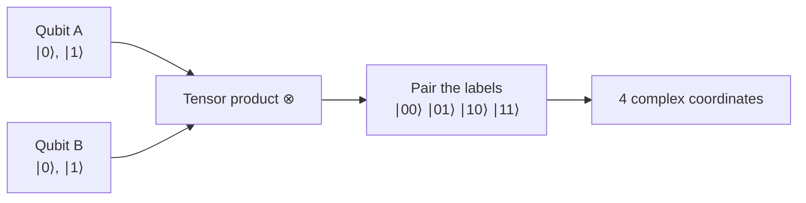
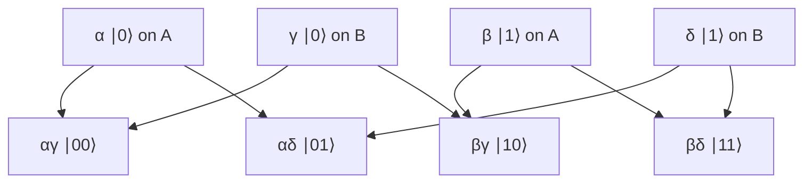
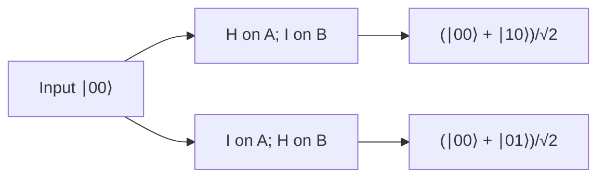
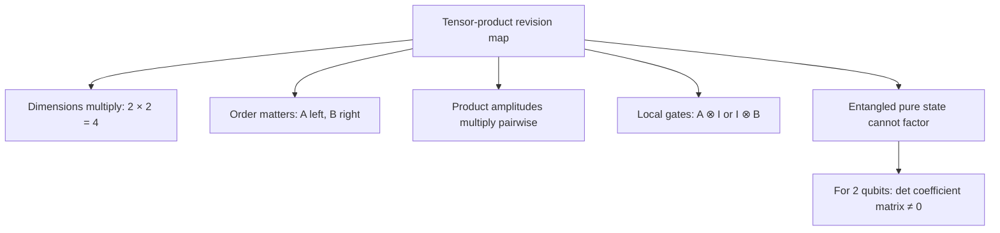

# Tensor products and two-qubit space

## The idea in one sentence

The tensor product combines two quantum systems: **multiply their dimensions**, pair their basis labels, and multiply their amplitudes when the joint state is a product state.

:::note A fixed convention for this note
System $A$ is written on the **left** and system $B$ on the **right**. Our coordinate order is $\ket{00},\ket{01},\ket{10},\ket{11}$, so $\ket{ab}=\ket{a}_A\otimes\ket{b}_B$. Stating this order prevents many silent gate mistakes. MIT uses this lexicographic order in its [tensor-product recap at 0:23–1:09](https://www.youtube.com/watch?v=UkqgvH4D1BA&t=23s).
:::

## The picture: two small spaces become one larger space

For $n$ qubits, the dimension is $2^n$. This is a **dimension** count, not a claim that one measurement reveals $2^n$ classical answers. MIT derives the four two-qubit basis states and the $2^n$ rule in [U1.4, “Tensor products and separable quantum states,” 0:14–1:44](https://www.youtube.com/watch?v=i8VslIQNDq0&t=14s).

## 1. Multiply two state vectors

Let

$$
\ket{a}=\alpha\ket0+\beta\ket1,
\qquad
\ket{b}=\gamma\ket0+\delta\ket1.
$$

Distribute as with ordinary algebra, but keep the subsystem labels:

$$
\begin{aligned}
\ket{a}\otimes\ket{b}
&=(\alpha\ket0_A+\beta\ket1_A)
  \otimes(\gamma\ket0_B+\delta\ket1_B)\\
&=\alpha\gamma\ket{00}+\alpha\delta\ket{01}
  +\beta\gamma\ket{10}+\beta\delta\ket{11}\\
&=\begin{pmatrix}\alpha\gamma\\\alpha\delta\\\beta\gamma\\\beta\delta\end{pmatrix}.
\end{aligned}
$$

Read the second line like a multiplication table: every amplitude from $A$ multiplies every amplitude from $B$. MIT writes this expansion in [U1.4 at about 6:35–7:12](https://www.youtube.com/watch?v=i8VslIQNDq0&t=395s).

### Worked example: $\ket+\otimes\ket1$

With $\ket+=(\ket0+\ket1)/\sqrt2$,

$$
\ket+\otimes\ket1
=\frac{\ket{01}+\ket{11}}{\sqrt2}
=\begin{pmatrix}0\\1/\sqrt2\\0\\1/\sqrt2\end{pmatrix}.
$$

Only $01$ and $11$ can appear in a computational-basis measurement, each with probability $1/2$. The $B$ bit is always $1$; the $A$ bit is random. Squared magnitudes add to one.

## 2. A general two-qubit state need not factor

Every normalized pure two-qubit state can be written

$$
\ket\psi=c_{00}\ket{00}+c_{01}\ket{01}
            +c_{10}\ket{10}+c_{11}\ket{11},
\qquad \sum_{a,b}|c_{ab}|^2=1.
$$

For a product state, the coefficient table has a special pattern:

$$
C=\begin{pmatrix}c_{00}&c_{01}\\c_{10}&c_{11}\end{pmatrix}
=\begin{pmatrix}\alpha\\\beta\end{pmatrix}
 \begin{pmatrix}\gamma&\delta\end{pmatrix}.
$$

That matrix has rank one, so $\det C=c_{00}c_{11}-c_{01}c_{10}=0$. For a **nonzero pure two-qubit state**, the reverse also holds: determinant zero means it can be factored into one-qubit vectors. This is an easy algebraic separability test. MIT distinguishes product from entangled states in [U1.4 at 5:37–7:56](https://www.youtube.com/watch?v=i8VslIQNDq0&t=337s).

:::example Bell state is not a product
For $\ket{\Phi^+}=(\ket{00}+\ket{11})/\sqrt2$,

$$
C=\frac1{\sqrt2}\begin{pmatrix}1&0\\0&1\end{pmatrix},
\qquad \det C=\frac12\ne0.
$$

No single state of $A$ tensored with a single state of $B$ can produce this ket. We call this pure state **entangled**. Its measurement outcomes are correlated, but each local outcome is still random.
:::

## 3. Multiply operators in the same order

If $A$ acts on the first qubit and $B$ on the second, the joint operator is $A\otimes B$. If $A=(a_{ij})$, form blocks by multiplying the whole matrix $B$ by each entry of $A$:

$$
A\otimes B=\begin{pmatrix}a_{00}B&a_{01}B\\a_{10}B&a_{11}B\end{pmatrix}.
$$

This is a $4\times4$ matrix when both input matrices are $2\times2$. MIT works through $H\otimes I$ and $I\otimes H$ in [U1.4, “Tensor products of matrices,” 0:00–4:50](https://www.youtube.com/watch?v=KJZtu-GIsUo&t=0s). Their difference is exactly which qubit changes.

For example, using $H=\frac1{\sqrt2}\begin{pmatrix}1&1\\1&-1\end{pmatrix}$,

$$
(H\otimes I)\ket{00}
=\frac{\ket{00}+\ket{10}}{\sqrt2},
\qquad
(I\otimes H)\ket{00}
=\frac{\ket{00}+\ket{01}}{\sqrt2}.
$$

The first gate randomizes $A$; the second randomizes $B$. Both outputs are normalized. A circuit should state wire order before presenting either expression.

## 4. A useful shortcut for overlaps

For product vectors,

$$
(\bra a\otimes\bra b)(\ket c\otimes\ket d)
=\braket{a|c}\,\braket{b|d}.
$$

This follows by distributing coordinates, and MIT explicitly develops it in [U1.4, “Inner product of two-qubit states,” around 0:59–1:40](https://www.youtube.com/watch?v=GlU40FYkYS0&t=59s). It lets you check orthogonality without constructing all four coordinates: $\braket{0|1}=0$ implies $\braket{0+|1+}=0$.

## What to remember in 30 seconds

| Object | One-qubit size | Two-qubit size |
| --- | --- | --- |
| State vector | $2\times1$ | $4\times1$ |
| Gate matrix | $2\times2$ | $4\times4$ |
| Basis labels | $0,1$ | $00,01,10,11$ |

## Check your understanding

Expand $(\ket0+i\ket1)\otimes\ket0$ before normalizing.

The expansion is $\ket{00}+i\ket{10}$. Its squared norm is two, so divide by $\sqrt2$ for a physical pure-state representative.

Why does $H\otimes I$ send $\ket{00}$ to a superposition of $00$ and $10$?

It changes only the left (A) factor: $H\ket0=\ket+$, while $I\ket0=\ket0$.

Is $(\ket{00}+\ket{11})/\sqrt2$ a product state?

No. Its $2\times2$ coefficient matrix has determinant $1/2$, so it has rank two.

## Next connections

- [Complex vectors and Dirac notation](02-complex-vectors-and-dirac-notation.md) explains the inner-product rule used here.
- [Measuring part of a quantum system](../states-and-measurement/04-measuring-part-of-a-quantum-system.md) shows what measuring just one factor of an entangled state does.
