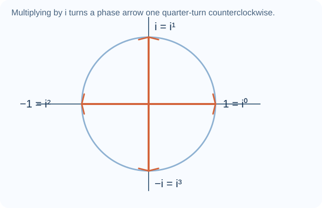
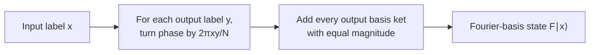
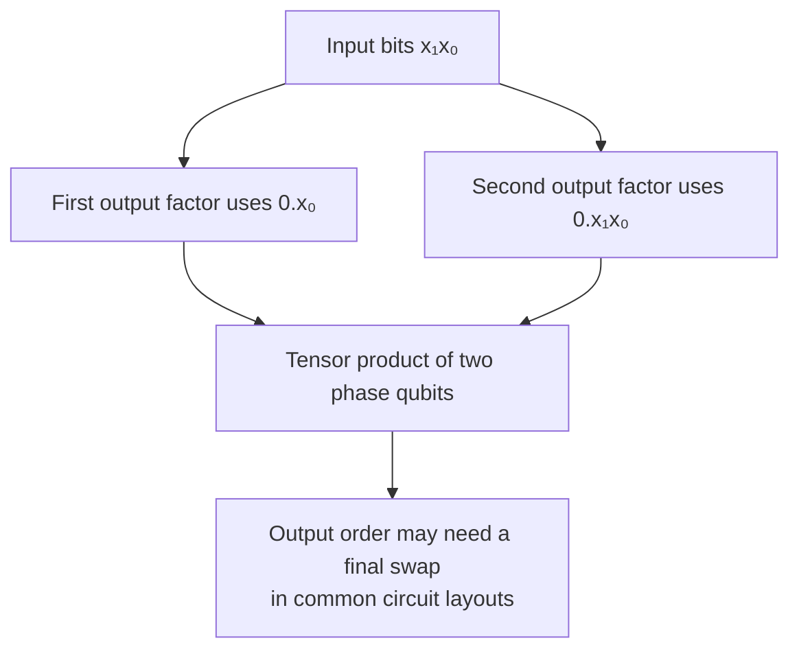
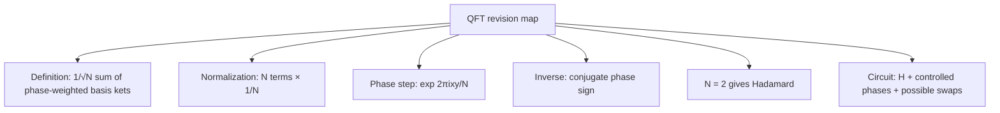

# Discrete and quantum Fourier transforms

## The idea in one sentence

The Fourier transform changes coordinates from **position labels** to **phase patterns**; the quantum Fourier transform (QFT) does that change of basis to the amplitudes of a quantum register.

This is a Foundations bridge to the site's future Basic Algorithms Fourier-transform topic. The requested playlist teaches the formula in lecture 13 and a circuit in lecture 14; MITx 8.370.1x Part 1 does not list QFT in its syllabus. The playlist's automatic captions are most useful for topic order and timestamps, so the signs, normalization, and two-qubit example below are checked directly from the definition.

## Phase clock: the picture before the formula

For $N=4$, the basic phase is $\omega=e^{2\pi i/4}=i$. Its powers are $1,i,-1,-i$, returning to $1$ after four steps. In the playlist, the root-of-unity definition appears in [lecture 13 around 15:00–20:00](https://www.youtube.com/watch?v=Ob4mcdBimro&t=900s).

## 1. The discrete Fourier transform as a matrix

Fix the **positive-exponent convention**:

$$
F_N\ket x
=\frac1{\sqrt N}\sum_{y=0}^{N-1}e^{2\pi ixy/N}\ket y,
\qquad x\in\{0,\ldots,N-1\}.
$$

This definition tells us the $x$th **column** of the $N\times N$ matrix $F_N$. Every entry has magnitude $1/\sqrt N$; the phases depend on both $x$ and $y$. The playlist introduces the general QFT expression and binary labels in [lecture 13 about 15:00–35:00](https://www.youtube.com/watch?v=Ob4mcdBimro&t=900s).

Why divide by $\sqrt N$? One output column has $N$ amplitudes of squared magnitude $1/N$, so its total probability is $N(1/N)=1$. Different columns are orthogonal because the roots of unity cancel:

$$
\sum_{y=0}^{N-1}e^{2\pi i(x-x')y/N}
=\begin{cases}N,&x=x'\\0,&x\ne x'.\end{cases}
$$

That makes $F_N$ unitary. The inverse changes the phase sign:

$$
F_N^{-1}=F_N^\dagger,
\qquad
F_N^{-1}\ket y=\frac1{\sqrt N}\sum_x e^{-2\pi ixy/N}\ket x.
$$

Some sources define the forward transform with a **negative** exponent. Neither convention is wrong; swap “forward” and “inverse” consistently. Here every worked step uses the positive-exponent convention.

## 2. The one-qubit QFT is Hadamard

For $N=2$, $e^{2\pi i/2}=-1$:

$$
F_2=\frac1{\sqrt2}
\begin{pmatrix}1&1\\1&-1\end{pmatrix}=H.
$$

Thus $F_2\ket0=\ket+$ and $F_2\ket1=\ket-$. The playlist checks this small case in [lecture 13 around 20:00–25:00](https://www.youtube.com/watch?v=Ob4mcdBimro&t=1200s). It is the quickest sanity check for the formula and its sign.

## 3. Work $N=4$ without a circuit first

For two qubits, take $x=1$ and $N=4$. Since $\omega=i$,

$$
F_4\ket1
=\frac12(\ket0+i\ket1-\ket2-i\ket3)
=\frac12(\ket{00}+i\ket{01}-\ket{10}-i\ket{11}).
$$

All four amplitudes have magnitude $1/2$, so a computational-basis measurement is uniform: four probabilities of $1/4$. The **phase pattern** contains the information about $x$; measuring immediately in that basis discards most of it. Subsequent controlled operations or an inverse QFT can turn phase structure into useful outcome differences.

:::example Check a second input
For $x=0$, every exponential is one:

$$
F_4\ket0=\frac{\ket{00}+\ket{01}+\ket{10}+\ket{11}}2=\ket+\otimes\ket+.
$$

This is a product state. The $x=1$ output above is also a product state, but with different relative phases; the QFT can entangle superpositions of different input labels even though each computational-basis input has this product form.
:::

## 4. See the product structure through binary fractions

Write the two input bits as $x=x_1x_0$ (value $2x_1+x_0$). A binary fraction such as $0.x_1x_0$ means $x_1/2+x_0/4$. Then direct expansion of the $F_4$ definition gives

$$
F_4\ket{x_1x_0}
=\frac{\ket0+e^{2\pi i(0.x_0)}\ket1}{\sqrt2}
\otimes
\frac{\ket0+e^{2\pi i(0.x_1x_0)}\ket1}{\sqrt2}.
$$

For $x_1x_0=01$, the first factor is $(\ket0-\ket1)/\sqrt2$, the second is $(\ket0+i\ket1)/\sqrt2$. Multiplying them produces the four amplitudes above. The playlist develops binary-fraction phase factors in [lecture 13 around 60:00–95:00](https://www.youtube.com/watch?v=Ob4mcdBimro&t=3600s).

## 5. Why the circuit uses Hadamards and controlled phases

Hadamard creates a balanced pair of branches. A controlled phase gate then multiplies only selected joint basis amplitudes by a root of unity. Repeating this at progressively smaller angles builds the binary fractions in the product formula. A final swap network is often used because the natural circuit generates output factors in reverse bit order. The playlist moves from the factored expression to Hadamards, controlled rotations, and bit reversal in [lecture 14 about 0:00–20:00](https://www.youtube.com/watch?v=sKwULpfku10&t=0s) and [50:00–57:00](https://www.youtube.com/watch?v=sKwULpfku10&t=3000s).

For two qubits, a controlled phase $CP(\pi/2)=\operatorname{diag}(1,1,1,i)$ supplies the quarter-turn when both relevant bits are $1$. The order of H, controlled phase, and final SWAP depends on which wire is called the most-significant bit; always compare a proposed circuit with $F_4\ket0$ and $F_4\ket1$ under the declared convention.

## What to remember in 30 seconds

## Check your understanding

What is $F_4\ket0$?

All phase factors are one, so the output is $(\ket0+\ket1+\ket2+\ket3)/2$.

Why is $F_4\ket1$ normalized?

There are four amplitudes of magnitude $1/2$. Their squared magnitudes sum to $4\cdot(1/4)=1$.

What changes if you choose a negative exponent for the forward transform?

You obtain the conjugate-transposed matrix of this note's $F_N$, so the “forward” formula here becomes its inverse. State the convention before comparing circuits.

## Next connections

- [Complex vectors and Dirac notation](02-complex-vectors-and-dirac-notation.md) supplies phases and inner products.
- [Gate matrices and interference](../gates-and-circuits/05-gate-matrices-and-interference.md) shows how controlled gates build amplitude patterns.
