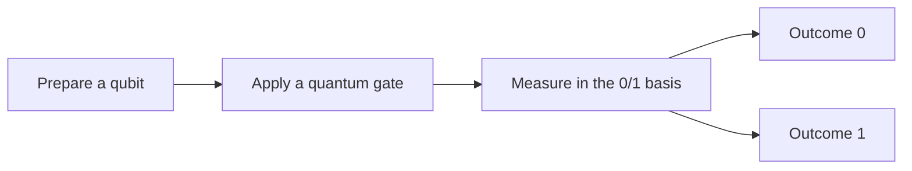

# Qubits and quantum states

:::note About this notebook
This is an original starter note demonstrating the repository format. Expand it with your own observations as you work through the course.
:::

## The idea in one sentence

A pure qubit state is a normalized vector of two complex amplitudes; measurement converts those amplitudes into probabilities for classical outcomes.

## From bits to qubits

A classical bit has value 0 or 1. A qubit has computational basis states $\ket{0}$ and $\ket{1}$. A general **pure state** is

$$
\ket{\psi} = \alpha\ket{0} + \beta\ket{1},
\qquad \alpha,\beta\in\mathbb{C},
\qquad |\alpha|^2 + |\beta|^2 = 1.
$$

The complex numbers $\alpha$ and $\beta$ are **probability amplitudes**. They are not probabilities themselves.

  
<h3>State</h3>
Amplitudes describe the system before measurement, including relative phase.

  
<h3>Outcome</h3>
A computational-basis measurement gives a single classical result: 0 or 1.

## The computational basis

We represent the two basis states as column vectors:

$$
\ket{0} = \begin{pmatrix}1\\0\end{pmatrix},
\qquad
\ket{1} = \begin{pmatrix}0\\1\end{pmatrix},
\qquad
\ket{\psi} = \begin{pmatrix}\alpha\\\beta\end{pmatrix}.
$$

They are orthonormal: $\braket{0|1}=0$, and each has norm one. See [vectors and inner products](../mathematics/01-vectors-and-inner-products.md) for the linear algebra.

## Measurement probabilities

The Born rule for measurement in this basis gives

$$
P(0)=|\alpha|^2, \qquad P(1)=|\beta|^2.
$$

:::example Worked example
For $\ket{\psi}=\frac{\sqrt{3}}{2}\ket{0}+\frac{1}{2}\ket{1}$, the probabilities are $P(0)=\frac{3}{4}$ and $P(1)=\frac{1}{4}$. Their sum is one, as required.
:::

## Relative phase matters

The states $\ket{+}=(\ket{0}+\ket{1})/\sqrt{2}$ and $\ket{-}=(\ket{0}-\ket{1})/\sqrt{2}$ have identical computational-basis measurement probabilities. They respond differently to later gates because their **relative phases** differ.

:::warning A common misconception
Superposition does not let us read both amplitudes from a single measurement. Estimating an unknown state needs many identically prepared copies and suitable measurement settings.
:::

## Check your understanding

Is a vector with amplitudes 1 and 1 already a valid normalized state?

No. Its squared norm is 2. Divide both amplitudes by the square root of 2 to normalize it.

Can computational-basis measurement distinguish the plus and minus states?

No. Both give 0 and 1 with equal probability. Applying a Hadamard gate first maps them to different computational basis states.

## Next connection

[Quantum gates and interference](../gates-and-circuits/02-gates-and-interference.md) explains how gates act on these vectors.
