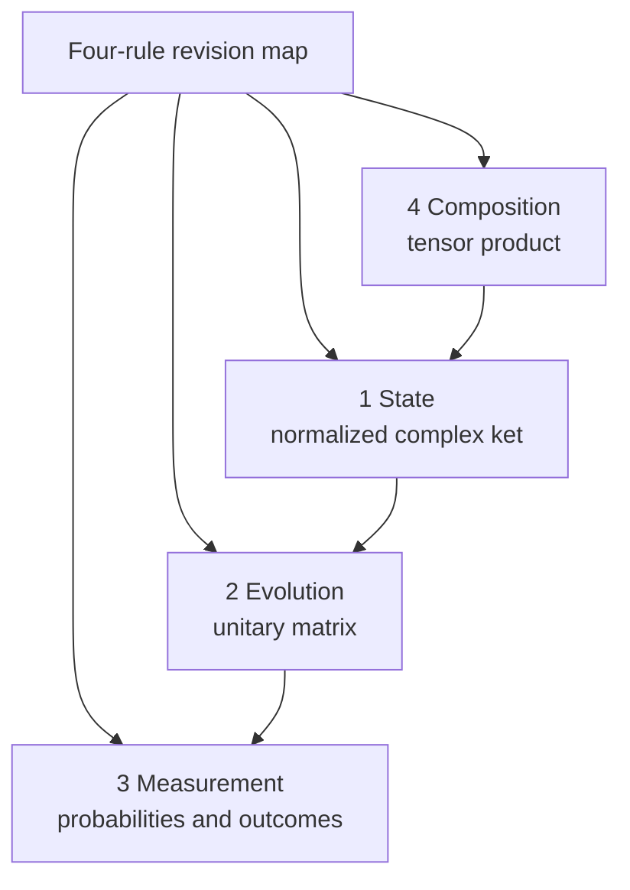
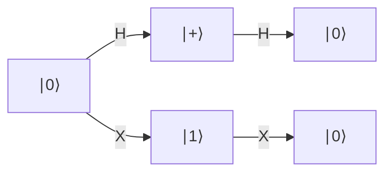
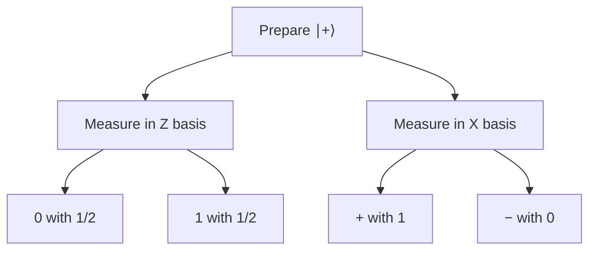

# Four rules for quantum states

## The idea in one sentence

To solve an elementary quantum problem, ask four questions in order: **What is the state? What operation changes it? What measurement is made? What systems are combined?**

MIT's Part 1 introduction organizes quantum mechanics around states, time evolution, measurement, and tensor products ([U1.1 “About 8.370.1x”](https://openlearninglibrary.mit.edu/courses/course-v1:MITx+8.370.1x+1T2018/courseware/Week1/lectures_u1_1/)). This note uses the finite-dimensional, pure-state and projective-measurement version of those rules. Later notes extend measurement and mixed states.

## Rule 1 — State: a unit vector, with a chosen basis

For a qubit in the computational basis,

$$
\ket\psi=\alpha\ket0+\beta\ket1,
\quad \alpha,\beta\in\mathbb C,
\quad |\alpha|^2+|\beta|^2=1.
$$

The two complex numbers are **amplitudes**, not probabilities. The normalization condition makes their squared magnitudes add to one. MIT introduces complex quantum state spaces and unit vectors in [U1.3, “Mathematical representation of quantum states,” about 1:00–5:12](https://www.youtube.com/watch?v=UikJ0wg-Z7U&t=60s).

Two kets that differ by a single overall phase $e^{i\gamma}$ represent the same pure physical state:

$$
\ket\psi \sim e^{i\gamma}\ket\psi.
$$

For example, $\ket+$ and $i\ket+$ are equivalent. But $\ket+=(\ket0+\ket1)/\sqrt2$ and $(\ket0+i\ket1)/\sqrt2$ have different **relative** phases and need not behave alike after later gates. MIT flags this distinction in [U1.3, “Global phases and quantum states,” 0:00–1:27](https://www.youtube.com/watch?v=6pitt4xv0a8&t=0s). A global phase is a factor of magnitude one; an arbitrary scale factor must first be normalized and is not itself a phase.

:::tip A memory hook
State coordinates depend on the basis. A different basis is like a different coordinate grid for the same physical vector; the outcome labels and amplitudes change together.
:::

## Rule 2 — Evolution: preserve lengths and overlaps

An isolated gate acts linearly:

$$
\ket{\psi_{\rm after}}=U\ket{\psi_{\rm before}}.
$$

The gate is **unitary** when $U^\dagger U=I$. Here $U^\dagger$ is the conjugate transpose. Therefore,

$$
\langle U\psi|U\psi\rangle
=\bra\psi U^\dagger U\ket\psi
=\braket{\psi|\psi}=1.
$$

This three-step calculation explains why a gate cannot accidentally change total probability. It also preserves overlaps: $\langle U\phi|U\psi\rangle=\braket{\phi|\psi}$. MIT derives unitary columns and $U^{-1}=U^\dagger$ in [U1.3, “Unitary transformations” parts 1–2](https://www.youtube.com/watch?v=5FY9D7FES-U&t=0s) and [part 3 at 0:43–3:03](https://www.youtube.com/watch?v=MrANPH79NlA&t=43s).

The UV Physics playlist revisits outer-product operators before moving into the postulates in [lecture 2, about 0:00–10:00](https://www.youtube.com/watch?v=GYOiKkQd9fU&t=0s). That recap connects the ket notation in Rule 1 to the projectors used in Rule 3.

### Worked gate check: Hadamard

$$
H=\frac1{\sqrt2}\begin{pmatrix}1&1\\1&-1\end{pmatrix},
\quad H\ket0=\frac{\ket0+\ket1}{\sqrt2}=\ket+.
$$

Its columns are orthonormal, so $H^\dagger H=I$. It is also self-inverse: $H^2=I$. Apply $H$ twice to $\ket0$ and the output returns to $\ket0$. An operation that maps multiple distinct input states to the same output cannot be unitary.

## Rule 3 — Measurement: specify the basis first

For an orthonormal basis $\{\ket{w_j}\}$, a projective measurement returns label $j$ with probability

$$
p(j)=|\braket{w_j|\psi}|^2.
$$

The basis resolves the identity, $\sum_j\ket{w_j}\bra{w_j}=I$, so

$$
\sum_jp(j)
=\bra\psi\left(\sum_j\ket{w_j}\bra{w_j}\right)\ket\psi
=\braket{\psi|\psi}=1.
$$

MIT first gives the computational-basis probabilities $|\alpha|^2,|\beta|^2$, then extends the same overlap rule to an arbitrary orthonormal basis in [U1.4, “Brief introduction to quantum measurements,” 0:40–5:14](https://www.youtube.com/watch?v=wc05dh1BVVI&t=40s).

The playlist's [lecture 3, about 0:00–35:00](https://www.youtube.com/watch?v=m3-4hUdfkrY&t=0s) works the same measurement rule with $\ket0\bra0$ and $\ket1\bra1$, then normalizes the state after a reported outcome. Its [X-basis exercise, about 40:00–50:00](https://www.youtube.com/watch?v=m3-4hUdfkrY&t=2400s), motivates the changed-basis example below. Automatic captions are noisy around symbols, so the formulas here are derived from the projector rule.

In the ideal projective model, after obtaining nondegenerate outcome $j$, the state becomes $\ket{w_j}$ (up to global phase). If an outcome corresponds to a subspace projector $P_j$, the conditional state is $P_j\ket\psi/\sqrt{p(j)}$ when $p(j)>0$. **Probabilities describe possible outcomes; the post-measurement state describes what a later operation receives.**

:::example Same state, different measurement basis
Prepare $\ket+$. In the $\{\ket0,\ket1\}$ basis, $p(0)=p(1)=1/2$. In the $\{\ket+,\ket-\}$ basis, $p(+)=1$ and $p(-)=0$. Nothing mysterious changed in the preparation; the question asked of the state changed.
:::

## Rule 4 — Composition: pair systems with a tensor product

For independent preparations $\ket a_A$ and $\ket b_B$, the joint state is $\ket a_A\otimes\ket b_B$. Each qubit has dimension $2$, so two qubits have dimension $2\cdot2=4$. A general joint state may be **entangled** and impossible to write as one tensor product. MIT develops this in [U1.4, “Tensor products and separable quantum states,” 0:14–7:56](https://www.youtube.com/watch?v=i8VslIQNDq0&t=14s).

Our order is $A$ then $B$: $\ket{00},\ket{01},\ket{10},\ket{11}$. The [tensor-product note](../mathematics/03-tensor-products-and-two-qubit-space.md) shows exactly how the coordinates and local gates work.

## A full four-rule walk-through

Start with two qubits in $\ket{00}$. Apply $H$ to $A$, then CNOT with $A$ as control and $B$ as target:

$$
\ket{00}
\xrightarrow{H\otimes I}
\frac{\ket{00}+\ket{10}}{\sqrt2}
\xrightarrow{\mathrm{CNOT}_{A\to B}}
\frac{\ket{00}+\ket{11}}{\sqrt2}=\ket{\Phi^+}.
$$

Measure both qubits in the computational basis. You get $00$ or $11$, each with probability $1/2$; $01$ and $10$ have probability zero. The probabilities total one. This example uses composition (two qubits), state (the ket), evolution (two unitary gates), and measurement (Born probabilities).

## What to remember in 30 seconds

| Question | Mathematical answer | Sanity check |
| --- | --- | --- |
| What is the state? | Normalized complex ket | $\braket{\psi|\psi}=1$ |
| How does it change? | $U\ket\psi$ | $U^\dagger U=I$ |
| What can a measurement say? | $|\braket{w_j|\psi}|^2$ | Probabilities sum to $1$ |
| How do systems combine? | $\mathcal H_A\otimes\mathcal H_B$ | Dimensions multiply |

## Check your understanding

Does $e^{i\pi/3}\ket0$ have a different computational-basis outcome from $\ket0$?

No. That factor is a global phase; both yield outcome 0 with probability one.

Why must a gate preserve the norm of $\ket\psi$?

The norm gives total probability. If $U^\dagger U=I$, then $\langle U\psi|U\psi\rangle=\bra\psi U^\dagger U\ket\psi=1$.

After the Bell-state circuit above, can a computational-basis measurement produce 01?

No. The amplitude of $\ket{01}$ is zero, so its probability is zero.

