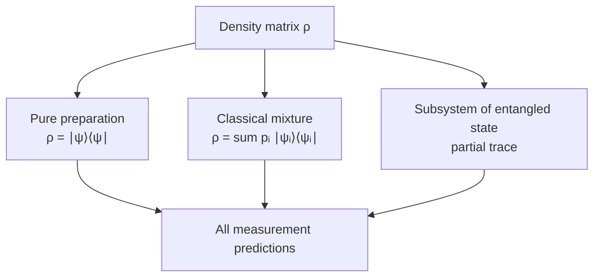
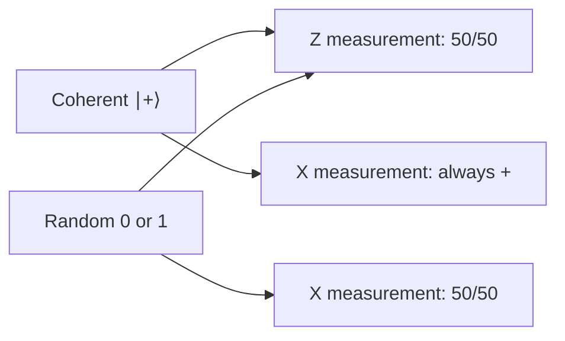
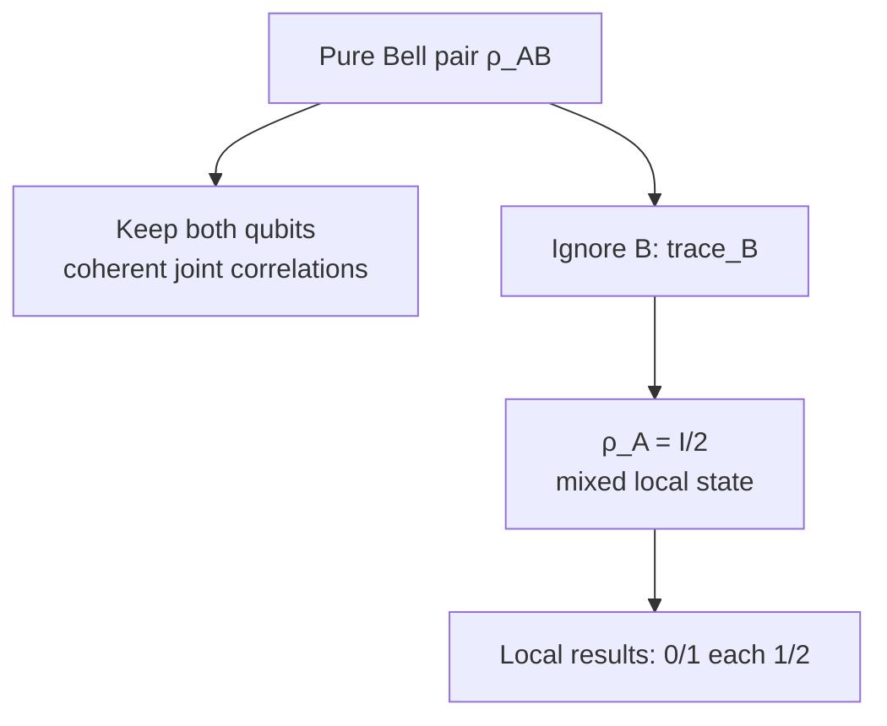
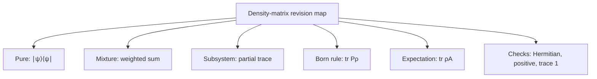

# Density matrices and partial trace

## The idea in one sentence

A density matrix describes all measurement predictions for a system, whether we know its exact pure state, have a classical mixture of possible preparations, or look at only one part of an entangled pair.

:::note Source and notation
The playlist introduces ensembles and $\rho=\ket\psi\bra\psi$ in [“Density Matrix 1,” about 20:00–31:00](https://www.youtube.com/watch?v=s2RM68EbZBk&t=1200s), then computes a reduced state from a Bell pair in [“Density Matrix 2,” about 5:00–23:30](https://www.youtube.com/watch?v=PrJcQu_8kgE&t=300s). The captions are automatic and garble some displayed equations, so the matrices here are original, independently checked calculations. A Bell pair is **globally pure**; each single-qubit reduced state is mixed.
:::

## A map before the algebra

These three roads can lead to the **same** matrix for one subsystem. A density matrix tells us what can be predicted locally, but it does not by itself reveal which preparation story produced it.

## 1. From one known ket to a density matrix

If the state is the normalized ket $\ket\psi$, define

$$
\rho_\psi=\ket\psi\bra\psi.
$$

For $\ket+=\frac1{\sqrt2}(\ket0+\ket1)$,

$$
\rho_+=\frac12
\begin{pmatrix}1\\1\end{pmatrix}
\begin{pmatrix}1&1\end{pmatrix}
=\frac12\begin{pmatrix}1&1\\1&1\end{pmatrix}.
$$

The diagonal entries are computational-basis probabilities: $1/2$ and $1/2$. The off-diagonal entries carry **coherence** between the two basis amplitudes. They matter when a later gate or a different measurement basis lets paths interfere. The playlist explicitly contrasts ket/outer-product and matrix descriptions around [30:00–47:00](https://www.youtube.com/watch?v=s2RM68EbZBk&t=1800s).

### What a valid density matrix must satisfy

$$
\rho^\dagger=\rho,
\qquad \operatorname{tr}\rho=1,
\qquad \bra v\rho\ket v\geq0\quad\text{for every }\ket v.
$$

These mean **Hermitian**, **trace one**, and **positive semidefinite**. For a pure state, $\rho^2=\rho$ and $\operatorname{tr}(\rho^2)=1$. A genuinely mixed finite-dimensional state has $\operatorname{tr}(\rho^2)<1$.

## 2. An ensemble is not a superposition

Suppose a coin chooses $\ket0$ half the time and $\ket1$ half the time. We do **not** add the kets. We average their density matrices using classical probabilities:

$$
\rho_{\rm mix}
=\tfrac12\ket0\bra0+\tfrac12\ket1\bra1
=\frac12\begin{pmatrix}1&0\\0&1\end{pmatrix}
=\frac I2.
$$

Both $\rho_+$ and $I/2$ give a 50–50 result in the computational basis. They differ in the $\{\ket+,\ket-\}$ basis:

| Preparation | $P(0)$ | $P(1)$ | $P(+)$ | $P(-)$ |
| --- | --- | --- | --- | --- |
| Pure $\ket+$ | $1/2$ | $1/2$ | $1$ | $0$ |
| Half $\ket0$, half $\ket1$ | $1/2$ | $1/2$ | $1/2$ | $1/2$ |

Here is the direct density-matrix calculation, using $P_+=\ket+\bra+$:

$$
P(+)=\operatorname{tr}(P_+\rho).
$$

For $\rho_+$, this is $1$; for $I/2$, it is $\tfrac12\operatorname{tr}(P_+)=1/2$. The playlist discusses ensembles and different preparation probabilities around [20:00–30:00](https://www.youtube.com/watch?v=s2RM68EbZBk&t=1200s).

## 3. Born rule and expectation in one line each

For a measurement outcome with projector $P_j$,

$$
p(j)=\operatorname{tr}(P_j\rho).
$$

For an observable $A$,

$$
\langle A\rangle=\operatorname{tr}(\rho A).
$$

Why does the second expression agree with the familiar pure-state formula? If $\rho=\ket\psi\bra\psi$, cyclicity of trace gives

$$
\operatorname{tr}(\rho A)
=\operatorname{tr}(\ket\psi\bra\psi A)
=\bra\psi A\ket\psi.
$$

The playlist makes this pure-to-mixed expectation connection around [35:00–45:00](https://www.youtube.com/watch?v=s2RM68EbZBk&t=2100s).

## 4. A Bell pair: pure together, mixed separately

Take $\ket{\Phi^+}_{AB}=(\ket{00}+\ket{11})/\sqrt2$. The full state is pure:

$$
\rho_{AB}=\ket{\Phi^+}\bra{\Phi^+}
=\frac12\bigl(
\ket{00}\bra{00}+\ket{00}\bra{11}
+\ket{11}\bra{00}+\ket{11}\bra{11}
\bigr).
$$

To describe $A$ alone, take the **partial trace over $B$**. On a product outer term, the rule is

$$
\operatorname{tr}_B\bigl(
\ket a\bra c\otimes\ket b\bra d
\bigr)
=\ket a\bra c\,\braket{d|b}.
$$

The cross terms vanish because $\braket{1|0}=\braket{0|1}=0$. The diagonal terms survive:

$$
\rho_A=\operatorname{tr}_B(\rho_{AB})
=\tfrac12\ket0\bra0+\tfrac12\ket1\bra1=\frac I2.
$$

This is exactly the same **local** matrix as the classical mixture above. Yet the **joint** Bell state has correlations that the product $I/2\otimes I/2$ does not. The playlist works the reduced-state idea in [“Density Matrix 2,” about 15:00–23:30](https://www.youtube.com/watch?v=PrJcQu_8kgE&t=900s).

:::warning A precise distinction
“Entangled” does not mean “mixed” for the full pair. $\rho_{AB}$ has purity $\operatorname{tr}(\rho_{AB}^2)=1$; $\rho_A=I/2$ has purity $\operatorname{tr}(\rho_A^2)=1/2$. Always say **which system** a density matrix describes.
:::

## 5. The Bloch-vector shortcut

Every qubit density matrix can be expressed as

$$
\rho=\frac12\left(I+r_xX+r_yY+r_zZ\right),
\qquad \mathbf r\in\mathbb R^3,
\qquad |\mathbf r|\leq1.
$$

Pure qubit states lie on the Bloch sphere's surface ($|\mathbf r|=1$); mixed states lie inside. For $\ket+$, $\mathbf r=(1,0,0)$. For $I/2$, $\mathbf r=(0,0,0)$. The playlist derives a Pauli-matrix form of a pure-qubit density operator around [60:00–78:00](https://www.youtube.com/watch?v=s2RM68EbZBk&t=3600s). [Bloch sphere and qubit rotations](../gates-and-circuits/04-bloch-sphere-and-qubit-rotations.md) builds the geometry carefully.

## What to remember in 30 seconds

## Check your understanding

Are $\ket+$ and a 50–50 mixture of $\ket0,\ket1$ the same state?

No. They agree in the computational basis, but only the pure $\ket+$ preparation has probability one for the $+$ outcome in the $X$ basis.

What is the reduced state of either qubit of $\ket{\Phi^+}$?

$I/2$. The whole pair is pure; either qubit considered alone is maximally mixed.

What is $\operatorname{tr}[(I/2)^2]$?

$(I/2)^2=I/4$ and $\operatorname{tr}I=2$, so the purity is $1/2$.

## Next connections

- [Complex vectors and Dirac notation](../mathematics/02-complex-vectors-and-dirac-notation.md) builds the outer product used here.
- [Tensor products and two-qubit space](../mathematics/03-tensor-products-and-two-qubit-space.md) fixes the $A,B$ basis order used in the partial trace.
