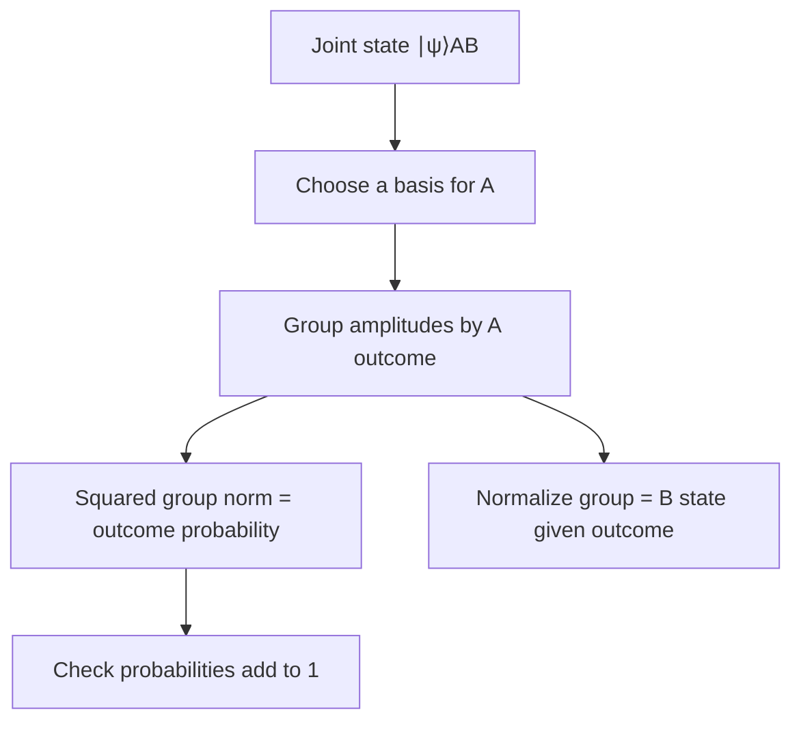
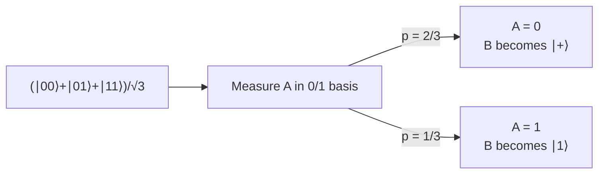
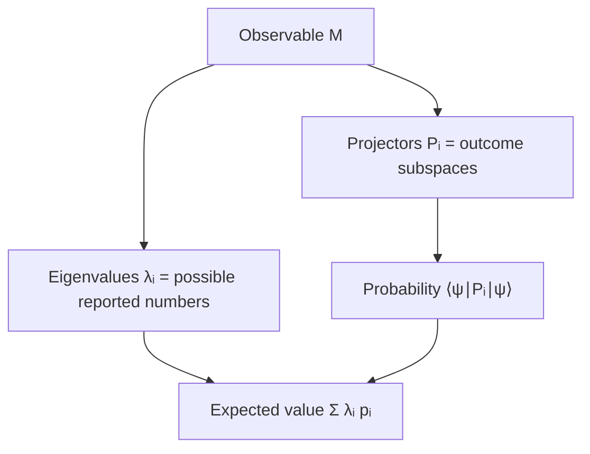

# Measuring part of a quantum system

## The idea in one sentence

When you measure only one qubit of an entangled system, group the joint amplitudes by that qubit's possible outcomes; each group gives both the outcome probability and the remaining qubit's conditional state.

## Start with a map

This is the idea of MIT's [U1.5 opening lecture, “Combining measurement and tensor products,” 0:00–9:37](https://www.youtube.com/watch?v=d5xMdgPY1qY&t=0s). We use $A$ as the left qubit, $B$ as the right qubit, and basis order $00,01,10,11$.

## 1. Measuring both qubits is straightforward

MIT uses this normalized state:

$$
\ket\psi_{AB}=\frac{\ket{00}+\ket{01}+\ket{11}}{\sqrt3}.
$$

The $\ket{10}$ amplitude is zero. A computational-basis measurement of **both** qubits has four possible labels:

| Outcome | Amplitude | Probability |
| --- | --- | --- |
| $00$ | $1/\sqrt3$ | $1/3$ |
| $01$ | $1/\sqrt3$ | $1/3$ |
| $10$ | $0$ | $0$ |
| $11$ | $1/\sqrt3$ | $1/3$ |

The probabilities add to one. MIT introduces the same example at [about 0:48–2:19](https://www.youtube.com/watch?v=d5xMdgPY1qY&t=48s).

## 2. Measure only $A$: group by its label

Regroup the ket without changing it:

$$
\ket\psi_{AB}
=\ket0_A\otimes\frac{\ket0_B+\ket1_B}{\sqrt3}
 +\ket1_A\otimes\frac{\ket1_B}{\sqrt3}.
$$

The two $B$ vectors on the right are **unnormalized**. Their squared norms are the probabilities of $A=0$ and $A=1$:

$$
p(A=0)=\frac{(\bra0+\bra1)(\ket0+\ket1)}{3}=\frac23,
\qquad
p(A=1)=\frac13.
$$

After observing $A=0$, normalize the first $B$ vector: $B$ is $\ket+=(\ket0+\ket1)/\sqrt2$. After observing $A=1$, $B$ is $\ket1$. MIT works these two branches in [U1.5 at about 3:47–6:06](https://www.youtube.com/watch?v=d5xMdgPY1qY&t=227s).

**Do not normalize a branch before calculating its probability.** Its original squared norm is what tells you how often that branch occurs.

## 3. Partial inner product: a short calculation tool

For a chosen outcome $\ket a$ on $A$, apply $\bra a_A\otimes I_B$ to the joint ket:

$$
\ket{v_a}_B=(\bra a_A\otimes I_B)\ket\psi_{AB}.
$$

The output $\ket{v_a}$ is an unnormalized vector in $B$'s space. Then

$$
p(a)=\braket{v_a|v_a},
\qquad
\ket{B\mid a}=\frac{\ket{v_a}}{\sqrt{p(a)}}
\quad\text{if }p(a)>0.
$$

For the previous state and $a=0$,

$$
(\bra0_A\otimes I_B)\ket\psi_{AB}
=\frac{\ket0_B+\ket1_B}{\sqrt3}.
$$

The bra acts only on $A$: $\braket{0|0}=1$ and $\braket{0|1}=0$. MIT calls this a partial inner product in [U1.5, “Measurement expressed using partial inner products,” about 1:10–2:28](https://www.youtube.com/watch?v=P6JpQ0lulsE&t=70s).

## 4. Change the measurement basis: a surprising 5/6

Now measure **A** in the $X$ basis $\{\ket+,\ket-\}$. Use $\bra+=(\bra0+\bra1)/\sqrt2$:

$$
\begin{aligned}
\ket{v_+}_B
&=(\bra+_A\otimes I_B)\ket\psi_{AB}\\
&=\frac{\ket0_B+2\ket1_B}{\sqrt6}.
\end{aligned}
$$

Its squared norm is $(1+4)/6=5/6$. Conditioned on observing $+$, $B$ is $(\ket0+2\ket1)/\sqrt5$. Similarly,

$$
\ket{v_-}_B=\frac{\ket0_B}{\sqrt6},
\qquad p(-)=\frac16,
\qquad \ket{B\mid -}=\ket0.
$$

The probabilities again add to one. MIT calculates the $5/6$ and $1/6$ branches in [U1.5, “Measurement expressed using partial inner products,” about 2:55–6:31](https://www.youtube.com/watch?v=P6JpQ0lulsE&t=175s).

:::example Why did the $\ket1_B$ coefficient become two?
The $\ket{01}$ and $\ket{11}$ terms both contribute to the $+$ outcome on $A$. Their amplitudes add **before** squaring, so $1+1=2$. This is interference in a changed measurement basis, not a change to the prepared joint state.
:::

## 5. Observables package outcomes and expected values

A projective observable $M$ is Hermitian. Its spectral form is

$$
M=\sum_j\lambda_jP_j,
$$

where $\lambda_j$ is a possible measured value and $P_j$ projects onto its eigenspace. For a pure state,

$$
p(j)=\bra\psi P_j\ket\psi,
\qquad
\langle M\rangle=\bra\psi M\ket\psi
=\sum_j\lambda_jp(j).
$$

If every eigenvalue is nondegenerate, $P_j=\ket{v_j}\bra{v_j}$. For the Pauli $X$ observable, outcomes are $+1$ and $-1$ with eigenstates $\ket+$ and $\ket-$. MIT derives this observable/expectation connection in [U1.5, “Measurement operators as Hermitian matrices,” about 0:00–6:37](https://www.youtube.com/watch?v=qXdU-mAgkA8&t=0s).

The source course focuses here on projective measurements. Generalized POVM measurements exist but are outside this first note.

## What to remember in 30 seconds

| Step | Keep straight |
| --- | --- |
| Choose basis | A different basis asks a different question. |
| Take a partial inner product | The remaining subsystem vector is initially unnormalized. |
| Square its norm | That is the outcome probability. |
| Divide by square root of probability | That is the remaining subsystem's conditional pure state. |
| Check all outcomes | Probabilities must add to one. |

## Check your understanding

For the example state, if $A=0$ is observed, what is the next $Z$-basis probability for $B=1$?

$B$ becomes $\ket+$, so $P(B=1\mid A=0)=1/2$.

What is $P(A=0,B=1)$ in the original state? Can you recover it sequentially?

It is $1/3$. Sequentially, $P(A=0)=2/3$ and $P(B=1\mid A=0)=1/2$, so the product is $1/3$.

Why is the $+$ outcome on $A$ more likely than the $-$ outcome?

In the $+$ branch, the two amplitudes that lead to $\ket1_B$ add; in the $-$ branch they cancel. Their squared branch norms are $5/6$ and $1/6$.

## Next connections

- [Tensor products and two-qubit space](../mathematics/03-tensor-products-and-two-qubit-space.md) supplies the basis ordering.
- [Density matrices and partial trace](03-density-matrices-and-partial-trace.md) describes the state of $B$ when the outcome on $A$ is not known.
