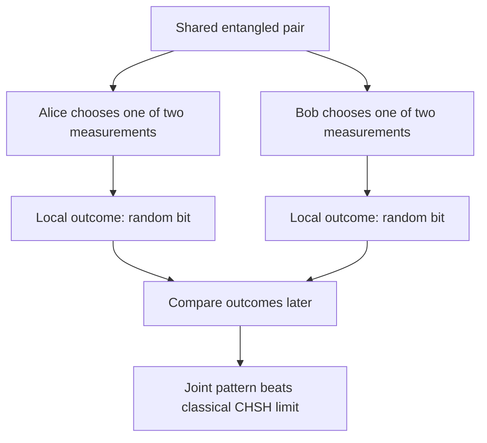
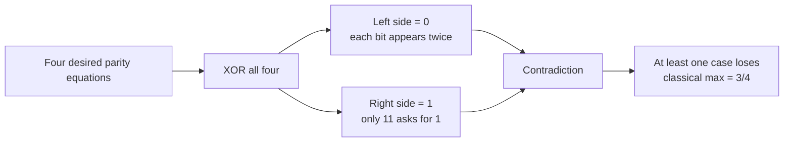
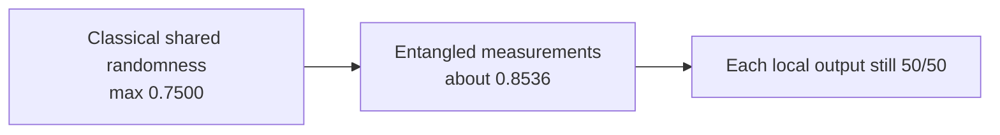
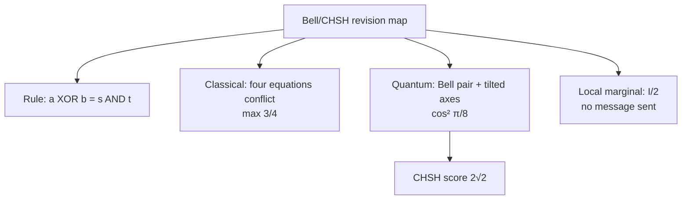

# Entanglement and the CHSH game

## The idea in one sentence

Two separated players who share an entangled pair can produce correlations that beat every classical strategy based on shared randomness, while each player's local outcomes remain random.

MIT introduces the EPR motivation in [U1.6, “Einstein, Podolsky, and Rosen's issues,” 0:00–5:44](https://www.youtube.com/watch?v=yDOY3AAtvDI&t=0s), then expresses Bell's reasoning as a cooperative game. The point of the game is precise: compare a specified quantum strategy with **all classical no-communication strategies**, including ones with shared random bits.

## 1. The pair and its local view

Alice and Bob share

$$
\ket{\Phi^+}_{AB}=\frac{\ket{00}+\ket{11}}{\sqrt2}.
$$

If both measure in the $Z$ basis, their bits agree every time: $00$ and $11$ each occur with probability $1/2$. If both measure in the $X$ basis, their results also agree. Yet each side alone sees a fair coin:

$$
\rho_A=\rho_B=\frac I2.
$$

This local mixed-state calculation is worked in [Density matrices and partial trace](03-density-matrices-and-partial-trace.md). MIT sets up the equal-axis correlations for $\ket{\Phi^+}$ in [U1.6, “Quantum protocol demonstrating EPR violation — setup,” 0:00–2:45](https://www.youtube.com/watch?v=TH0HxAxNLmE&t=0s).

## 2. The game rules

A referee sends Alice a uniformly random input bit $s\in\{0,1\}$ and Bob an independent uniformly random bit $t\in\{0,1\}$. They cannot communicate after receiving them. Alice replies $a$, Bob replies $b$. They win when

$$
a\oplus b=s\land t.
$$

| Referee inputs $(s,t)$ | Required output relation |
| --- | --- |
| $(0,0)$ | $a=b$ |
| $(0,1)$ | $a=b$ |
| $(1,0)$ | $a=b$ |
| $(1,1)$ | $a\ne b$ |

MIT states the game and its four cases in [U1.6, “Bell's argument as a classical game,” about 1:26–4:09](https://www.youtube.com/watch?v=PcHkeCU8Sr8&t=86s).

## 3. Why classical players top out at $3/4$

First suppose both players write down fixed answers before entering separate rooms: Alice has $a_0,a_1$, Bob has $b_0,b_1$. To win all four cases, they would need

$$
\begin{aligned}
a_0\oplus b_0&=0, & a_0\oplus b_1&=0,\\
a_1\oplus b_0&=0, & a_1\oplus b_1&=1.
\end{aligned}
$$

XOR all four left sides: every answer bit appears twice, so the result is $0$. XOR the right sides: the result is $1$. Contradiction. At least one of the four equally likely cases must fail, so success is at most $3/4$. Choosing $a=b=0$ always wins the first three and reaches $3/4$.

Shared randomness cannot improve the maximum: once its random seed is fixed, the strategy is just one fixed-answer table; averaging tables that each win at most $3/4$ cannot exceed $3/4$. MIT gives both parts of this argument around [5:37–9:51](https://www.youtube.com/watch?v=PcHkeCU8Sr8&t=337s).

## 4. A quantum strategy

Share $\ket{\Phi^+}$. Alice measures $A_0=Z$ for $s=0$ and $A_1=X$ for $s=1$. Bob measures

$$
B_0=\frac{Z+X}{\sqrt2}\quad(t=0),
\qquad
B_1=\frac{Z-X}{\sqrt2}\quad(t=1).
$$

These are valid $\pm1$ observables: they are Hermitian and square to $I$. Record output bit $0$ for eigenvalue $+1$ and bit $1$ for eigenvalue $-1$. The four correlations on $\ket{\Phi^+}$ are

$$
E_{00}=E_{01}=E_{10}=\frac1{\sqrt2},
\qquad E_{11}=-\frac1{\sqrt2},
$$

where $E_{st}=\langle\Phi^+|A_s\otimes B_t|\Phi^+\rangle$. To check one: $\langle Z\otimes Z\rangle=1$ and $\langle Z\otimes X\rangle=0$, so $E_{00}=(1+0)/\sqrt2=1/\sqrt2$. The other signs follow similarly.

For the first three input pairs the players need equal output bits, with probability $(1+E_{st})/2$. For $(1,1)$ they need different bits, with probability $(1-E_{11})/2$. All four winning probabilities therefore equal

$$
p_{\rm quantum}
=\frac{1+1/\sqrt2}{2}
=\cos^2\frac\pi8
\approx0.8536.
$$

MIT constructs the axes in [U1.6, “Quantum protocol … setup,” about 5:00–7:16](https://www.youtube.com/watch?v=TH0HxAxNLmE&t=300s) and calculates the win rate in [“analysis,” about 1:38–11:46](https://www.youtube.com/watch?v=9yNpvPBe538&t=98s). The lecture transcript includes a spoken correction to a missing factor of two around [7:35–7:49](https://www.youtube.com/watch?v=9yNpvPBe538&t=455s); the formula here uses the corrected factor.

## 5. What the result does and does not say

The CHSH score can be written $S=E_{00}+E_{01}+E_{10}-E_{11}$. Classical local-answer strategies satisfy $|S|\leq2$; the measurements above give $S=2\sqrt2$. This demonstrates that the specified local classical model cannot reproduce those joint statistics.

It does **not** let Alice send Bob a message by choosing her measurement. Whatever Alice chooses, Bob's reduced state remains $I/2$, so his local outcomes stay 50–50. Only after Alice and Bob later compare their recorded inputs and outputs through an ordinary communication channel can they see the pattern. This follows directly from the reduced density matrix, without needing a philosophical interpretation of measurement.

## What to remember in 30 seconds

## Check your understanding

Why can a fixed classical table not win every referee input?

XORing the four required equations gives $0=1$: each local answer appears twice on the left, while the right side has one 1.

If Bob's local state is $I/2$, what is his $Z$-basis probability of outcome 0?

It is $1/2$, regardless of which measurement Alice chooses.

Which is larger, $3/4$ or $\cos^2(\pi/8)$?

$\cos^2(\pi/8)\approx0.8536$, which is larger than $0.75$.

## Next connections

- [Measuring part of a quantum system](04-measuring-part-of-a-quantum-system.md) teaches conditional outcomes.
- [Bloch sphere and qubit rotations](../gates-and-circuits/04-bloch-sphere-and-qubit-rotations.md) gives the axis geometry behind Bob's tilted measurements.
