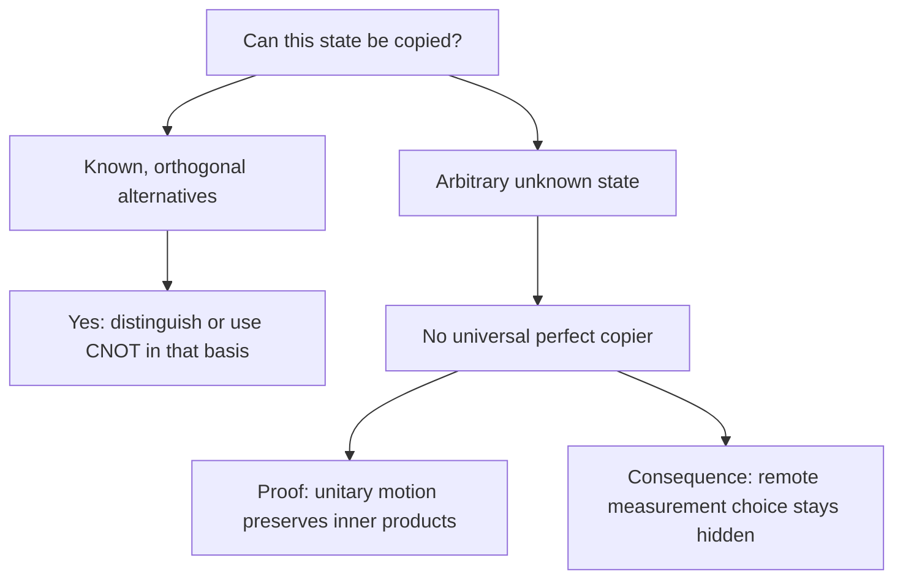
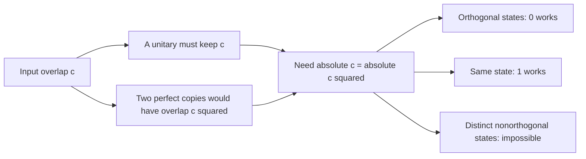

# No-cloning: why an unknown qubit cannot be copied

## The idea in one sentence

You can copy a *known basis bit* with CNOT, but no single physical operation can perfectly copy **every possible unknown quantum state**.

## 1. First see what a classical-looking copy gate really does

With the first qubit controlling CNOT and a clean second qubit,

$$
\operatorname{CNOT}\ket{0,0}=\ket{0,0},\qquad
\operatorname{CNOT}\ket{1,0}=\ket{1,1}.
$$

That copies either **computational-basis label**. It does not copy a superposition. For $\ket+=\bigl(\ket0+\ket1\bigr)/\sqrt2$, linearity gives

$$
\operatorname{CNOT}(\ket+\ket0)
=\frac{\ket{00}+\ket{11}}{\sqrt2}=\ket{\Phi^+},
$$

whereas two genuine copies would be

$$
\ket+\ket+
=\frac{\ket{00}+\ket{01}+\ket{10}+\ket{11}}2.
$$

These states differ: the CNOT output never produces $01$ or $10$ in a $Z$-basis measurement, while $\ket+\ket+$ produces each with probability $1/4$. The Bell pair has matching $Z$ bits, but neither qubit by itself is $\ket+$. This is the fastest way to avoid the misleading phrase “CNOT copies a qubit.”

:::example Tiny test
Apply CNOT to $\ket-\ket0$. The answer is $(\ket{00}-\ket{11})/\sqrt2$, not $\ket-\ket-$. Expand both expressions to see the missing $01$ and $10$ terms.
:::

## 2. What a universal copier would have to promise

Give a device a fixed, clean blank register $\ket0$. A perfect universal copier would be a unitary $U$ such that

$$
U(\ket\psi\ket0)=\ket\psi\ket\psi
\quad\text{for every normalized }\ket\psi.
$$

The same fixed $U$ must work when the input is $\ket\phi$, without anyone telling the device which state arrived. A state-specific preparation recipe does not meet that promise.

MIT states the claim and introduces the blank register in the official timed transcript for [U1.4, “The no-cloning theorem,” 0:00–1:27](https://www.youtube.com/watch?v=Evjk9RI_tYk&t=0s). The corresponding video is currently unavailable publicly, so the timed transcript is the source for these lecture positions.

## 3. One inner product proves the limit

Choose any two possible inputs $\ket\psi$ and $\ket\phi$, and abbreviate their overlap by $c=\braket{\psi|\phi}$. Before copying, their two-register overlap is

$$
(\bra\psi\bra0)(\ket\phi\ket0)
=\braket{\psi|\phi}\braket{0|0}=c.
$$

If both are copied perfectly, their output overlap would be

$$
(\bra\psi\bra\psi)(\ket\phi\ket\phi)
=\braket{\psi|\phi}^2=c^2.
$$

But a unitary preserves inner products, since $U^\dagger U=I$:

$$
\braket{U\Psi|U\Phi}
=\bra\Psi U^\dagger U\ket\Phi
=\braket{\Psi|\Phi}.
$$

Therefore a perfect copier for *both* possible vectors requires $c=c^2$. The only solutions are $c=0$ and $c=1$. Orthogonal states have $c=0$ and can be distinguished and copied in their known basis; $c=1$ means the normalized vectors are identical under the phases fixed in this copy promise. **Two distinct, nonorthogonal possibilities have $0<|c|<1$ and cannot both be copied.** MIT presents this overlap argument around [1:30–3:34](https://www.youtube.com/watch?v=Evjk9RI_tYk&t=90s) and the unitary-inner-product identity around [3:39–5:32](https://www.youtube.com/watch?v=Evjk9RI_tYk&t=219s).

:::note Phase nuance
The simple equation $c=c^2$ fixes vector phases in the copy promise. Since physical pure states ignore a global phase, the phase-independent version compares **magnitudes**: $|c|=|c|^2$. This still rules out every pair with $0<|c|<1$. An arbitrary output global phase or a fixed ancilla cannot rescue a universal perfect copier.
:::

## 4. Why this matters for entanglement and signals

Suppose Alice and Bob share a Bell pair. Alice may measure her half in the $Z$ basis, leaving Bob with the *ensemble* $\{\ket0,\ket1\}$, each with probability $1/2$. Or she may choose the $X$ basis, leaving him with $\{\ket+,\ket-\}$, each with probability $1/2$. Without her outcome message, Bob's state in either case is

$$
\frac12\ket0\bra0+\frac12\ket1\bra1
=\frac I2
=\frac12\ket+\bra++\frac12\ket-\bra-.
$$

These are **different decompositions of the same density matrix**. Bob cannot locally tell which basis Alice chose. An impossible device that cloned each unknown ensemble member would let him collect many copies and distinguish the two preparations, turning a remote choice into a signal. MIT walks through this hypothetical argument in [U1.5, “Cloning implies faster-than-light communication,” about 1:30–7:35](https://www.youtube.com/watch?v=EZR98e6W2DE&t=90s). The impossibility of that copier agrees with the no-signalling calculation above; the inner-product proof already establishes the theorem without assuming a communication protocol.

## What to remember in 30 seconds

| Claim | Precise version |
| --- | --- |
| “CNOT copies” | It copies $0$ and $1$ basis labels into a blank target. |
| “A superposition is copied too” | False: CNOT makes a Bell pair from $\ket+\ket0$. |
| No-cloning | One fixed operation cannot perfectly clone every unknown pure state. |
| Why | Two output copies square an overlap; a unitary preserves it. |
| Allowed case | A known family of mutually orthogonal states can be copied in its basis. |

## Check your understanding

Can one device copy both $\ket0$ and $\ket+$ perfectly?

No. Their overlap has magnitude $1/\sqrt2$, which is neither zero nor one. A unitary would have to keep that overlap while two perfect copies would square it.

Does no-cloning forbid preparing ten $\ket+$ states when you know how to make $\ket+$?

No. You can run the known preparation ten times. The theorem concerns a single fixed device receiving an arbitrary unknown input state.

Why does Bob see the same local state after Alice chooses either measurement basis?

Both resulting ensembles average to $I/2$. Any local measurement probability depends on that same density matrix.

## Next connections

- [Reversible classical computation](../gates-and-circuits/03-reversible-classical-computation.md) explains why copying an ordinary bit label is allowed.
- [Tensor products and two-qubit space](../mathematics/03-tensor-products-and-two-qubit-space.md) supplies the product-overlap rule.
- [Density matrices and partial trace](03-density-matrices-and-partial-trace.md) explains the two equal ensembles.
