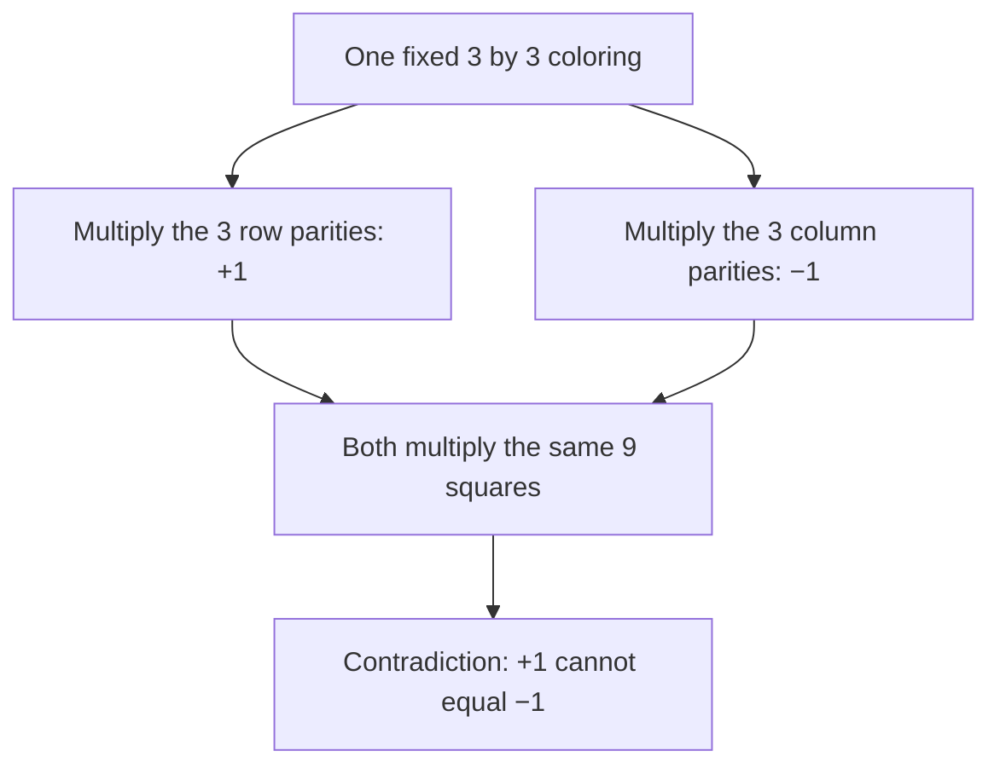
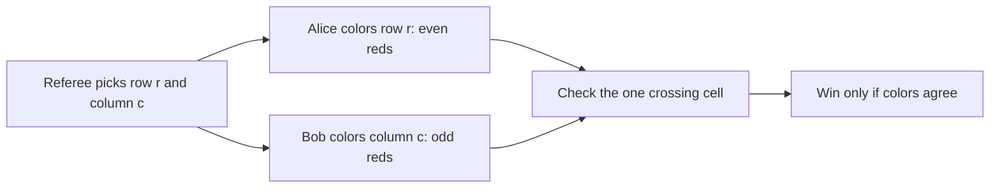
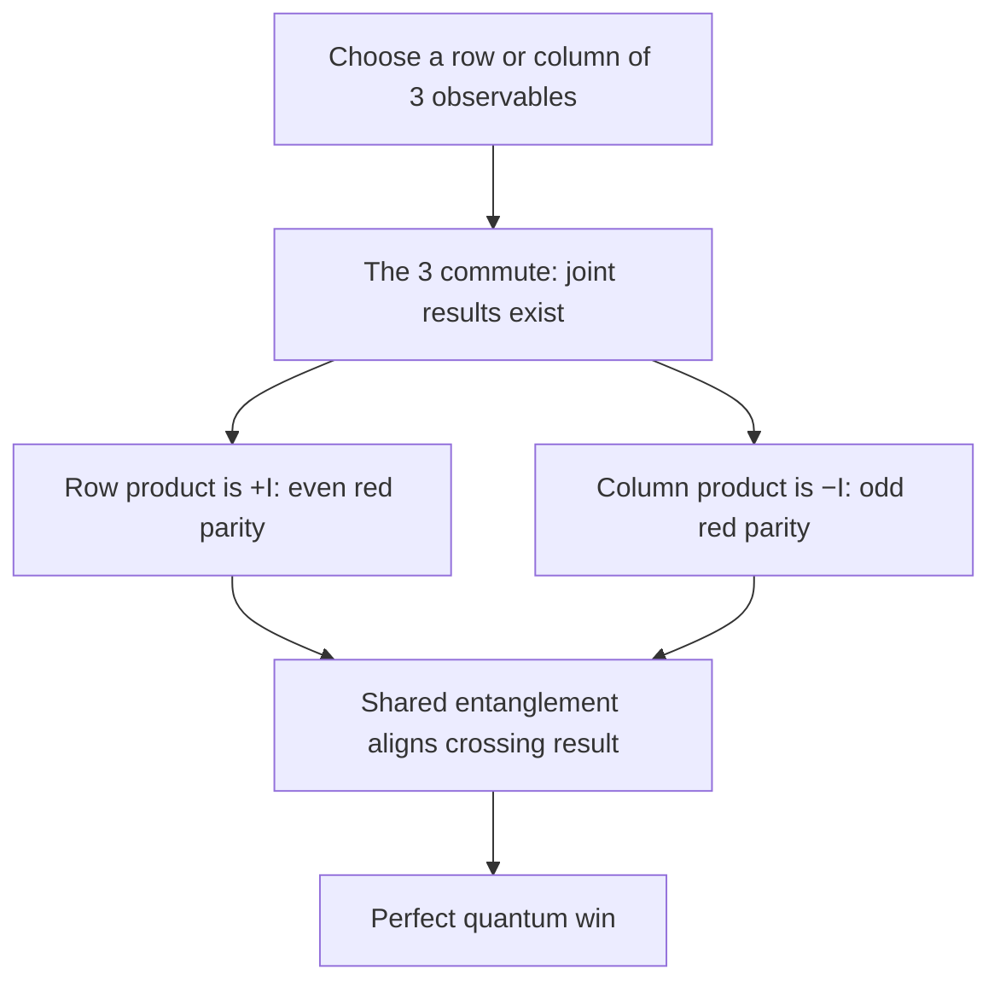

# Mermin's magic square: a perfect quantum game

## The idea in one sentence

No fixed coloring of a $3\times3$ grid can satisfy these row and column parity rules, yet entangled players can answer one row and one column at a time and win every round.

## 1. Begin with a puzzle you can see

Imagine every square is either green ($+1$) or red ($-1$). Every **row** must have an even number of reds; every **column** must have an odd number. Multiplying colors is a compact way to state the rules:

| Line | Needed color product | Red-count version |
| --- | --- | --- |
| Each of three rows | $+1$ | Even number of reds |
| Each of three columns | $-1$ | Odd number of reds |

Each square appears exactly once in the product of all rows and exactly once in the product of all columns. The same nine colors cannot multiply to both $+1$ and $-1$. MIT starts with precisely this contradiction in [U1.6, “Mermin's magic square game — classical limit,” 0:00–1:40](https://www.youtube.com/watch?v=AieU3jiYKUY&t=0s). The official course transcript supplies the timestamps because the embedded YouTube video is currently unavailable.

## 2. Turn the puzzle into a two-player game

A referee independently chooses a row $r\in\{1,2,3\}$ for Alice and a column $c\in\{1,2,3\}$ for Bob, uniformly at random. Alice returns three colors with **even red parity** for her row. Bob returns three colors with **odd red parity** for his column. They must agree on the shared cell $(r,c)$. They may agree on a strategy beforehand but cannot communicate after getting $r$ and $c$.

MIT gives these rules around [1:40–4:24](https://www.youtube.com/watch?v=AieU3jiYKUY&t=100s). The game asks for answers to *one context at a time*. It never asks either player to color all nine cells during a round.

## 3. Why the best classical win rate is $8/9$

Fix a deterministic classical strategy. Alice has a preselected legal response for each row, and Bob has one for each column. These make two full grids. If the grids agreed in all nine cells, they would form the impossible fixed coloring above. Therefore at least one crossing cell disagrees. Each of the nine $(r,c)$ pairs is equally likely, so the win probability is at most $8/9$. A strategy with an illegal row or column already loses whenever it is asked and cannot do better.

The bound is reachable. Alice can use this row-legal grid, where R means red and G means green:

| Alice's row answers | Column 1 | Column 2 | Column 3 |
| --- | --- | --- | --- |
| Row 1 | R | R | G |
| Row 2 | G | G | G |
| Row 3 | G | G | G |

Bob uses the same grid **except** he answers R at row 3, column 3. Each of his columns then has one red. They disagree in only that one cell, losing only when $(r,c)=(3,3)$. Shared random choices cannot beat $8/9$: fixing the shared seed gives a deterministic strategy with at most $8/9$, and averaging such strategies stays at most $8/9$. MIT derives and achieves this limit around [4:24–8:32](https://www.youtube.com/watch?v=AieU3jiYKUY&t=264s).

## 4. The quantum square uses measurements, not permanent colors

Let $X,Y,Z$ be the Pauli matrices and $I$ the one-qubit identity. Each entry below is an observable on **two qubits**:

|  | Column 1 | Column 2 | Column 3 |
| --- | --- | --- | --- |
| Row 1 | $X\otimes I$ | $I\otimes X$ | $X\otimes X$ |
| Row 2 | $I\otimes Z$ | $Z\otimes I$ | $Z\otimes Z$ |
| Row 3 | $-X\otimes Z$ | $-Z\otimes X$ | $Y\otimes Y$ |

Each observable has possible eigenvalues $+1$ and $-1$, interpreted as green and red. Entries **within one row** commute, and entries **within one column** commute. Thus Alice can jointly measure the three in her selected row, and Bob can jointly measure the three in his selected column. We do not claim that all nine entries have simultaneous preassigned values. MIT introduces this table and the commuting rule in [“A set of commuting measurements,” about 0:00–5:16](https://www.youtube.com/watch?v=b8y_8EkUrDI&t=0s); the needed simultaneous-diagonalization fact is developed in [the preceding lecture, about 0:00–9:25](https://www.youtube.com/watch?v=LSoiJKIykb4&t=0s).

Why do the signs work? A sample row is immediate:

$$
(X\otimes I)(I\otimes X)(X\otimes X)=I\otimes I.
$$

For the last column, $XZ=-iY$, so

$$
(X\otimes X)(Z\otimes Z)(Y\otimes Y)
=(XZY)\otimes(XZY)=(-iI)\otimes(-iI)=-I\otimes I.
$$

The same direct multiplication gives **$+I$ for all three row products** and **$-I$ for all three column products**. Consequently, each joint measurement automatically has the required color parity, independent of which eigenvalues individually appear. These checks match MIT's product calculation around [5:16–7:45](https://www.youtube.com/watch?v=b8y_8EkUrDI&t=316s). The transcript misrecognizes some spoken symbols, so the displayed matrix identities have also been checked algebraically.

## 5. How Alice and Bob agree at the crossing

They share two Bell pairs, one qubit of each pair per person. Equivalently, across their two-qubit registers they share the four-level maximally entangled state

$$
\ket{\Omega_4}
=\frac12\sum_{j=0}^{3}\ket j_A\ket j_B
=\ket{\Phi^+}_{A_1B_1}\otimes\ket{\Phi^+}_{A_2B_2},
$$

where the second equality assumes a consistent ordering of the four qubits. For any matrix $M$,

$$
(M_A\otimes I_B)\ket{\Omega_4}
=(I_A\otimes M_B^{\mathsf T})\ket{\Omega_4}.
$$

Every entry in the displayed square is **real and symmetric**. Even $Y\otimes Y$ is real and symmetric because both factors change sign under transpose. Hence $M^{\mathsf T}=M$ for each cell. When Alice and Bob measure the same crossing observable on their own registers, their $\pm1$ answers agree with certainty. Meanwhile the commuting row and column measurements enforce their local parities. MIT describes the shared state and strategy in [“Quantum setup,” 0:00–1:13](https://www.youtube.com/watch?v=HPIJ25zyxUY&t=0s) and [“Quantum protocol and analysis,” about 0:00–5:19](https://www.youtube.com/watch?v=i21_4AD8FGk&t=0s).

:::note The surprising part
The classical contradiction assumes a **single context-independent grid of nine values**. The quantum strategy produces valid values only for the row or column actually requested. Different requested measurement contexts need not reveal one fixed underlying grid; the overlap result still matches because of entanglement.
:::

## What to remember in 30 seconds

| Layer | Key fact |
| --- | --- |
| Fixed grid | Row products demand $+1$ overall; column products demand $-1$. Impossible. |
| Classical game | At least one of nine crossings fails, so $p\le8/9$. |
| Quantum row/column | Commuting observables can be measured together. |
| Quantum parity | Row products are $+I$; column products are $-I$. |
| Quantum agreement | Two Bell pairs correlate the same real symmetric crossing observable. |
| Result | Perfect win probability $1$. |

## Check your understanding

Why does one wrong crossing give $8/9$ rather than $3/4$?

The referee chooses independently among three rows and three columns, giving nine equally likely crossings. One losing crossing has probability $1/9$.

What lets Alice measure all three observables in a requested row?

They are Hermitian and pairwise commute, so they have a common eigenbasis and compatible joint outcomes.

Does the strategy assign a fixed color to every square before the referee asks?

No. It supplies outcomes for the requested compatible row or column. A fixed full grid would contradict the parity puzzle.

## Next connections

- [Entanglement and the CHSH game](05-entanglement-and-chsh-game.md) gives a smaller game where quantum success is about $0.854$ rather than perfect.
- [Measuring part of a quantum system](04-measuring-part-of-a-quantum-system.md) develops observables and conditional outcomes.
- [Tensor products and two-qubit space](../mathematics/03-tensor-products-and-two-qubit-space.md) explains $X\otimes Z$ and the four-level register.
