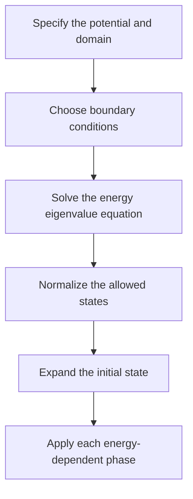

# The Schrödinger equation

## Time evolution

For a closed quantum system, the Schrödinger equation describes how a state changes with time:

$$
i\hbar\frac{\partial}{\partial t}\ket{\psi(t)}=\hat{H}\ket{\psi(t)}.
$$

The Hamiltonian $\hat{H}$ represents the total energy observable. For a nonrelativistic particle of mass $m$ in one spatial dimension with a local potential,

$$
i\hbar\frac{\partial\psi}{\partial t}
=-\frac{\hbar^2}{2m}\frac{\partial^2\psi}{\partial x^2}+V(x,t)\psi.
$$

## A time-independent Hamiltonian

When $\hat{H}$ has no explicit time dependence, an energy eigenstate satisfies

$$
\hat{H}\phi_n=E_n\phi_n.
$$

Its evolution is $\psi_n(x,t)=\phi_n(x)e^{-iE_nt/\hbar}$. The phase changes, but the position probability density stays the same.

:::warning Stationary does not mean motionless
A stationary state's probability density is time-independent. This does not mean that its energy is zero or that the wavefunction itself is time-independent.
:::

## A practical workflow

## Connection to gates

For a time-independent Hamiltonian in a finite-dimensional system, evolution over time $t$ is

$$
U(t)=e^{-i\hat{H}t/\hbar}.
$$

This connects continuous time evolution with the unitary matrices used in [quantum gates](../ibm-quantum/02-gates-and-interference.md).
